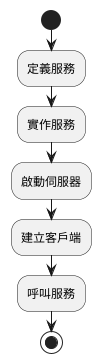
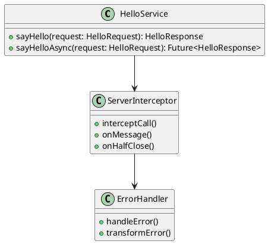
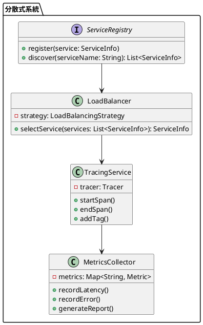

# Spring 使用 gRPC 教學

## 初級（Beginner）層級

### 1. 概念說明
gRPC 是一個現代的遠端程序呼叫（RPC）框架，可以讓不同的程式互相溝通。初級學習者需要了解：
- 什麼是 gRPC
- 基本的服務定義
- 簡單的客戶端和伺服器端實作

### 2. PlantUML 圖解


### 3. 分段教學步驟

#### 步驟 1：基本專案設定
```xml
<!-- pom.xml -->
<dependencies>
    <dependency>
        <groupId>net.devh</groupId>
        <artifactId>grpc-server-spring-boot-starter</artifactId>
        <version>2.14.0.RELEASE</version>
    </dependency>
    <dependency>
        <groupId>net.devh</groupId>
        <artifactId>grpc-client-spring-boot-starter</artifactId>
        <version>2.14.0.RELEASE</version>
    </dependency>
</dependencies>
```

#### 步驟 2：定義簡單的服務
```protobuf
// src/main/proto/hello.proto
syntax = "proto3";

package hello;

service HelloService {
    rpc SayHello (HelloRequest) returns (HelloResponse);
}

message HelloRequest {
    string name = 1;
}

message HelloResponse {
    string message = 1;
}
```

#### 步驟 3：實作服務
```java
import io.grpc.stub.StreamObserver;
import net.devh.boot.grpc.server.service.GrpcService;
import hello.HelloRequest;
import hello.HelloResponse;
import hello.HelloServiceGrpc;

@GrpcService
public class HelloServiceImpl extends HelloServiceGrpc.HelloServiceImplBase {
    @Override
    public void sayHello(HelloRequest request, StreamObserver<HelloResponse> responseObserver) {
        String name = request.getName();
        HelloResponse response = HelloResponse.newBuilder()
            .setMessage("你好, " + name + "!")
            .build();
        
        responseObserver.onNext(response);
        responseObserver.onCompleted();
    }
}
```

## 中級（Intermediate）層級

### 1. 概念說明
中級學習者需要理解：
- 服務的錯誤處理
- 非同步呼叫
- 服務攔截器
- 基本的效能優化

### 2. PlantUML 圖解


### 3. 分段教學步驟

#### 步驟 1：錯誤處理
```java
import io.grpc.Status;
import io.grpc.stub.StreamObserver;
import net.devh.boot.grpc.server.service.GrpcService;
import hello.HelloRequest;
import hello.HelloResponse;
import hello.HelloServiceGrpc;

@GrpcService
public class HelloServiceImpl extends HelloServiceGrpc.HelloServiceImplBase {
    @Override
    public void sayHello(HelloRequest request, StreamObserver<HelloResponse> responseObserver) {
        try {
            if (request.getName().isEmpty()) {
                throw new IllegalArgumentException("名字不能為空");
            }
            
            HelloResponse response = HelloResponse.newBuilder()
                .setMessage("你好, " + request.getName() + "!")
                .build();
            
            responseObserver.onNext(response);
            responseObserver.onCompleted();
        } catch (IllegalArgumentException e) {
            responseObserver.onError(Status.INVALID_ARGUMENT
                .withDescription(e.getMessage())
                .asRuntimeException());
        } catch (Exception e) {
            responseObserver.onError(Status.INTERNAL
                .withDescription("發生內部錯誤")
                .asRuntimeException());
        }
    }
}
```

#### 步驟 2：非同步呼叫
```java
import io.grpc.stub.StreamObserver;
import net.devh.boot.grpc.server.service.GrpcService;
import hello.HelloRequest;
import hello.HelloResponse;
import hello.HelloServiceGrpc;
import java.util.concurrent.CompletableFuture;

@GrpcService
public class AsyncHelloServiceImpl extends HelloServiceGrpc.HelloServiceImplBase {
    @Override
    public void sayHello(HelloRequest request, StreamObserver<HelloResponse> responseObserver) {
        CompletableFuture.runAsync(() -> {
            try {
                // 模擬長時間運算
                Thread.sleep(1000);
                
                HelloResponse response = HelloResponse.newBuilder()
                    .setMessage("非同步回應: 你好, " + request.getName() + "!")
                    .build();
                
                responseObserver.onNext(response);
                responseObserver.onCompleted();
            } catch (Exception e) {
                responseObserver.onError(e);
            }
        });
    }
}
```

#### 步驟 3：服務攔截器
```java
import io.grpc.*;
import net.devh.boot.grpc.server.interceptor.GrpcGlobalServerInterceptor;
import org.springframework.stereotype.Component;

@Component
@GrpcGlobalServerInterceptor
public class LoggingInterceptor implements ServerInterceptor {
    @Override
    public <ReqT, RespT> ServerCall.Listener<ReqT> interceptCall(
            ServerCall<ReqT, RespT> call,
            Metadata headers,
            ServerCallHandler<ReqT, RespT> next) {
        
        System.out.println("收到請求: " + call.getMethodDescriptor().getFullMethodName());
        
        return new ForwardingServerCallListener.SimpleForwardingServerCallListener<ReqT>(
            next.startCall(call, headers)) {
            @Override
            public void onMessage(ReqT message) {
                System.out.println("請求內容: " + message);
                super.onMessage(message);
            }
            
            @Override
            public void onComplete() {
                System.out.println("請求完成");
                super.onComplete();
            }
        };
    }
}
```

## 高級（Advanced）層級

### 1. 概念說明
高級學習者需要掌握：
- 分散式系統設計
- 服務發現與負載平衡
- 進階效能優化
- 監控與追蹤

### 2. PlantUML 圖解


### 3. 分段教學步驟

#### 步驟 1：服務發現與負載平衡
```java
import io.grpc.*;
import net.devh.boot.grpc.client.discovery.GrpcDiscoveryClientAutoConfiguration;
import org.springframework.cloud.client.discovery.DiscoveryClient;
import org.springframework.context.annotation.Bean;
import org.springframework.context.annotation.Configuration;

@Configuration
public class GrpcClientConfig {
    @Bean
    public NameResolver.Factory discoveryClientResolverFactory(DiscoveryClient client) {
        return new DiscoveryClientResolverFactory(client);
    }
    
    @Bean
    public LoadBalancer.Factory loadBalancerFactory() {
        return new LoadBalancer.Factory() {
            @Override
            public LoadBalancer newLoadBalancer(LoadBalancer.Helper helper) {
                return new RoundRobinLoadBalancer(helper);
            }
        };
    }
}

class RoundRobinLoadBalancer extends LoadBalancer {
    private final Helper helper;
    private int currentIndex = 0;
    
    public RoundRobinLoadBalancer(Helper helper) {
        this.helper = helper;
    }
    
    @Override
    public void handleResolvedAddresses(ResolvedAddresses resolvedAddresses) {
        List<EquivalentAddressGroup> servers = resolvedAddresses.getServers();
        if (servers.isEmpty()) {
            helper.updateBalancingState(ConnectivityState.TRANSIENT_FAILURE,
                new EmptyPicker());
            return;
        }
        
        helper.updateBalancingState(ConnectivityState.READY,
            new RoundRobinPicker(servers));
    }
}
```

#### 步驟 2：分散式追蹤
```java
import io.opentracing.Span;
import io.opentracing.Tracer;
import io.opentracing.contrib.grpc.TracingServerInterceptor;
import net.devh.boot.grpc.server.interceptor.GrpcGlobalServerInterceptor;
import org.springframework.context.annotation.Bean;
import org.springframework.context.annotation.Configuration;

@Configuration
public class TracingConfig {
    @Bean
    @GrpcGlobalServerInterceptor
    public ServerInterceptor tracingInterceptor(Tracer tracer) {
        return TracingServerInterceptor
            .newBuilder()
            .withTracer(tracer)
            .withStreaming()
            .withVerbosity()
            .build();
    }
}

@GrpcService
public class TracedHelloServiceImpl extends HelloServiceGrpc.HelloServiceImplBase {
    private final Tracer tracer;
    
    public TracedHelloServiceImpl(Tracer tracer) {
        this.tracer = tracer;
    }
    
    @Override
    public void sayHello(HelloRequest request, StreamObserver<HelloResponse> responseObserver) {
        Span span = tracer.buildSpan("sayHello")
            .withTag("name", request.getName())
            .start();
        
        try {
            HelloResponse response = HelloResponse.newBuilder()
                .setMessage("你好, " + request.getName() + "!")
                .build();
            
            responseObserver.onNext(response);
            responseObserver.onCompleted();
        } finally {
            span.finish();
        }
    }
}
```

#### 步驟 3：進階效能優化
```java
import io.grpc.*;
import net.devh.boot.grpc.server.config.GrpcServerProperties;
import org.springframework.context.annotation.Bean;
import org.springframework.context.annotation.Configuration;

@Configuration
public class PerformanceConfig {
    @Bean
    public ServerBuilder<?> serverBuilder(GrpcServerProperties properties) {
        return ServerBuilder.forPort(properties.getPort())
            .executor(Executors.newFixedThreadPool(properties.getThreadCount()))
            .maxInboundMessageSize(properties.getMaxInboundMessageSize())
            .maxInboundMetadataSize(properties.getMaxInboundMetadataSize())
            .keepAliveTime(properties.getKeepAliveTime(), TimeUnit.SECONDS)
            .keepAliveTimeout(properties.getKeepAliveTimeout(), TimeUnit.SECONDS)
            .permitKeepAliveTime(properties.getPermitKeepAliveTime(), TimeUnit.SECONDS)
            .permitKeepAliveWithoutCalls(properties.isPermitKeepAliveWithoutCalls());
    }
    
    @Bean
    public Channel channel(ManagedChannelBuilder<?> channelBuilder) {
        return channelBuilder
            .maxInboundMessageSize(16 * 1024 * 1024) // 16MB
            .maxInboundMetadataSize(8192) // 8KB
            .keepAliveTime(30, TimeUnit.SECONDS)
            .keepAliveTimeout(10, TimeUnit.SECONDS)
            .idleTimeout(24, TimeUnit.HOURS)
            .enableRetry()
            .maxRetryAttempts(3)
            .build();
    }
}
```

這個教學文件提供了從基礎到進階的 Spring 使用 gRPC 學習路徑，每個層級都包含了相應的概念說明、圖解、教學步驟和實作範例。初級學習者可以從基本的服務定義和實作開始，中級學習者可以學習更複雜的錯誤處理和非同步呼叫，而高級學習者則可以掌握完整的分散式系統設計和效能優化。 