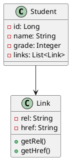
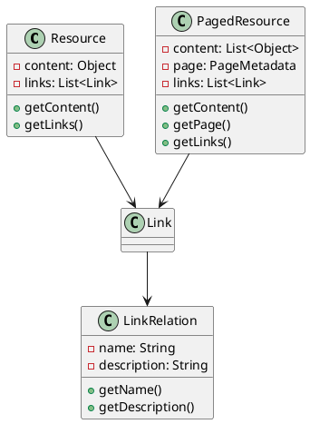
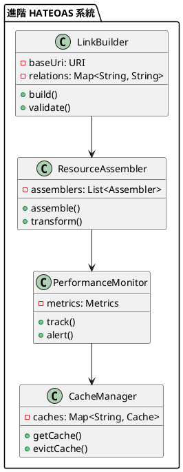

# Spring HATEOAS 教學

## 初級（Beginner）層級

### 1. 概念說明
Spring HATEOAS 就像是一個班級的導覽手冊，告訴你下一步可以去哪裡。初級學習者需要了解：
- 什麼是 HATEOAS
- 為什麼需要 HATEOAS
- 基本的超媒體連結

### 2. PlantUML 圖解


### 3. 分段教學步驟

#### 步驟 1：基本專案設定
```xml
<!-- pom.xml -->
<dependencies>
    <dependency>
        <groupId>org.springframework.boot</groupId>
        <artifactId>spring-boot-starter-hateoas</artifactId>
        <version>3.3.10</version>
    </dependency>
    <dependency>
        <groupId>org.springframework.boot</groupId>
        <artifactId>spring-boot-starter-web</artifactId>
        <version>3.3.10</version>
    </dependency>
</dependencies>
```

#### 步驟 2：基本配置
```yaml
# application.yml
spring:
  application:
    name: school-api
```

#### 步驟 3：簡單範例
```java
import org.springframework.hateoas.*;
import org.springframework.web.bind.annotation.*;

@RestController
@RequestMapping("/api/students")
public class StudentController {
    
    @GetMapping("/{id}")
    public EntityModel<Student> getStudent(@PathVariable Long id) {
        Student student = new Student(id, "小明", 90);
        return EntityModel.of(student,
            linkTo(methodOn(StudentController.class).getStudent(id)).withSelfRel(),
            linkTo(methodOn(StudentController.class).getAllStudents()).withRel("students"));
    }
    
    @GetMapping
    public CollectionModel<EntityModel<Student>> getAllStudents() {
        List<Student> students = List.of(
            new Student(1L, "小明", 90),
            new Student(2L, "小華", 85)
        );
        
        List<EntityModel<Student>> studentModels = students.stream()
            .map(student -> EntityModel.of(student,
                linkTo(methodOn(StudentController.class).getStudent(student.getId())).withSelfRel()))
            .toList();
            
        return CollectionModel.of(studentModels,
            linkTo(methodOn(StudentController.class).getAllStudents()).withSelfRel());
    }
}
```

## 中級（Intermediate）層級

### 1. 概念說明
中級學習者需要理解：
- 資源表示
- 連結關係
- 分頁和排序
- 條件連結

### 2. PlantUML 圖解


### 3. 分段教學步驟

#### 步驟 1：資源表示
```java
import org.springframework.hateoas.*;
import org.springframework.web.bind.annotation.*;

@RestController
@RequestMapping("/api/students")
public class StudentController {
    
    @GetMapping("/{id}")
    public EntityModel<Student> getStudent(@PathVariable Long id) {
        Student student = new Student(id, "小明", 90);
        
        return EntityModel.of(student)
            .add(linkTo(methodOn(StudentController.class).getStudent(id)).withSelfRel())
            .add(linkTo(methodOn(StudentController.class).getAllStudents()).withRel(IanaLinkRelations.COLLECTION))
            .add(linkTo(methodOn(StudentController.class).getStudentCourses(id)).withRel("courses"))
            .add(linkTo(methodOn(StudentController.class).getStudentGrades(id)).withRel("grades"));
    }
}
```

#### 步驟 2：分頁和排序
```java
import org.springframework.hateoas.*;
import org.springframework.data.domain.*;
import org.springframework.web.bind.annotation.*;

@RestController
@RequestMapping("/api/students")
public class StudentController {
    
    @GetMapping
    public PagedModel<EntityModel<Student>> getAllStudents(
            @RequestParam(defaultValue = "0") int page,
            @RequestParam(defaultValue = "10") int size,
            @RequestParam(defaultValue = "name") String sort) {
        
        Page<Student> students = studentService.findAll(
            PageRequest.of(page, size, Sort.by(sort)));
            
        List<EntityModel<Student>> studentModels = students.getContent().stream()
            .map(student -> EntityModel.of(student,
                linkTo(methodOn(StudentController.class).getStudent(student.getId())).withSelfRel()))
            .toList();
            
        return PagedModel.of(studentModels,
            new PagedModel.PageMetadata(
                students.getSize(),
                students.getNumber(),
                students.getTotalElements(),
                students.getTotalPages()))
            .add(linkTo(methodOn(StudentController.class)
                .getAllStudents(page, size, sort)).withSelfRel());
    }
}
```

#### 步驟 3：條件連結
```java
import org.springframework.hateoas.*;
import org.springframework.web.bind.annotation.*;

@RestController
@RequestMapping("/api/students")
public class StudentController {
    
    @GetMapping("/{id}")
    public EntityModel<Student> getStudent(@PathVariable Long id) {
        Student student = new Student(id, "小明", 90);
        
        EntityModel<Student> model = EntityModel.of(student)
            .add(linkTo(methodOn(StudentController.class).getStudent(id)).withSelfRel());
            
        if (student.getGrade() >= 90) {
            model.add(linkTo(methodOn(StudentController.class)
                .getHonorStudents()).withRel("honor-students"));
        }
        
        if (student.getGrade() < 60) {
            model.add(linkTo(methodOn(StudentController.class)
                .getTutoringProgram()).withRel("tutoring"));
        }
        
        return model;
    }
}
```

## 高級（Advanced）層級

### 1. 概念說明
高級學習者需要掌握：
- 自定義連結關係
- 進階資源組裝
- 效能優化
- 監控和追蹤

### 2. PlantUML 圖解


### 3. 分段教學步驟

#### 步驟 1：自定義連結關係
```java
import org.springframework.hateoas.*;
import org.springframework.context.annotation.*;
import org.springframework.web.bind.annotation.*;

@Configuration
public class CustomLinkRelationConfig {
    @Bean
    public LinkRelationProvider customLinkRelationProvider() {
        return new LinkRelationProvider() {
            @Override
            public String getCollectionResourceRelFor(Class<?> type) {
                return type.getSimpleName().toLowerCase() + "s";
            }
            
            @Override
            public String getItemResourceRelFor(Class<?> type) {
                return type.getSimpleName().toLowerCase();
            }
        };
    }
}

@RestController
@RequestMapping("/api/students")
public class StudentController {
    
    @GetMapping("/{id}")
    public EntityModel<Student> getStudent(@PathVariable Long id) {
        Student student = new Student(id, "小明", 90);
        
        return EntityModel.of(student)
            .add(linkTo(methodOn(StudentController.class).getStudent(id)).withSelfRel())
            .add(linkTo(methodOn(StudentController.class).getAllStudents())
                .withRel("students"))
            .add(Link.of("/api/students/{id}/courses", "courses")
                .expand(id));
    }
}
```

#### 步驟 2：進階資源組裝
```java
import org.springframework.hateoas.*;
import org.springframework.web.bind.annotation.*;
import org.springframework.hateoas.mediatype.hal.HalModelBuilder;

@RestController
@RequestMapping("/api/students")
public class StudentController {
    
    @GetMapping("/{id}")
    public RepresentationModel<?> getStudent(@PathVariable Long id) {
        Student student = new Student(id, "小明", 90);
        List<Course> courses = List.of(
            new Course(1L, "數學"),
            new Course(2L, "英文")
        );
        
        return HalModelBuilder.halModel()
            .entity(student)
            .link(linkTo(methodOn(StudentController.class).getStudent(id)).withSelfRel())
            .embed(courses, "courses")
            .link(linkTo(methodOn(StudentController.class).getStudentCourses(id))
                .withRel("courses"))
            .build();
    }
}
```

#### 步驟 3：效能監控
```java
import org.springframework.hateoas.*;
import org.springframework.web.bind.annotation.*;
import java.util.Map;
import java.util.concurrent.ConcurrentHashMap;

@RestController
@RequestMapping("/api/students")
public class MonitoredController {
    private final Map<String, ResourceMetrics> metrics = new ConcurrentHashMap<>();
    
    @GetMapping("/{id}")
    public EntityModel<Student> getStudent(@PathVariable Long id) {
        long startTime = System.currentTimeMillis();
        try {
            Student student = new Student(id, "小明", 90);
            EntityModel<Student> model = EntityModel.of(student)
                .add(linkTo(methodOn(StudentController.class).getStudent(id)).withSelfRel());
                
            recordMetrics("getStudent", startTime, true);
            return model;
        } catch (Exception e) {
            recordMetrics("getStudent", startTime, false);
            throw e;
        }
    }
    
    private void recordMetrics(String operation, long startTime, boolean success) {
        long duration = System.currentTimeMillis() - startTime;
        metrics.compute(operation, (key, value) -> {
            if (value == null) {
                return new ResourceMetrics(duration, success);
            }
            value.update(duration, success);
            return value;
        });
    }
}
```

這個教學文件提供了從基礎到進階的 Spring HATEOAS 學習路徑，每個層級都包含了相應的概念說明、圖解、教學步驟和實作範例。初級學習者可以從基本的超媒體連結開始，中級學習者可以學習更複雜的資源表示和分頁，而高級學習者則可以掌握自定義連結關係和進階資源組裝等進階功能。 