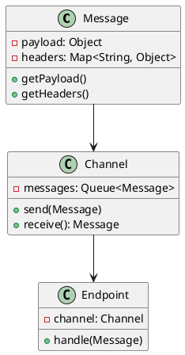
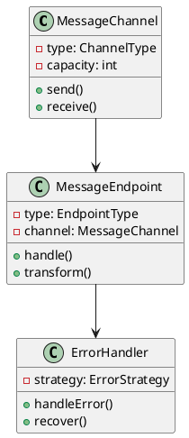
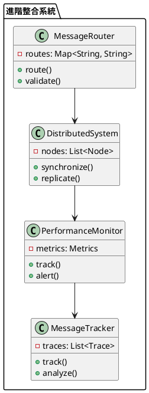

# Spring Integration 教學

## 初級（Beginner）層級

### 1. 概念說明
Spring Integration 就像是一個班級的傳話系統，幫助不同的同學之間傳遞訊息。初級學習者需要了解：
- 什麼是系統整合
- 為什麼需要系統整合
- 基本的訊息傳遞

### 2. PlantUML 圖解


### 3. 分段教學步驟

#### 步驟 1：基本專案設定
```xml
<!-- pom.xml -->
<dependencies>
    <dependency>
        <groupId>org.springframework.boot</groupId>
        <artifactId>spring-boot-starter-integration</artifactId>
        <version>3.3.10</version>
    </dependency>
    <dependency>
        <groupId>org.springframework.integration</groupId>
        <artifactId>spring-integration-file</artifactId>
        <version>6.2.4</version>
    </dependency>
</dependencies>
```

#### 步驟 2：基本配置
```yaml
# application.yml
spring:
  integration:
    channel:
      auto-create: true
```

#### 步驟 3：簡單範例
```java
import org.springframework.integration.annotation.*;
import org.springframework.messaging.Message;
import org.springframework.stereotype.Component;

@Component
public class StudentMessageHandler {
    
    @ServiceActivator(inputChannel = "studentChannel")
    public void handleStudentMessage(Message<String> message) {
        String studentName = message.getPayload();
        System.out.println("收到學生訊息: " + studentName);
    }
    
    @Transformer(inputChannel = "inputChannel", outputChannel = "outputChannel")
    public String transformMessage(String message) {
        return "處理後的訊息: " + message;
    }
}
```

## 中級（Intermediate）層級

### 1. 概念說明
中級學習者需要理解：
- 訊息通道
- 端點類型
- 訊息轉換
- 錯誤處理

### 2. PlantUML 圖解


### 3. 分段教學步驟

#### 步驟 1：訊息通道配置
```java
import org.springframework.integration.config.*;
import org.springframework.context.annotation.*;

@Configuration
public class IntegrationConfig {
    
    @Bean
    public MessageChannel studentChannel() {
        return new DirectChannel();
    }
    
    @Bean
    public MessageChannel teacherChannel() {
        return new QueueChannel(10);
    }
    
    @Bean
    public MessageChannel broadcastChannel() {
        return new PublishSubscribeChannel();
    }
}
```

#### 步驟 2：端點配置
```java
import org.springframework.integration.annotation.*;
import org.springframework.messaging.Message;
import org.springframework.stereotype.Component;

@Component
public class SchoolIntegration {
    
    @ServiceActivator(inputChannel = "studentChannel")
    public void handleStudentMessage(Message<String> message) {
        String studentName = message.getPayload();
        System.out.println("處理學生訊息: " + studentName);
    }
    
    @Router(inputChannel = "messageRouter")
    public String routeMessage(Message<String> message) {
        String content = message.getPayload();
        if (content.contains("作業")) {
            return "homeworkChannel";
        } else if (content.contains("考試")) {
            return "examChannel";
        }
        return "defaultChannel";
    }
    
    @Filter(inputChannel = "messageFilter", outputChannel = "filteredChannel")
    public boolean filterMessage(Message<String> message) {
        return message.getPayload().length() > 5;
    }
}
```

#### 步驟 3：錯誤處理
```java
import org.springframework.integration.annotation.*;
import org.springframework.messaging.Message;
import org.springframework.stereotype.Component;

@Component
public class ErrorHandling {
    
    @ServiceActivator(inputChannel = "errorChannel")
    public void handleError(Message<Throwable> errorMessage) {
        Throwable error = errorMessage.getPayload();
        System.out.println("發生錯誤: " + error.getMessage());
    }
    
    @ServiceActivator(inputChannel = "studentChannel")
    public void processStudentMessage(Message<String> message) {
        try {
            String studentName = message.getPayload();
            if (studentName == null || studentName.isEmpty()) {
                throw new IllegalArgumentException("學生姓名不能為空");
            }
            System.out.println("處理學生訊息: " + studentName);
        } catch (Exception e) {
            throw new RuntimeException("處理學生訊息時發生錯誤", e);
        }
    }
}
```

## 高級（Advanced）層級

### 1. 概念說明
高級學習者需要掌握：
- 進階訊息路由
- 分散式整合
- 效能優化
- 監控和追蹤

### 2. PlantUML 圖解


### 3. 分段教學步驟

#### 步驟 1：進階訊息路由
```java
import org.springframework.integration.annotation.*;
import org.springframework.messaging.Message;
import org.springframework.stereotype.Component;

@Component
public class AdvancedRouting {
    
    @Router(inputChannel = "advancedRouter")
    public String routeMessage(Message<String> message) {
        String content = message.getPayload();
        Map<String, String> headers = message.getHeaders();
        
        if (headers.containsKey("priority")) {
            return "priorityChannel";
        }
        
        if (content.contains("緊急")) {
            return "emergencyChannel";
        }
        
        if (content.contains("通知")) {
            return "notificationChannel";
        }
        
        return "defaultChannel";
    }
    
    @ServiceActivator(inputChannel = "priorityChannel")
    public void handlePriorityMessage(Message<String> message) {
        System.out.println("處理優先訊息: " + message.getPayload());
    }
}
```

#### 步驟 2：分散式整合
```java
import org.springframework.integration.annotation.*;
import org.springframework.messaging.Message;
import org.springframework.stereotype.Component;

@Component
public class DistributedIntegration {
    
    @ServiceActivator(inputChannel = "distributedChannel")
    public void handleDistributedMessage(Message<String> message) {
        String content = message.getPayload();
        Map<String, Object> headers = message.getHeaders();
        
        if (headers.containsKey("nodeId")) {
            String nodeId = (String) headers.get("nodeId");
            System.out.println("從節點 " + nodeId + " 收到訊息: " + content);
        }
        
        // 同步到其他節點
        syncToOtherNodes(content);
    }
    
    private void syncToOtherNodes(String content) {
        // 實現同步邏輯
    }
}
```

#### 步驟 3：效能監控
```java
import org.springframework.integration.annotation.*;
import org.springframework.messaging.Message;
import org.springframework.stereotype.Component;
import java.util.Map;
import java.util.concurrent.ConcurrentHashMap;

@Component
public class PerformanceMonitoring {
    private final Map<String, MessageMetrics> metrics = new ConcurrentHashMap<>();
    
    @ServiceActivator(inputChannel = "monitoredChannel")
    public void handleMonitoredMessage(Message<String> message) {
        long startTime = System.currentTimeMillis();
        try {
            String content = message.getPayload();
            System.out.println("處理訊息: " + content);
            
            recordMetrics("handleMessage", startTime, true);
        } catch (Exception e) {
            recordMetrics("handleMessage", startTime, false);
            throw e;
        }
    }
    
    private void recordMetrics(String operation, long startTime, boolean success) {
        long duration = System.currentTimeMillis() - startTime;
        metrics.compute(operation, (key, value) -> {
            if (value == null) {
                return new MessageMetrics(duration, success);
            }
            value.update(duration, success);
            return value;
        });
    }
}
```

這個教學文件提供了從基礎到進階的 Spring Integration 學習路徑，每個層級都包含了相應的概念說明、圖解、教學步驟和實作範例。初級學習者可以從基本的訊息傳遞開始，中級學習者可以學習更複雜的訊息通道和端點配置，而高級學習者則可以掌握進階訊息路由和分散式整合等進階功能。
