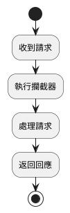
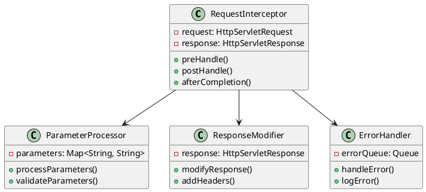
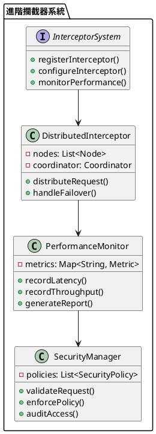

# Spring Interceptor 教學

## 初級（Beginner）層級

### 1. 概念說明
Spring Interceptor 是一個可以攔截請求的工具，就像學校的警衛一樣，可以檢查進出校園的人。初級學習者需要了解：
- 什麼是攔截器（Interceptor）
- 為什麼需要攔截器
- 基本的請求攔截方式

### 2. PlantUML 圖解


### 3. 分段教學步驟

#### 步驟 1：基本專案設定
```xml
<!-- pom.xml -->
<dependencies>
    <dependency>
        <groupId>org.springframework.boot</groupId>
        <artifactId>spring-boot-starter-web</artifactId>
    </dependency>
</dependencies>
```

#### 步驟 2：基本配置
```java
import org.springframework.context.annotation.Configuration;
import org.springframework.web.servlet.config.annotation.InterceptorRegistry;
import org.springframework.web.servlet.config.annotation.WebMvcConfigurer;

@Configuration
public class WebConfig implements WebMvcConfigurer {
    
    @Override
    public void addInterceptors(InterceptorRegistry registry) {
        registry.addInterceptor(new SimpleInterceptor());
    }
}
```

#### 步驟 3：基本使用
```java
import org.springframework.web.servlet.HandlerInterceptor;
import javax.servlet.http.HttpServletRequest;
import javax.servlet.http.HttpServletResponse;

public class SimpleInterceptor implements HandlerInterceptor {
    
    @Override
    public boolean preHandle(HttpServletRequest request, 
                           HttpServletResponse response, 
                           Object handler) {
        System.out.println("請求開始：" + request.getRequestURI());
        return true;
    }
    
    @Override
    public void afterCompletion(HttpServletRequest request, 
                              HttpServletResponse response, 
                              Object handler, 
                              Exception ex) {
        System.out.println("請求結束：" + request.getRequestURI());
    }
}
```

## 中級（Intermediate）層級

### 1. 概念說明
中級學習者需要理解：
- 攔截器的執行順序
- 請求參數的處理
- 回應的修改
- 錯誤處理機制

### 2. PlantUML 圖解


### 3. 分段教學步驟

#### 步驟 1：進階攔截器定義
```java
import org.springframework.web.servlet.HandlerInterceptor;
import javax.servlet.http.HttpServletRequest;
import javax.servlet.http.HttpServletResponse;
import java.util.Map;

public class AdvancedInterceptor implements HandlerInterceptor {
    
    @Override
    public boolean preHandle(HttpServletRequest request, 
                           HttpServletResponse response, 
                           Object handler) {
        // 處理請求參數
        Map<String, String[]> params = request.getParameterMap();
        params.forEach((key, values) -> {
            System.out.println("參數 " + key + ": " + String.join(", ", values));
        });
        
        // 添加請求頭
        response.addHeader("X-Request-Id", request.getSession().getId());
        return true;
    }
    
    @Override
    public void postHandle(HttpServletRequest request, 
                         HttpServletResponse response, 
                         Object handler, 
                         ModelAndView modelAndView) {
        // 修改回應
        if (modelAndView != null) {
            modelAndView.addObject("timestamp", System.currentTimeMillis());
        }
    }
}
```

#### 步驟 2：參數處理
```java
import org.springframework.web.servlet.HandlerInterceptor;
import javax.servlet.http.HttpServletRequest;
import javax.servlet.http.HttpServletResponse;
import java.util.Map;
import java.util.concurrent.ConcurrentHashMap;

public class ParameterInterceptor implements HandlerInterceptor {
    private final Map<String, ParameterStats> stats = new ConcurrentHashMap<>();
    
    @Override
    public boolean preHandle(HttpServletRequest request, 
                           HttpServletResponse response, 
                           Object handler) {
        String path = request.getRequestURI();
        Map<String, String[]> params = request.getParameterMap();
        
        stats.computeIfAbsent(path, k -> new ParameterStats())
             .recordParameters(params.size());
        
        return true;
    }
    
    private static class ParameterStats {
        private int totalRequests = 0;
        private int totalParameters = 0;
        
        void recordParameters(int paramCount) {
            totalRequests++;
            totalParameters += paramCount;
        }
        
        double getAverageParameters() {
            return totalRequests > 0 
                ? (double) totalParameters / totalRequests 
                : 0;
        }
    }
}
```

#### 步驟 3：錯誤處理
```java
import org.springframework.web.servlet.HandlerInterceptor;
import javax.servlet.http.HttpServletRequest;
import javax.servlet.http.HttpServletResponse;
import java.util.concurrent.ConcurrentHashMap;

public class ErrorInterceptor implements HandlerInterceptor {
    private final Map<String, ErrorStats> errorStats = new ConcurrentHashMap<>();
    
    @Override
    public void afterCompletion(HttpServletRequest request, 
                              HttpServletResponse response, 
                              Object handler, 
                              Exception ex) {
        if (ex != null) {
            String path = request.getRequestURI();
            errorStats.computeIfAbsent(path, k -> new ErrorStats())
                     .recordError(ex.getClass().getSimpleName());
            logError(request, ex);
        }
    }
    
    private void logError(HttpServletRequest request, Exception ex) {
        System.err.printf("請求 %s 發生錯誤: %s%n", 
            request.getRequestURI(), 
            ex.getMessage());
    }
}
```

## 高級（Advanced）層級

### 1. 概念說明
高級學習者需要掌握：
- 分散式攔截器
- 效能監控
- 動態配置
- 安全控制

### 2. PlantUML 圖解


### 3. 分段教學步驟

#### 步驟 1：分散式攔截器
```java
import org.springframework.web.servlet.HandlerInterceptor;
import javax.servlet.http.HttpServletRequest;
import javax.servlet.http.HttpServletResponse;
import java.util.List;
import java.util.concurrent.CompletableFuture;

public class DistributedInterceptor implements HandlerInterceptor {
    private final List<InterceptorNode> nodes;
    
    public DistributedInterceptor(List<InterceptorNode> nodes) {
        this.nodes = nodes;
    }
    
    @Override
    public boolean preHandle(HttpServletRequest request, 
                           HttpServletResponse response, 
                           Object handler) {
        return CompletableFuture.allOf(
            nodes.stream()
                .map(node -> node.processRequest(request))
                .toArray(CompletableFuture[]::new)
        ).thenApply(v -> true)
         .exceptionally(ex -> {
             handleNodeFailure(request, ex);
             return false;
         }).join();
    }
    
    private void handleNodeFailure(HttpServletRequest request, Throwable ex) {
        System.err.printf("節點處理請求 %s 失敗: %s%n", 
            request.getRequestURI(), 
            ex.getMessage());
    }
}
```

#### 步驟 2：效能監控
```java
import org.springframework.web.servlet.HandlerInterceptor;
import javax.servlet.http.HttpServletRequest;
import javax.servlet.http.HttpServletResponse;
import java.util.concurrent.ConcurrentHashMap;
import java.util.concurrent.atomic.AtomicLong;

public class PerformanceInterceptor implements HandlerInterceptor {
    private final Map<String, RequestStats> stats = new ConcurrentHashMap<>();
    
    @Override
    public boolean preHandle(HttpServletRequest request, 
                           HttpServletResponse response, 
                           Object handler) {
        String path = request.getRequestURI();
        RequestStats stat = stats.computeIfAbsent(path, k -> new RequestStats());
        stat.startRequest();
        request.setAttribute("startTime", System.currentTimeMillis());
        return true;
    }
    
    @Override
    public void afterCompletion(HttpServletRequest request, 
                              HttpServletResponse response, 
                              Object handler, 
                              Exception ex) {
        String path = request.getRequestURI();
        long startTime = (Long) request.getAttribute("startTime");
        long duration = System.currentTimeMillis() - startTime;
        
        RequestStats stat = stats.get(path);
        stat.endRequest(duration, ex == null);
    }
    
    private static class RequestStats {
        private final AtomicLong totalRequests = new AtomicLong();
        private final AtomicLong successfulRequests = new AtomicLong();
        private final AtomicLong totalDuration = new AtomicLong();
        
        void startRequest() {
            totalRequests.incrementAndGet();
        }
        
        void endRequest(long duration, boolean success) {
            if (success) {
                successfulRequests.incrementAndGet();
            }
            totalDuration.addAndGet(duration);
        }
        
        double getSuccessRate() {
            return totalRequests.get() > 0 
                ? (double) successfulRequests.get() / totalRequests.get() 
                : 0;
        }
        
        double getAverageDuration() {
            return totalRequests.get() > 0 
                ? (double) totalDuration.get() / totalRequests.get() 
                : 0;
        }
    }
}
```

#### 步驟 3：安全控制
```java
import org.springframework.web.servlet.HandlerInterceptor;
import javax.servlet.http.HttpServletRequest;
import javax.servlet.http.HttpServletResponse;
import java.util.List;
import java.util.concurrent.ConcurrentHashMap;

public class SecurityInterceptor implements HandlerInterceptor {
    private final List<SecurityPolicy> policies;
    private final Map<String, AccessStats> accessStats = new ConcurrentHashMap<>();
    
    public SecurityInterceptor(List<SecurityPolicy> policies) {
        this.policies = policies;
    }
    
    @Override
    public boolean preHandle(HttpServletRequest request, 
                           HttpServletResponse response, 
                           Object handler) {
        String path = request.getRequestURI();
        String clientId = request.getHeader("X-Client-Id");
        
        // 檢查訪問權限
        for (SecurityPolicy policy : policies) {
            if (!policy.validate(request)) {
                recordAccess(path, clientId, false);
                response.setStatus(HttpServletResponse.SC_FORBIDDEN);
                return false;
            }
        }
        
        recordAccess(path, clientId, true);
        return true;
    }
    
    private void recordAccess(String path, String clientId, boolean allowed) {
        accessStats.computeIfAbsent(path, k -> new AccessStats())
                  .recordAccess(clientId, allowed);
    }
}
```

這個教學文件提供了從基礎到進階的 Spring Interceptor 學習路徑，每個層級都包含了相應的概念說明、圖解、教學步驟和實作範例。初級學習者可以從基本的請求攔截開始，中級學習者可以學習更複雜的參數處理和錯誤處理，而高級學習者則可以掌握完整的分散式攔截和效能監控。 