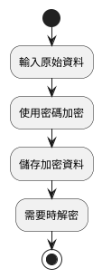
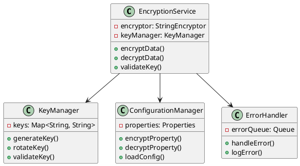
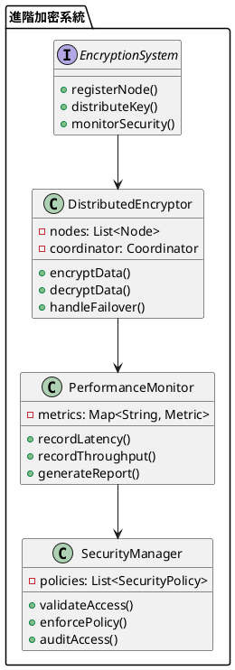

# Spring Jasypt 教學

## 初級（Beginner）層級

### 1. 概念說明
Spring Jasypt 就像是一個密碼保險箱，可以保護重要的資料，就像學校的保險箱一樣。初級學習者需要了解：
- 什麼是加密（Encryption）
- 為什麼需要加密
- 基本的加密和解密方式

### 2. PlantUML 圖解


### 3. 分段教學步驟

#### 步驟 1：基本專案設定
```xml
<!-- pom.xml -->
<dependencies>
    <dependency>
        <groupId>org.springframework.boot</groupId>
        <artifactId>spring-boot-starter</artifactId>
    </dependency>
    <dependency>
        <groupId>com.github.ulisesbocchio</groupId>
        <artifactId>jasypt-spring-boot-starter</artifactId>
        <version>3.0.5</version>
    </dependency>
</dependencies>
```

#### 步驟 2：基本配置
```java
import org.springframework.context.annotation.Configuration;
import org.jasypt.encryption.StringEncryptor;
import org.jasypt.encryption.pbe.StandardPBEStringEncryptor;

@Configuration
public class JasyptConfig {
    
    @Bean
    public StringEncryptor stringEncryptor() {
        StandardPBEStringEncryptor encryptor = new StandardPBEStringEncryptor();
        encryptor.setPassword("mySecretPassword");
        return encryptor;
    }
}
```

#### 步驟 3：基本使用
```java
import org.springframework.beans.factory.annotation.Autowired;
import org.jasypt.encryption.StringEncryptor;

public class SimpleEncryptionService {
    
    @Autowired
    private StringEncryptor encryptor;
    
    public String encryptData(String data) {
        return encryptor.encrypt(data);
    }
    
    public String decryptData(String encryptedData) {
        return encryptor.decrypt(encryptedData);
    }
}
```

## 中級（Intermediate）層級

### 1. 概念說明
中級學習者需要理解：
- 加密演算法的選擇
- 密鑰管理
- 配置檔案的加密
- 錯誤處理機制

### 2. PlantUML 圖解


### 3. 分段教學步驟

#### 步驟 1：進階加密服務
```java
import org.springframework.beans.factory.annotation.Autowired;
import org.jasypt.encryption.StringEncryptor;
import java.util.Map;
import java.util.concurrent.ConcurrentHashMap;

public class AdvancedEncryptionService {
    
    @Autowired
    private StringEncryptor encryptor;
    
    private final Map<String, String> encryptedData = new ConcurrentHashMap<>();
    
    public String encryptData(String data, String keyId) {
        try {
            String encrypted = encryptor.encrypt(data);
            encryptedData.put(keyId, encrypted);
            return encrypted;
        } catch (Exception ex) {
            handleEncryptionError(ex);
            return null;
        }
    }
    
    public String decryptData(String keyId) {
        try {
            String encrypted = encryptedData.get(keyId);
            return encrypted != null ? encryptor.decrypt(encrypted) : null;
        } catch (Exception ex) {
            handleDecryptionError(ex);
            return null;
        }
    }
    
    private void handleEncryptionError(Exception ex) {
        System.err.println("加密失敗: " + ex.getMessage());
    }
    
    private void handleDecryptionError(Exception ex) {
        System.err.println("解密失敗: " + ex.getMessage());
    }
}
```

#### 步驟 2：密鑰管理
```java
import org.springframework.beans.factory.annotation.Autowired;
import org.jasypt.encryption.StringEncryptor;
import java.util.Map;
import java.util.concurrent.ConcurrentHashMap;

public class KeyManager {
    private final Map<String, String> keys = new ConcurrentHashMap<>();
    
    @Autowired
    private StringEncryptor encryptor;
    
    public String generateKey(String keyId) {
        String key = generateRandomKey();
        keys.put(keyId, key);
        return key;
    }
    
    public void rotateKey(String keyId) {
        String newKey = generateRandomKey();
        keys.put(keyId, newKey);
    }
    
    public boolean validateKey(String keyId, String key) {
        return keys.get(keyId).equals(key);
    }
    
    private String generateRandomKey() {
        // 生成隨機密鑰的邏輯
        return "randomKey" + System.currentTimeMillis();
    }
}
```

#### 步驟 3：配置檔案加密
```java
import org.springframework.beans.factory.annotation.Autowired;
import org.jasypt.encryption.StringEncryptor;
import java.util.Properties;
import java.util.concurrent.ConcurrentHashMap;

public class ConfigurationManager {
    private final Properties properties = new Properties();
    
    @Autowired
    private StringEncryptor encryptor;
    
    public void encryptProperty(String key, String value) {
        String encrypted = encryptor.encrypt(value);
        properties.setProperty(key, encrypted);
    }
    
    public String decryptProperty(String key) {
        String encrypted = properties.getProperty(key);
        return encrypted != null ? encryptor.decrypt(encrypted) : null;
    }
    
    public void loadConfig(Map<String, String> config) {
        config.forEach(this::encryptProperty);
    }
}
```

## 高級（Advanced）層級

### 1. 概念說明
高級學習者需要掌握：
- 分散式加密系統
- 效能優化
- 動態密鑰管理
- 安全監控

### 2. PlantUML 圖解


### 3. 分段教學步驟

#### 步驟 1：分散式加密系統
```java
import org.springframework.beans.factory.annotation.Autowired;
import org.jasypt.encryption.StringEncryptor;
import java.util.List;
import java.util.concurrent.CompletableFuture;

public class DistributedEncryptionService {
    private final List<EncryptionNode> nodes;
    
    @Autowired
    private StringEncryptor encryptor;
    
    public DistributedEncryptionService(List<EncryptionNode> nodes) {
        this.nodes = nodes;
    }
    
    public CompletableFuture<String> encryptData(String data) {
        return CompletableFuture.supplyAsync(() -> {
            try {
                return encryptor.encrypt(data);
            } catch (Exception ex) {
                handleEncryptionError(ex);
                return null;
            }
        });
    }
    
    public CompletableFuture<String> decryptData(String encryptedData) {
        return CompletableFuture.supplyAsync(() -> {
            try {
                return encryptor.decrypt(encryptedData);
            } catch (Exception ex) {
                handleDecryptionError(ex);
                return null;
            }
        });
    }
    
    private void handleEncryptionError(Exception ex) {
        System.err.println("分散式加密失敗: " + ex.getMessage());
    }
    
    private void handleDecryptionError(Exception ex) {
        System.err.println("分散式解密失敗: " + ex.getMessage());
    }
}
```

#### 步驟 2：效能監控
```java
import org.springframework.beans.factory.annotation.Autowired;
import org.jasypt.encryption.StringEncryptor;
import java.util.concurrent.ConcurrentHashMap;
import java.util.concurrent.atomic.AtomicLong;

public class PerformanceMonitor {
    private final Map<String, OperationStats> stats = new ConcurrentHashMap<>();
    
    @Autowired
    private StringEncryptor encryptor;
    
    public String encryptWithMetrics(String data) {
        long startTime = System.currentTimeMillis();
        try {
            String result = encryptor.encrypt(data);
            recordOperation("encrypt", System.currentTimeMillis() - startTime, true);
            return result;
        } catch (Exception ex) {
            recordOperation("encrypt", System.currentTimeMillis() - startTime, false);
            throw ex;
        }
    }
    
    private void recordOperation(String operation, long duration, boolean success) {
        OperationStats stat = stats.computeIfAbsent(operation, k -> new OperationStats());
        stat.recordOperation(duration, success);
    }
    
    private static class OperationStats {
        private final AtomicLong totalOperations = new AtomicLong();
        private final AtomicLong successfulOperations = new AtomicLong();
        private final AtomicLong totalDuration = new AtomicLong();
        
        void recordOperation(long duration, boolean success) {
            totalOperations.incrementAndGet();
            if (success) {
                successfulOperations.incrementAndGet();
            }
            totalDuration.addAndGet(duration);
        }
        
        double getSuccessRate() {
            return totalOperations.get() > 0 
                ? (double) successfulOperations.get() / totalOperations.get() 
                : 0;
        }
        
        double getAverageDuration() {
            return totalOperations.get() > 0 
                ? (double) totalDuration.get() / totalOperations.get() 
                : 0;
        }
    }
}
```

#### 步驟 3：安全控制
```java
import org.springframework.beans.factory.annotation.Autowired;
import org.jasypt.encryption.StringEncryptor;
import java.util.List;
import java.util.concurrent.ConcurrentHashMap;

public class SecurityManager {
    private final List<SecurityPolicy> policies;
    private final Map<String, AccessStats> accessStats = new ConcurrentHashMap<>();
    
    @Autowired
    private StringEncryptor encryptor;
    
    public SecurityManager(List<SecurityPolicy> policies) {
        this.policies = policies;
    }
    
    public String encryptWithSecurity(String data, String clientId) {
        // 檢查訪問權限
        for (SecurityPolicy policy : policies) {
            if (!policy.validateAccess(clientId)) {
                recordAccess(clientId, false);
                throw new SecurityException("訪問被拒絕");
            }
        }
        
        try {
            String result = encryptor.encrypt(data);
            recordAccess(clientId, true);
            return result;
        } catch (Exception ex) {
            recordAccess(clientId, false);
            throw ex;
        }
    }
    
    private void recordAccess(String clientId, boolean allowed) {
        accessStats.computeIfAbsent(clientId, k -> new AccessStats())
                  .recordAccess(allowed);
    }
}
```

這個教學文件提供了從基礎到進階的 Spring Jasypt 學習路徑，每個層級都包含了相應的概念說明、圖解、教學步驟和實作範例。初級學習者可以從基本的加密解密開始，中級學習者可以學習更複雜的密鑰管理和配置加密，而高級學習者則可以掌握完整的分散式加密系統和效能監控。 