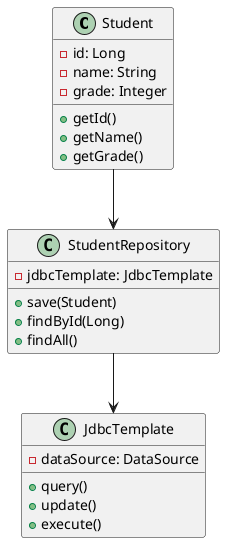
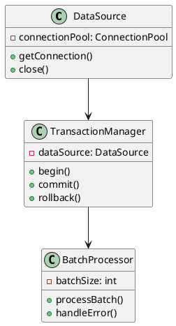
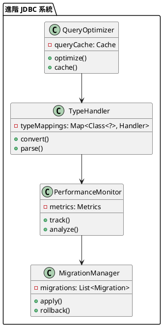

# Spring JDBC 教學

## 初級（Beginner）層級

### 1. 概念說明
Spring JDBC 就像是一個班級的班長，幫助我們管理班級資料。初級學習者需要了解：
- 什麼是資料庫
- 為什麼需要 Spring JDBC
- 基本的資料庫操作

### 2. PlantUML 圖解


### 3. 分段教學步驟

#### 步驟 1：基本專案設定
```xml
<!-- pom.xml -->
<dependencies>
    <dependency>
        <groupId>org.springframework.boot</groupId>
        <artifactId>spring-boot-starter-jdbc</artifactId>
        <version>3.3.10</version>
    </dependency>
    <dependency>
        <groupId>com.h2database</groupId>
        <artifactId>h2</artifactId>
        <version>2.2.224</version>
    </dependency>
</dependencies>
```

#### 步驟 2：基本配置
```yaml
# application.yml
spring:
  datasource:
    url: jdbc:h2:mem:testdb
    username: sa
    password: 
    driver-class-name: org.h2.Driver
  sql:
    init:
      mode: always
      schema-locations: classpath:schema.sql
      data-locations: classpath:data.sql
```

#### 步驟 3：簡單範例
```java
import org.springframework.jdbc.core.*;
import org.springframework.stereotype.Repository;

@Repository
public class StudentRepository {
    private final JdbcTemplate jdbcTemplate;
    
    public StudentRepository(JdbcTemplate jdbcTemplate) {
        this.jdbcTemplate = jdbcTemplate;
    }
    
    public void save(Student student) {
        String sql = "INSERT INTO students (name, grade) VALUES (?, ?)";
        jdbcTemplate.update(sql, student.getName(), student.getGrade());
    }
    
    public Student findById(Long id) {
        String sql = "SELECT * FROM students WHERE id = ?";
        return jdbcTemplate.queryForObject(sql, new Object[]{id}, 
            (rs, rowNum) -> new Student(
                rs.getLong("id"),
                rs.getString("name"),
                rs.getInt("grade")
            ));
    }
}
```

## 中級（Intermediate）層級

### 1. 概念說明
中級學習者需要理解：
- 資料庫連接池
- 事務管理
- 批次處理
- 錯誤處理

### 2. PlantUML 圖解


### 3. 分段教學步驟

#### 步驟 1：資料庫連接池配置
```java
import org.springframework.context.annotation.*;
import org.springframework.jdbc.datasource.DataSourceTransactionManager;
import org.springframework.transaction.PlatformTransactionManager;
import com.zaxxer.hikari.HikariDataSource;

@Configuration
public class DatabaseConfig {
    
    @Bean
    public DataSource dataSource() {
        HikariDataSource dataSource = new HikariDataSource();
        dataSource.setJdbcUrl("jdbc:h2:mem:testdb");
        dataSource.setUsername("sa");
        dataSource.setPassword("");
        dataSource.setMaximumPoolSize(10);
        return dataSource;
    }
    
    @Bean
    public PlatformTransactionManager transactionManager(DataSource dataSource) {
        return new DataSourceTransactionManager(dataSource);
    }
}
```

#### 步驟 2：事務管理
```java
import org.springframework.transaction.annotation.*;
import org.springframework.stereotype.Service;

@Service
public class StudentService {
    private final StudentRepository studentRepository;
    
    public StudentService(StudentRepository studentRepository) {
        this.studentRepository = studentRepository;
    }
    
    @Transactional
    public void updateStudentGrade(Long id, int newGrade) {
        Student student = studentRepository.findById(id);
        student.setGrade(newGrade);
        studentRepository.save(student);
    }
}
```

#### 步驟 3：批次處理
```java
import org.springframework.jdbc.core.*;
import org.springframework.stereotype.Repository;

@Repository
public class StudentRepository {
    private final JdbcTemplate jdbcTemplate;
    
    public StudentRepository(JdbcTemplate jdbcTemplate) {
        this.jdbcTemplate = jdbcTemplate;
    }
    
    public void batchInsert(List<Student> students) {
        String sql = "INSERT INTO students (name, grade) VALUES (?, ?)";
        jdbcTemplate.batchUpdate(sql, new BatchPreparedStatementSetter() {
            @Override
            public void setValues(PreparedStatement ps, int i) throws SQLException {
                Student student = students.get(i);
                ps.setString(1, student.getName());
                ps.setInt(2, student.getGrade());
            }
            
            @Override
            public int getBatchSize() {
                return students.size();
            }
        });
    }
}
```

## 高級（Advanced）層級

### 1. 概念說明
高級學習者需要掌握：
- 進階查詢優化
- 自定義類型處理
- 效能監控
- 資料庫遷移

### 2. PlantUML 圖解


### 3. 分段教學步驟

#### 步驟 1：進階查詢優化
```java
import org.springframework.jdbc.core.*;
import org.springframework.stereotype.Repository;

@Repository
public class StudentRepository {
    private final JdbcTemplate jdbcTemplate;
    private final NamedParameterJdbcTemplate namedParameterJdbcTemplate;
    
    public StudentRepository(JdbcTemplate jdbcTemplate) {
        this.jdbcTemplate = jdbcTemplate;
        this.namedParameterJdbcTemplate = new NamedParameterJdbcTemplate(jdbcTemplate);
    }
    
    public List<Student> findTopStudents(int limit) {
        String sql = """
            SELECT s.* FROM students s
            WHERE s.grade >= :minGrade
            ORDER BY s.grade DESC
            LIMIT :limit
        """;
        
        Map<String, Object> params = new HashMap<>();
        params.put("minGrade", 90);
        params.put("limit", limit);
        
        return namedParameterJdbcTemplate.query(sql, params, 
            (rs, rowNum) -> new Student(
                rs.getLong("id"),
                rs.getString("name"),
                rs.getInt("grade")
            ));
    }
}
```

#### 步驟 2：自定義類型處理
```java
import org.springframework.jdbc.core.*;
import org.springframework.stereotype.Repository;
import java.sql.*;

@Repository
public class StudentRepository {
    private final JdbcTemplate jdbcTemplate;
    
    public StudentRepository(JdbcTemplate jdbcTemplate) {
        this.jdbcTemplate = jdbcTemplate;
        jdbcTemplate.setTypeHandler(new GradeTypeHandler());
    }
    
    private static class GradeTypeHandler implements TypeHandler<Integer> {
        @Override
        public void setParameter(PreparedStatement ps, int i, Integer grade, JdbcType jdbcType) 
                throws SQLException {
            ps.setInt(i, grade);
        }
        
        @Override
        public Integer getResult(ResultSet rs, String columnName) throws SQLException {
            int grade = rs.getInt(columnName);
            return grade >= 0 ? grade : null;
        }
        
        @Override
        public Integer getResult(ResultSet rs, int columnIndex) throws SQLException {
            int grade = rs.getInt(columnIndex);
            return grade >= 0 ? grade : null;
        }
        
        @Override
        public Integer getResult(CallableStatement cs, int columnIndex) throws SQLException {
            int grade = cs.getInt(columnIndex);
            return grade >= 0 ? grade : null;
        }
    }
}
```

#### 步驟 3：效能監控
```java
import org.springframework.jdbc.core.*;
import org.springframework.stereotype.Repository;
import java.util.Map;
import java.util.concurrent.ConcurrentHashMap;

@Repository
public class StudentRepository {
    private final JdbcTemplate jdbcTemplate;
    private final Map<String, QueryMetrics> metrics = new ConcurrentHashMap<>();
    
    public StudentRepository(JdbcTemplate jdbcTemplate) {
        this.jdbcTemplate = jdbcTemplate;
    }
    
    public List<Student> findAll() {
        long startTime = System.currentTimeMillis();
        try {
            String sql = "SELECT * FROM students";
            List<Student> students = jdbcTemplate.query(sql, 
                (rs, rowNum) -> new Student(
                    rs.getLong("id"),
                    rs.getString("name"),
                    rs.getInt("grade")
                ));
            
            recordMetrics("findAll", startTime, true);
            return students;
        } catch (Exception e) {
            recordMetrics("findAll", startTime, false);
            throw e;
        }
    }
    
    private void recordMetrics(String operation, long startTime, boolean success) {
        long duration = System.currentTimeMillis() - startTime;
        metrics.compute(operation, (key, value) -> {
            if (value == null) {
                return new QueryMetrics(duration, success);
            }
            value.update(duration, success);
            return value;
        });
    }
}
```

這個教學文件提供了從基礎到進階的 Spring JDBC 學習路徑，每個層級都包含了相應的概念說明、圖解、教學步驟和實作範例。初級學習者可以從基本的資料庫操作開始，中級學習者可以學習更複雜的事務管理和批次處理，而高級學習者則可以掌握進階查詢優化和效能監控等進階功能。 