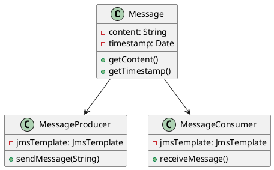
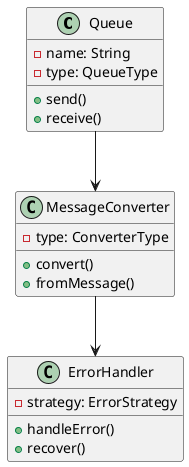
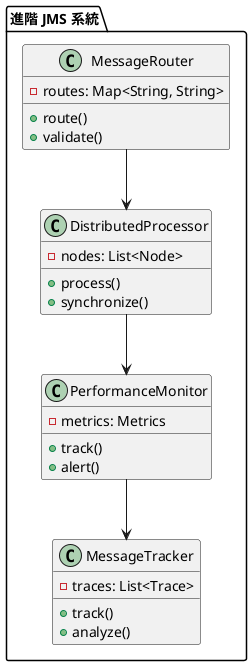

# Spring JMS 教學

## 初級（Beginner）層級

### 1. 概念說明
Spring JMS 就像是一個班級的傳話筒系統，幫助同學們互相傳遞訊息。初級學習者需要了解：
- 什麼是訊息佇列
- 為什麼需要 JMS
- 基本的訊息傳送和接收

### 2. PlantUML 圖解


### 3. 分段教學步驟

#### 步驟 1：基本專案設定
```xml
<!-- pom.xml -->
<dependencies>
    <dependency>
        <groupId>org.springframework.boot</groupId>
        <artifactId>spring-boot-starter-activemq</artifactId>
        <version>3.3.10</version>
    </dependency>
</dependencies>
```

#### 步驟 2：基本配置
```yaml
# application.yml
spring:
  activemq:
    broker-url: tcp://localhost:61616
    user: admin
    password: admin
```

#### 步驟 3：簡單範例
```java
import org.springframework.jms.core.*;
import org.springframework.stereotype.Component;

@Component
public class ClassMessageService {
    private final JmsTemplate jmsTemplate;
    
    public ClassMessageService(JmsTemplate jmsTemplate) {
        this.jmsTemplate = jmsTemplate;
    }
    
    public void sendMessage(String message) {
        jmsTemplate.convertAndSend("class.notice", message);
    }
    
    public String receiveMessage() {
        return (String) jmsTemplate.receiveAndConvert("class.notice");
    }
}
```

## 中級（Intermediate）層級

### 1. 概念說明
中級學習者需要理解：
- 訊息佇列類型
- 訊息確認機制
- 訊息轉換器
- 錯誤處理

### 2. PlantUML 圖解


### 3. 分段教學步驟

#### 步驟 1：佇列配置
```java
import org.springframework.context.annotation.*;
import org.springframework.jms.config.*;
import org.apache.activemq.command.ActiveMQQueue;

@Configuration
public class JmsConfig {
    
    @Bean
    public ActiveMQQueue homeworkQueue() {
        return new ActiveMQQueue("homework.queue");
    }
    
    @Bean
    public ActiveMQQueue examQueue() {
        return new ActiveMQQueue("exam.queue");
    }
    
    @Bean
    public JmsListenerContainerFactory<?> jmsListenerContainerFactory(
            ConnectionFactory connectionFactory,
            DefaultJmsListenerContainerFactoryConfigurer configurer) {
        DefaultJmsListenerContainerFactory factory = new DefaultJmsListenerContainerFactory();
        configurer.configure(factory, connectionFactory);
        return factory;
    }
}
```

#### 步驟 2：訊息監聽器
```java
import org.springframework.jms.annotation.*;
import org.springframework.stereotype.Component;

@Component
public class ClassMessageListener {
    
    @JmsListener(destination = "homework.queue")
    public void handleHomework(String message) {
        System.out.println("收到作業通知: " + message);
    }
    
    @JmsListener(destination = "exam.queue")
    public void handleExam(String message) {
        System.out.println("收到考試通知: " + message);
    }
}
```

#### 步驟 3：錯誤處理
```java
import org.springframework.jms.annotation.*;
import org.springframework.stereotype.Component;

@Component
public class MessageErrorHandler {
    
    @JmsListener(destination = "error.queue")
    public void handleError(String errorMessage) {
        System.out.println("處理錯誤訊息: " + errorMessage);
    }
    
    @JmsListener(destination = "homework.queue")
    public void processHomework(String message) {
        try {
            if (message == null || message.isEmpty()) {
                throw new IllegalArgumentException("訊息不能為空");
            }
            System.out.println("處理作業通知: " + message);
        } catch (Exception e) {
            System.out.println("處理作業通知時發生錯誤: " + e.getMessage());
        }
    }
}
```

## 高級（Advanced）層級

### 1. 概念說明
高級學習者需要掌握：
- 進階訊息路由
- 分散式訊息處理
- 效能優化
- 監控和追蹤

### 2. PlantUML 圖解


### 3. 分段教學步驟

#### 步驟 1：進階訊息路由
```java
import org.springframework.jms.annotation.*;
import org.springframework.stereotype.Component;

@Component
public class AdvancedMessageRouter {
    
    @JmsListener(destination = "message.router")
    public void routeMessage(String message) {
        if (message.contains("緊急")) {
            jmsTemplate.convertAndSend("emergency.queue", message);
        } else if (message.contains("通知")) {
            jmsTemplate.convertAndSend("notification.queue", message);
        } else {
            jmsTemplate.convertAndSend("default.queue", message);
        }
    }
}
```

#### 步驟 2：分散式訊息處理
```java
import org.springframework.jms.annotation.*;
import org.springframework.stereotype.Component;

@Component
public class DistributedMessageProcessor {
    
    @JmsListener(destination = "distributed.queue")
    public void processMessage(String message) {
        System.out.println("處理分散式訊息: " + message);
        // 同步到其他節點
        syncToOtherNodes(message);
    }
    
    private void syncToOtherNodes(String message) {
        // 實現同步邏輯
    }
}
```

#### 步驟 3：效能監控
```java
import org.springframework.jms.annotation.*;
import org.springframework.stereotype.Component;
import java.util.Map;
import java.util.concurrent.ConcurrentHashMap;

@Component
public class MessagePerformanceMonitor {
    private final Map<String, MessageMetrics> metrics = new ConcurrentHashMap<>();
    
    @JmsListener(destination = "monitored.queue")
    public void processMonitoredMessage(String message) {
        long startTime = System.currentTimeMillis();
        try {
            System.out.println("處理監控訊息: " + message);
            recordMetrics("processMessage", startTime, true);
        } catch (Exception e) {
            recordMetrics("processMessage", startTime, false);
            throw e;
        }
    }
    
    private void recordMetrics(String operation, long startTime, boolean success) {
        long duration = System.currentTimeMillis() - startTime;
        metrics.compute(operation, (key, value) -> {
            if (value == null) {
                return new MessageMetrics(duration, success);
            }
            value.update(duration, success);
            return value;
        });
    }
}
```

這個教學文件提供了從基礎到進階的 Spring JMS 學習路徑，每個層級都包含了相應的概念說明、圖解、教學步驟和實作範例。初級學習者可以從基本的訊息傳送和接收開始，中級學習者可以學習更複雜的訊息佇列和錯誤處理，而高級學習者則可以掌握進階訊息路由和分散式處理等進階功能。 