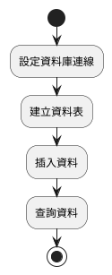
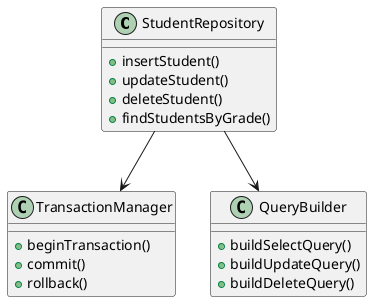
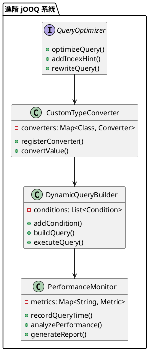

# Spring 使用 jOOQ 教學

## 初級（Beginner）層級

### 1. 概念說明
jOOQ 是一個幫助我們更容易操作資料庫的工具。初級學習者需要了解：
- 什麼是 jOOQ
- 基本的資料庫操作
- 簡單的查詢和更新

### 2. PlantUML 圖解


### 3. 分段教學步驟

#### 步驟 1：基本專案設定
```xml
<!-- pom.xml -->
<dependencies>
    <dependency>
        <groupId>org.springframework.boot</groupId>
        <artifactId>spring-boot-starter-jooq</artifactId>
    </dependency>
    <dependency>
        <groupId>com.h2database</groupId>
        <artifactId>h2</artifactId>
        <scope>runtime</scope>
    </dependency>
</dependencies>
```

#### 步驟 2：建立資料表
```sql
-- src/main/resources/schema.sql
CREATE TABLE student (
    id INT PRIMARY KEY AUTO_INCREMENT,
    name VARCHAR(100) NOT NULL,
    age INT NOT NULL,
    grade VARCHAR(10) NOT NULL
);
```

#### 步驟 3：基本操作
```java
import org.jooq.DSLContext;
import org.springframework.beans.factory.annotation.Autowired;
import org.springframework.stereotype.Repository;
import static org.jooq.generated.Tables.STUDENT;

@Repository
public class StudentRepository {
    @Autowired
    private DSLContext dsl;

    public void insertStudent(String name, int age, String grade) {
        dsl.insertInto(STUDENT)
           .set(STUDENT.NAME, name)
           .set(STUDENT.AGE, age)
           .set(STUDENT.GRADE, grade)
           .execute();
    }

    public List<Student> getAllStudents() {
        return dsl.selectFrom(STUDENT)
                 .fetchInto(Student.class);
    }
}
```

## 中級（Intermediate）層級

### 1. 概念說明
中級學習者需要理解：
- 複雜的查詢操作
- 交易管理
- 資料驗證
- 效能優化

### 2. PlantUML 圖解


### 3. 分段教學步驟

#### 步驟 1：複雜查詢
```java
import org.jooq.DSLContext;
import org.springframework.beans.factory.annotation.Autowired;
import org.springframework.stereotype.Repository;
import static org.jooq.generated.Tables.STUDENT;

@Repository
public class AdvancedStudentRepository {
    @Autowired
    private DSLContext dsl;

    public List<Student> findStudentsByGradeAndAge(String grade, int minAge) {
        return dsl.selectFrom(STUDENT)
                 .where(STUDENT.GRADE.eq(grade))
                 .and(STUDENT.AGE.ge(minAge))
                 .orderBy(STUDENT.AGE.desc())
                 .fetchInto(Student.class);
    }

    public void updateStudentGrade(int id, String newGrade) {
        dsl.update(STUDENT)
           .set(STUDENT.GRADE, newGrade)
           .where(STUDENT.ID.eq(id))
           .execute();
    }
}
```

#### 步驟 2：交易管理
```java
import org.springframework.transaction.annotation.Transactional;
import org.springframework.beans.factory.annotation.Autowired;
import org.springframework.stereotype.Service;

@Service
public class StudentService {
    @Autowired
    private StudentRepository studentRepository;

    @Transactional
    public void transferStudent(int studentId, String newGrade) {
        // 檢查學生是否存在
        Student student = studentRepository.findById(studentId);
        if (student == null) {
            throw new RuntimeException("學生不存在");
        }

        // 更新年級
        studentRepository.updateStudentGrade(studentId, newGrade);

        // 記錄轉班日誌
        studentRepository.logGradeChange(studentId, student.getGrade(), newGrade);
    }
}
```

#### 步驟 3：資料驗證
```java
import org.springframework.stereotype.Component;
import org.jooq.Record;
import org.jooq.Result;

@Component
public class StudentValidator {
    public void validateStudentData(Student student) {
        if (student.getName() == null || student.getName().isEmpty()) {
            throw new IllegalArgumentException("學生姓名不能為空");
        }
        if (student.getAge() < 0 || student.getAge() > 100) {
            throw new IllegalArgumentException("年齡必須在 0-100 之間");
        }
        if (!isValidGrade(student.getGrade())) {
            throw new IllegalArgumentException("無效的年級");
        }
    }

    private boolean isValidGrade(String grade) {
        return grade.matches("^[1-9][A-Z]$");
    }
}
```

## 高級（Advanced）層級

### 1. 概念說明
高級學習者需要掌握：
- 進階查詢優化
- 自訂類型轉換
- 動態查詢建構
- 效能監控

### 2. PlantUML 圖解


### 3. 分段教學步驟

#### 步驟 1：自訂類型轉換
```java
import org.jooq.Converter;
import org.springframework.context.annotation.Bean;
import org.springframework.context.annotation.Configuration;

@Configuration
public class CustomConverterConfig {
    @Bean
    public Converter<String, Grade> gradeConverter() {
        return new Converter<String, Grade>() {
            @Override
            public Grade from(String databaseObject) {
                return Grade.fromString(databaseObject);
            }

            @Override
            public String to(Grade userObject) {
                return userObject.toString();
            }

            @Override
            public Class<String> fromType() {
                return String.class;
            }

            @Override
            public Class<Grade> toType() {
                return Grade.class;
            }
        };
    }
}

public enum Grade {
    GRADE_1A("1A"),
    GRADE_1B("1B"),
    GRADE_2A("2A"),
    GRADE_2B("2B");

    private final String value;

    Grade(String value) {
        this.value = value;
    }

    public static Grade fromString(String value) {
        for (Grade grade : values()) {
            if (grade.value.equals(value)) {
                return grade;
            }
        }
        throw new IllegalArgumentException("無效的年級: " + value);
    }

    @Override
    public String toString() {
        return value;
    }
}
```

#### 步驟 2：動態查詢建構
```java
import org.jooq.*;
import org.springframework.stereotype.Repository;
import java.util.List;
import java.util.Map;

@Repository
public class DynamicQueryRepository {
    @Autowired
    private DSLContext dsl;

    public List<Student> findStudents(Map<String, Object> criteria) {
        SelectQuery<Record> query = dsl.selectQuery();
        query.addFrom(STUDENT);

        criteria.forEach((field, value) -> {
            switch (field) {
                case "name":
                    query.addConditions(STUDENT.NAME.like("%" + value + "%"));
                    break;
                case "age":
                    query.addConditions(STUDENT.AGE.eq((Integer) value));
                    break;
                case "grade":
                    query.addConditions(STUDENT.GRADE.eq((String) value));
                    break;
            }
        });

        return query.fetchInto(Student.class);
    }
}
```

#### 步驟 3：效能監控
```java
import org.aspectj.lang.ProceedingJoinPoint;
import org.aspectj.lang.annotation.Around;
import org.aspectj.lang.annotation.Aspect;
import org.springframework.stereotype.Component;
import java.util.concurrent.ConcurrentHashMap;

@Aspect
@Component
public class QueryPerformanceMonitor {
    private final Map<String, QueryMetrics> metrics = new ConcurrentHashMap<>();

    @Around("execution(* org.jooq.DSLContext.*(..))")
    public Object monitorQuery(ProceedingJoinPoint joinPoint) throws Throwable {
        long startTime = System.currentTimeMillis();
        String queryName = joinPoint.getSignature().getName();

        try {
            Object result = joinPoint.proceed();
            long executionTime = System.currentTimeMillis() - startTime;

            metrics.computeIfAbsent(queryName, k -> new QueryMetrics())
                  .recordExecution(executionTime);

            return result;
        } catch (Exception e) {
            metrics.computeIfAbsent(queryName, k -> new QueryMetrics())
                  .recordError();
            throw e;
        }
    }

    private static class QueryMetrics {
        private long totalExecutions = 0;
        private long totalTime = 0;
        private long errorCount = 0;

        void recordExecution(long executionTime) {
            totalExecutions++;
            totalTime += executionTime;
        }

        void recordError() {
            errorCount++;
        }

        double getAverageExecutionTime() {
            return totalExecutions > 0 ? (double) totalTime / totalExecutions : 0;
        }
    }
}
```

這個教學文件提供了從基礎到進階的 Spring 使用 jOOQ 學習路徑，每個層級都包含了相應的概念說明、圖解、教學步驟和實作範例。初級學習者可以從基本的資料庫操作開始，中級學習者可以學習更複雜的查詢和交易管理，而高級學習者則可以掌握完整的效能優化和監控。 