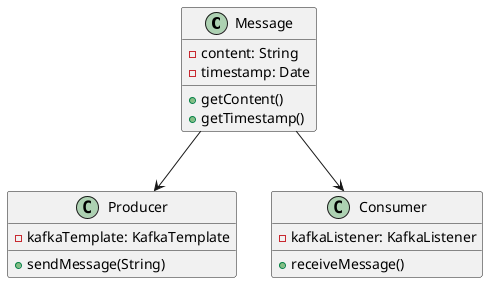
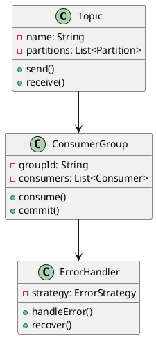
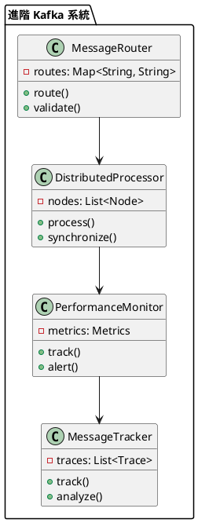

# Spring Kafka 教學

## 初級（Beginner）層級

### 1. 概念說明
Spring Kafka 就像是一個班級的廣播系統，可以同時向多個同學發送訊息。初級學習者需要了解：
- 什麼是 Kafka
- 為什麼需要 Kafka
- 基本的訊息發送和接收

### 2. PlantUML 圖解


### 3. 分段教學步驟

#### 步驟 1：基本專案設定
```xml
<!-- pom.xml -->
<dependencies>
    <dependency>
        <groupId>org.springframework.kafka</groupId>
        <artifactId>spring-kafka</artifactId>
        <version>3.1.4</version>
    </dependency>
</dependencies>
```

#### 步驟 2：基本配置
```yaml
# application.yml
spring:
  kafka:
    bootstrap-servers: localhost:9092
    producer:
      key-serializer: org.apache.kafka.common.serialization.StringSerializer
      value-serializer: org.apache.kafka.common.serialization.StringSerializer
    consumer:
      group-id: class-group
      key-deserializer: org.apache.kafka.common.serialization.StringDeserializer
      value-deserializer: org.apache.kafka.common.serialization.StringDeserializer
```

#### 步驟 3：簡單範例
```java
import org.springframework.kafka.core.*;
import org.springframework.stereotype.Component;

@Component
public class ClassMessageService {
    private final KafkaTemplate<String, String> kafkaTemplate;
    
    public ClassMessageService(KafkaTemplate<String, String> kafkaTemplate) {
        this.kafkaTemplate = kafkaTemplate;
    }
    
    public void sendMessage(String message) {
        kafkaTemplate.send("class.notice", message);
    }
    
    @KafkaListener(topics = "class.notice")
    public void receiveMessage(String message) {
        System.out.println("收到班級通知: " + message);
    }
}
```

## 中級（Intermediate）層級

### 1. 概念說明
中級學習者需要理解：
- 主題和分區
- 消費者群組
- 訊息序列化
- 錯誤處理

### 2. PlantUML 圖解


### 3. 分段教學步驟

#### 步驟 1：主題配置
```java
import org.springframework.context.annotation.*;
import org.springframework.kafka.config.*;
import org.apache.kafka.clients.admin.*;

@Configuration
public class KafkaConfig {
    
    @Bean
    public NewTopic homeworkTopic() {
        return TopicBuilder.name("homework.topic")
                .partitions(3)
                .replicas(1)
                .build();
    }
    
    @Bean
    public NewTopic examTopic() {
        return TopicBuilder.name("exam.topic")
                .partitions(3)
                .replicas(1)
                .build();
    }
}
```

#### 步驟 2：消費者配置
```java
import org.springframework.kafka.annotation.*;
import org.springframework.stereotype.Component;

@Component
public class ClassMessageListener {
    
    @KafkaListener(topics = "homework.topic", groupId = "homework-group")
    public void handleHomework(String message) {
        System.out.println("收到作業通知: " + message);
    }
    
    @KafkaListener(topics = "exam.topic", groupId = "exam-group")
    public void handleExam(String message) {
        System.out.println("收到考試通知: " + message);
    }
}
```

#### 步驟 3：錯誤處理
```java
import org.springframework.kafka.annotation.*;
import org.springframework.stereotype.Component;

@Component
public class MessageErrorHandler {
    
    @KafkaListener(topics = "error.topic")
    public void handleError(String errorMessage) {
        System.out.println("處理錯誤訊息: " + errorMessage);
    }
    
    @KafkaListener(topics = "homework.topic")
    public void processHomework(String message) {
        try {
            if (message == null || message.isEmpty()) {
                throw new IllegalArgumentException("訊息不能為空");
            }
            System.out.println("處理作業通知: " + message);
        } catch (Exception e) {
            System.out.println("處理作業通知時發生錯誤: " + e.getMessage());
        }
    }
}
```

## 高級（Advanced）層級

### 1. 概念說明
高級學習者需要掌握：
- 進階訊息路由
- 分散式處理
- 效能優化
- 監控和追蹤

### 2. PlantUML 圖解


### 3. 分段教學步驟

#### 步驟 1：進階訊息路由
```java
import org.springframework.kafka.annotation.*;
import org.springframework.stereotype.Component;

@Component
public class AdvancedMessageRouter {
    
    @KafkaListener(topics = "message.router")
    public void routeMessage(String message) {
        if (message.contains("緊急")) {
            kafkaTemplate.send("emergency.topic", message);
        } else if (message.contains("通知")) {
            kafkaTemplate.send("notification.topic", message);
        } else {
            kafkaTemplate.send("default.topic", message);
        }
    }
}
```

#### 步驟 2：分散式處理
```java
import org.springframework.kafka.annotation.*;
import org.springframework.stereotype.Component;

@Component
public class DistributedMessageProcessor {
    
    @KafkaListener(topics = "distributed.topic")
    public void processMessage(String message) {
        System.out.println("處理分散式訊息: " + message);
        // 同步到其他節點
        syncToOtherNodes(message);
    }
    
    private void syncToOtherNodes(String message) {
        // 實現同步邏輯
    }
}
```

#### 步驟 3：效能監控
```java
import org.springframework.kafka.annotation.*;
import org.springframework.stereotype.Component;
import java.util.Map;
import java.util.concurrent.ConcurrentHashMap;

@Component
public class MessagePerformanceMonitor {
    private final Map<String, MessageMetrics> metrics = new ConcurrentHashMap<>();
    
    @KafkaListener(topics = "monitored.topic")
    public void processMonitoredMessage(String message) {
        long startTime = System.currentTimeMillis();
        try {
            System.out.println("處理監控訊息: " + message);
            recordMetrics("processMessage", startTime, true);
        } catch (Exception e) {
            recordMetrics("processMessage", startTime, false);
            throw e;
        }
    }
    
    private void recordMetrics(String operation, long startTime, boolean success) {
        long duration = System.currentTimeMillis() - startTime;
        metrics.compute(operation, (key, value) -> {
            if (value == null) {
                return new MessageMetrics(duration, success);
            }
            value.update(duration, success);
            return value;
        });
    }
}
```

這個教學文件提供了從基礎到進階的 Spring Kafka 學習路徑，每個層級都包含了相應的概念說明、圖解、教學步驟和實作範例。初級學習者可以從基本的訊息發送和接收開始，中級學習者可以學習更複雜的主題和消費者群組配置，而高級學習者則可以掌握進階訊息路由和分散式處理等進階功能。 