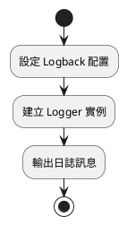
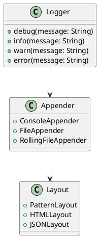
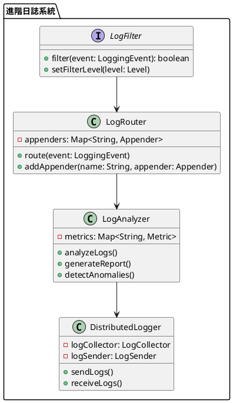

# Spring 使用 Logback 教學

## 初級（Beginner）層級

### 1. 概念說明
Logback 是一個幫助我們記錄程式執行過程的工具。初級學習者需要了解：
- 什麼是日誌（Log）
- 基本的日誌級別
- 簡單的日誌輸出

### 2. PlantUML 圖解


### 3. 分段教學步驟

#### 步驟 1：基本專案設定
```xml
<!-- pom.xml -->
<dependencies>
    <dependency>
        <groupId>ch.qos.logback</groupId>
        <artifactId>logback-classic</artifactId>
        <version>1.2.11</version>
    </dependency>
</dependencies>
```

#### 步驟 2：基本配置
```xml
<!-- src/main/resources/logback.xml -->
<configuration>
    <appender name="CONSOLE" class="ch.qos.logback.core.ConsoleAppender">
        <encoder>
            <pattern>%d{HH:mm:ss.SSS} [%thread] %-5level %logger{36} - %msg%n</pattern>
        </encoder>
    </appender>

    <root level="INFO">
        <appender-ref ref="CONSOLE" />
    </root>
</configuration>
```

#### 步驟 3：基本使用
```java
import org.slf4j.Logger;
import org.slf4j.LoggerFactory;
import org.springframework.stereotype.Service;

@Service
public class StudentService {
    private static final Logger logger = LoggerFactory.getLogger(StudentService.class);

    public void addStudent(String name, int age) {
        logger.info("開始新增學生: {}, 年齡: {}", name, age);
        
        try {
            // 新增學生的邏輯
            logger.debug("學生資料驗證通過");
            // ...
            logger.info("成功新增學生: {}", name);
        } catch (Exception e) {
            logger.error("新增學生失敗: {}", e.getMessage());
        }
    }
}
```

## 中級（Intermediate）層級

### 1. 概念說明
中級學習者需要理解：
- 進階日誌配置
- 日誌分級管理
- 檔案輸出
- 日誌格式化

### 2. PlantUML 圖解


### 3. 分段教學步驟

#### 步驟 1：進階配置
```xml
<!-- src/main/resources/logback.xml -->
<configuration>
    <!-- 控制台輸出 -->
    <appender name="CONSOLE" class="ch.qos.logback.core.ConsoleAppender">
        <encoder>
            <pattern>%d{yyyy-MM-dd HH:mm:ss.SSS} [%thread] %-5level %logger{36} - %msg%n</pattern>
        </encoder>
    </appender>

    <!-- 檔案輸出 -->
    <appender name="FILE" class="ch.qos.logback.core.rolling.RollingFileAppender">
        <file>logs/application.log</file>
        <rollingPolicy class="ch.qos.logback.core.rolling.TimeBasedRollingPolicy">
            <fileNamePattern>logs/application.%d{yyyy-MM-dd}.log</fileNamePattern>
            <maxHistory>30</maxHistory>
        </rollingPolicy>
        <encoder>
            <pattern>%d{yyyy-MM-dd HH:mm:ss.SSS} [%thread] %-5level %logger{36} - %msg%n</pattern>
        </encoder>
    </appender>

    <!-- 錯誤日誌 -->
    <appender name="ERROR_FILE" class="ch.qos.logback.core.rolling.RollingFileAppender">
        <file>logs/error.log</file>
        <filter class="ch.qos.logback.classic.filter.ThresholdFilter">
            <level>ERROR</level>
        </filter>
        <rollingPolicy class="ch.qos.logback.core.rolling.TimeBasedRollingPolicy">
            <fileNamePattern>logs/error.%d{yyyy-MM-dd}.log</fileNamePattern>
            <maxHistory>30</maxHistory>
        </rollingPolicy>
        <encoder>
            <pattern>%d{yyyy-MM-dd HH:mm:ss.SSS} [%thread] %-5level %logger{36} - %msg%n</pattern>
        </encoder>
    </appender>

    <root level="INFO">
        <appender-ref ref="CONSOLE" />
        <appender-ref ref="FILE" />
        <appender-ref ref="ERROR_FILE" />
    </root>
</configuration>
```

#### 步驟 2：分級日誌
```java
import org.slf4j.Logger;
import org.slf4j.LoggerFactory;
import org.springframework.stereotype.Service;

@Service
public class AdvancedLoggingService {
    private static final Logger logger = LoggerFactory.getLogger(AdvancedLoggingService.class);

    public void processStudentData(Student student) {
        // 詳細的除錯資訊
        logger.debug("開始處理學生資料: {}", student);
        
        // 一般資訊
        logger.info("學生 {} 的資料正在處理中", student.getName());
        
        try {
            // 處理邏輯
            if (student.getAge() < 0) {
                logger.warn("學生年齡異常: {}", student.getAge());
            }
            
            // ...
            
        } catch (Exception e) {
            // 錯誤資訊
            logger.error("處理學生資料時發生錯誤: {}", e.getMessage(), e);
        }
    }
}
```

#### 步驟 3：自訂日誌格式
```java
import org.slf4j.Logger;
import org.slf4j.LoggerFactory;
import org.springframework.stereotype.Component;

@Component
public class CustomLogFormatter {
    private static final Logger logger = LoggerFactory.getLogger(CustomLogFormatter.class);

    public void logWithCustomFormat(String message, Object... args) {
        String formattedMessage = String.format("[自訂格式] %s", message);
        logger.info(formattedMessage, args);
    }

    public void logWithContext(String operation, String userId, String message) {
        logger.info("[操作:{}][用戶:{}] {}", operation, userId, message);
    }
}
```

## 高級（Advanced）層級

### 1. 概念說明
高級學習者需要掌握：
- 進階日誌管理
- 日誌過濾與路由
- 效能監控
- 分散式日誌

### 2. PlantUML 圖解


### 3. 分段教學步驟

#### 步驟 1：進階日誌過濾
```java
import ch.qos.logback.classic.Level;
import ch.qos.logback.classic.spi.ILoggingEvent;
import ch.qos.logback.core.filter.Filter;
import ch.qos.logback.core.spi.FilterReply;
import org.springframework.stereotype.Component;

@Component
public class CustomLogFilter extends Filter<ILoggingEvent> {
    private Level level = Level.INFO;

    @Override
    public FilterReply decide(ILoggingEvent event) {
        if (event.getLevel().isGreaterOrEqual(level)) {
            return FilterReply.ACCEPT;
        } else {
            return FilterReply.DENY;
        }
    }

    public void setLevel(Level level) {
        this.level = level;
    }
}
```

#### 步驟 2：日誌效能監控
```java
import org.slf4j.Logger;
import org.slf4j.LoggerFactory;
import org.springframework.stereotype.Component;
import java.util.concurrent.ConcurrentHashMap;
import java.util.concurrent.atomic.AtomicLong;

@Component
public class LogPerformanceMonitor {
    private static final Logger logger = LoggerFactory.getLogger(LogPerformanceMonitor.class);
    private final Map<String, LogMetrics> metrics = new ConcurrentHashMap<>();

    public void recordLogEvent(String loggerName, long processingTime) {
        metrics.computeIfAbsent(loggerName, k -> new LogMetrics())
              .recordEvent(processingTime);
    }

    public void generatePerformanceReport() {
        metrics.forEach((loggerName, metric) -> {
            logger.info("日誌效能報告 - {}: 平均處理時間={}ms, 總事件數={}",
                loggerName,
                metric.getAverageProcessingTime(),
                metric.getTotalEvents());
        });
    }

    private static class LogMetrics {
        private final AtomicLong totalEvents = new AtomicLong();
        private final AtomicLong totalProcessingTime = new AtomicLong();

        void recordEvent(long processingTime) {
            totalEvents.incrementAndGet();
            totalProcessingTime.addAndGet(processingTime);
        }

        double getAverageProcessingTime() {
            return totalEvents.get() > 0 
                ? totalProcessingTime.get() / (double) totalEvents.get() 
                : 0;
        }

        long getTotalEvents() {
            return totalEvents.get();
        }
    }
}
```

#### 步驟 3：分散式日誌收集
```java
import org.slf4j.Logger;
import org.slf4j.LoggerFactory;
import org.springframework.stereotype.Component;
import java.util.concurrent.BlockingQueue;
import java.util.concurrent.LinkedBlockingQueue;

@Component
public class DistributedLogCollector {
    private static final Logger logger = LoggerFactory.getLogger(DistributedLogCollector.class);
    private final BlockingQueue<LogEvent> logQueue = new LinkedBlockingQueue<>();

    public void collectLog(LogEvent event) {
        try {
            logQueue.put(event);
        } catch (InterruptedException e) {
            logger.error("日誌收集被中斷", e);
            Thread.currentThread().interrupt();
        }
    }

    public void processLogs() {
        while (!Thread.currentThread().isInterrupted()) {
            try {
                LogEvent event = logQueue.take();
                // 處理日誌事件
                processLogEvent(event);
            } catch (InterruptedException e) {
                logger.error("日誌處理被中斷", e);
                Thread.currentThread().interrupt();
                break;
            }
        }
    }

    private void processLogEvent(LogEvent event) {
        // 實現日誌處理邏輯
        logger.info("處理日誌事件: {}", event);
    }
}
```

這個教學文件提供了從基礎到進階的 Spring 使用 Logback 學習路徑，每個層級都包含了相應的概念說明、圖解、教學步驟和實作範例。初級學習者可以從基本的日誌輸出開始，中級學習者可以學習更複雜的日誌配置和分級管理，而高級學習者則可以掌握完整的日誌效能監控和分散式日誌收集。 