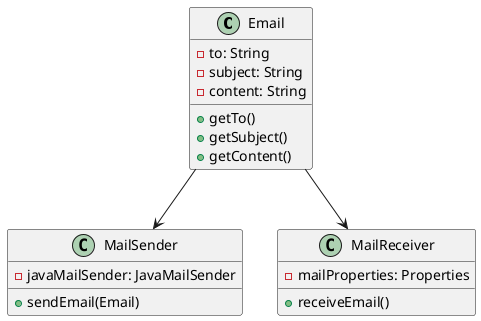
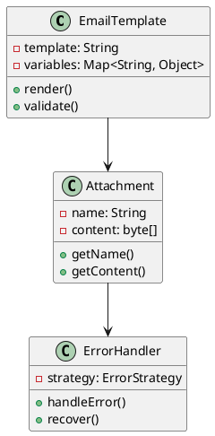
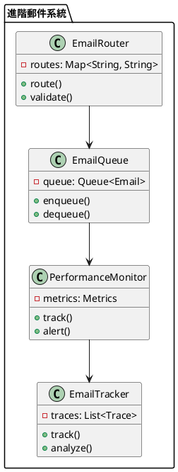

# Spring Mail 教學

## 初級（Beginner）層級

### 1. 概念說明
Spring Mail 就像是一個班級的郵差，幫助我們發送和接收電子郵件。初級學習者需要了解：
- 什麼是電子郵件
- 為什麼需要 Spring Mail
- 基本的郵件發送和接收

### 2. PlantUML 圖解


### 3. 分段教學步驟

#### 步驟 1：基本專案設定
```xml
<!-- pom.xml -->
<dependencies>
    <dependency>
        <groupId>org.springframework.boot</groupId>
        <artifactId>spring-boot-starter-mail</artifactId>
        <version>3.3.10</version>
    </dependency>
</dependencies>
```

#### 步驟 2：基本配置
```yaml
# application.yml
spring:
  mail:
    host: smtp.gmail.com
    port: 587
    username: your-email@gmail.com
    password: your-password
    properties:
      mail:
        smtp:
          auth: true
          starttls:
            enable: true
```

#### 步驟 3：簡單範例
```java
import org.springframework.mail.*;
import org.springframework.stereotype.Service;

@Service
public class ClassEmailService {
    private final JavaMailSender mailSender;
    
    public ClassEmailService(JavaMailSender mailSender) {
        this.mailSender = mailSender;
    }
    
    public void sendEmail(String to, String subject, String content) {
        SimpleMailMessage message = new SimpleMailMessage();
        message.setTo(to);
        message.setSubject(subject);
        message.setText(content);
        mailSender.send(message);
    }
}
```

## 中級（Intermediate）層級

### 1. 概念說明
中級學習者需要理解：
- 郵件模板
- 附件處理
- 郵件格式
- 錯誤處理

### 2. PlantUML 圖解


### 3. 分段教學步驟

#### 步驟 1：郵件模板配置
```java
import org.springframework.context.annotation.*;
import org.thymeleaf.*;
import org.thymeleaf.spring6.*;

@Configuration
public class MailConfig {
    
    @Bean
    public SpringTemplateEngine templateEngine() {
        SpringTemplateEngine templateEngine = new SpringTemplateEngine();
        templateEngine.setTemplateResolver(templateResolver());
        return templateEngine;
    }
    
    private ITemplateResolver templateResolver() {
        ClassLoaderTemplateResolver templateResolver = new ClassLoaderTemplateResolver();
        templateResolver.setPrefix("templates/");
        templateResolver.setSuffix(".html");
        templateResolver.setTemplateMode("HTML");
        return templateResolver;
    }
}
```

#### 步驟 2：附件處理
```java
import org.springframework.mail.javamail.*;
import org.springframework.stereotype.Service;
import org.springframework.core.io.*;

@Service
public class ClassEmailService {
    private final JavaMailSender mailSender;
    
    public ClassEmailService(JavaMailSender mailSender) {
        this.mailSender = mailSender;
    }
    
    public void sendEmailWithAttachment(String to, String subject, String content, 
            String attachmentName, byte[] attachmentContent) {
        MimeMessage message = mailSender.createMimeMessage();
        MimeMessageHelper helper = new MimeMessageHelper(message, true);
        
        helper.setTo(to);
        helper.setSubject(subject);
        helper.setText(content);
        
        helper.addAttachment(attachmentName, new ByteArrayResource(attachmentContent));
        mailSender.send(message);
    }
}
```

#### 步驟 3：錯誤處理
```java
import org.springframework.mail.*;
import org.springframework.stereotype.Service;

@Service
public class EmailErrorHandler {
    
    public void handleEmailError(MailException ex) {
        System.out.println("發送郵件時發生錯誤: " + ex.getMessage());
        // 可以記錄錯誤日誌或發送通知
    }
    
    public void sendEmailWithRetry(String to, String subject, String content) {
        int maxRetries = 3;
        int retryCount = 0;
        
        while (retryCount < maxRetries) {
            try {
                sendEmail(to, subject, content);
                break;
            } catch (MailException ex) {
                retryCount++;
                if (retryCount == maxRetries) {
                    handleEmailError(ex);
                }
            }
        }
    }
}
```

## 高級（Advanced）層級

### 1. 概念說明
高級學習者需要掌握：
- 進階郵件路由
- 郵件佇列
- 效能優化
- 監控和追蹤

### 2. PlantUML 圖解


### 3. 分段教學步驟

#### 步驟 1：進階郵件路由
```java
import org.springframework.mail.*;
import org.springframework.stereotype.Service;

@Service
public class AdvancedEmailRouter {
    
    public void routeEmail(String to, String subject, String content) {
        if (subject.contains("緊急")) {
            sendEmail(to, "[緊急]" + subject, content);
        } else if (subject.contains("通知")) {
            sendEmail(to, "[通知]" + subject, content);
        } else {
            sendEmail(to, subject, content);
        }
    }
}
```

#### 步驟 2：郵件佇列處理
```java
import org.springframework.mail.*;
import org.springframework.stereotype.Service;
import java.util.concurrent.*;

@Service
public class EmailQueueService {
    private final BlockingQueue<Email> emailQueue = new LinkedBlockingQueue<>();
    private final ExecutorService executorService = Executors.newFixedThreadPool(5);
    
    public void enqueueEmail(Email email) {
        emailQueue.offer(email);
    }
    
    @PostConstruct
    public void startProcessing() {
        for (int i = 0; i < 5; i++) {
            executorService.submit(this::processEmails);
        }
    }
    
    private void processEmails() {
        while (true) {
            try {
                Email email = emailQueue.take();
                sendEmail(email);
            } catch (InterruptedException e) {
                Thread.currentThread().interrupt();
                break;
            }
        }
    }
}
```

#### 步驟 3：效能監控
```java
import org.springframework.mail.*;
import org.springframework.stereotype.Service;
import java.util.Map;
import java.util.concurrent.ConcurrentHashMap;

@Service
public class EmailPerformanceMonitor {
    private final Map<String, EmailMetrics> metrics = new ConcurrentHashMap<>();
    
    public void sendMonitoredEmail(String to, String subject, String content) {
        long startTime = System.currentTimeMillis();
        try {
            sendEmail(to, subject, content);
            recordMetrics("sendEmail", startTime, true);
        } catch (Exception e) {
            recordMetrics("sendEmail", startTime, false);
            throw e;
        }
    }
    
    private void recordMetrics(String operation, long startTime, boolean success) {
        long duration = System.currentTimeMillis() - startTime;
        metrics.compute(operation, (key, value) -> {
            if (value == null) {
                return new EmailMetrics(duration, success);
            }
            value.update(duration, success);
            return value;
        });
    }
}
```

這個教學文件提供了從基礎到進階的 Spring Mail 學習路徑，每個層級都包含了相應的概念說明、圖解、教學步驟和實作範例。初級學習者可以從基本的郵件發送開始，中級學習者可以學習更複雜的郵件模板和附件處理，而高級學習者則可以掌握進階郵件路由和佇列處理等進階功能。 