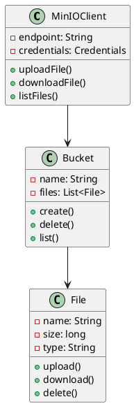
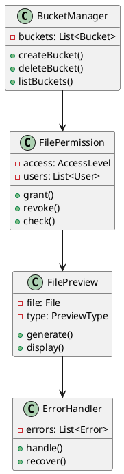
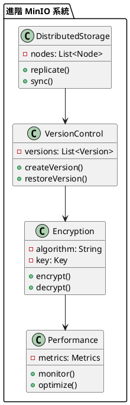

# Spring MinIO 教學

## 初級（Beginner）層級

### 1. 概念說明
Spring MinIO 就像是一個班級的雲端儲存空間，可以讓同學們安全地儲存和分享文件。初級學習者需要了解：
- 什麼是物件儲存
- 為什麼需要物件儲存
- 基本的檔案操作

### 2. PlantUML 圖解


### 3. 分段教學步驟

#### 步驟 1：基本專案設定
```xml
<!-- pom.xml -->
<dependencies>
    <dependency>
        <groupId>org.springframework.boot</groupId>
        <artifactId>spring-boot-starter-web</artifactId>
        <version>3.3.10</version>
    </dependency>
    <dependency>
        <groupId>io.minio</groupId>
        <artifactId>minio</artifactId>
        <version>8.5.7</version>
    </dependency>
</dependencies>
```

#### 步驟 2：基本配置
```yaml
# application.yml
minio:
  endpoint: http://localhost:9000
  access-key: minioadmin
  secret-key: minioadmin
  bucket: class-files
```

#### 步驟 3：簡單範例
```java
import io.minio.*;
import org.springframework.stereotype.*;
import org.springframework.web.multipart.*;

@Service
public class ClassFileService {
    
    private final MinioClient minioClient;
    private final String bucketName;
    
    public ClassFileService(MinioClient minioClient,
                          @Value("${minio.bucket}") String bucketName) {
        this.minioClient = minioClient;
        this.bucketName = bucketName;
    }
    
    public void uploadFile(MultipartFile file) throws Exception {
        minioClient.putObject(
            PutObjectArgs.builder()
                .bucket(bucketName)
                .object(file.getOriginalFilename())
                .stream(file.getInputStream(), file.getSize(), -1)
                .contentType(file.getContentType())
                .build()
        );
    }
    
    public byte[] downloadFile(String filename) throws Exception {
        try (InputStream stream = minioClient.getObject(
            GetObjectArgs.builder()
                .bucket(bucketName)
                .object(filename)
                .build()
        )) {
            return stream.readAllBytes();
        }
    }
}
```

## 中級（Intermediate）層級

### 1. 概念說明
中級學習者需要理解：
- 儲存桶管理
- 檔案權限
- 檔案預覽
- 錯誤處理

### 2. PlantUML 圖解


### 3. 分段教學步驟

#### 步驟 1：儲存桶管理
```java
import io.minio.*;
import org.springframework.stereotype.*;

@Service
public class ClassBucketService {
    
    private final MinioClient minioClient;
    
    public ClassBucketService(MinioClient minioClient) {
        this.minioClient = minioClient;
    }
    
    public void createBucket(String bucketName) throws Exception {
        boolean exists = minioClient.bucketExists(
            BucketExistsArgs.builder()
                .bucket(bucketName)
                .build()
        );
        
        if (!exists) {
            minioClient.makeBucket(
                MakeBucketArgs.builder()
                    .bucket(bucketName)
                    .build()
            );
        }
    }
    
    public void deleteBucket(String bucketName) throws Exception {
        minioClient.removeBucket(
            RemoveBucketArgs.builder()
                .bucket(bucketName)
                .build()
        );
    }
}
```

#### 步驟 2：檔案權限
```java
import io.minio.*;
import org.springframework.stereotype.*;

@Service
public class ClassFilePermissionService {
    
    private final MinioClient minioClient;
    
    public void setFilePermission(String bucketName,
                                String objectName,
                                String policy) throws Exception {
        minioClient.setBucketPolicy(
            SetBucketPolicyArgs.builder()
                .bucket(bucketName)
                .config(policy)
                .build()
        );
    }
    
    public String getFilePermission(String bucketName) throws Exception {
        return minioClient.getBucketPolicy(
            GetBucketPolicyArgs.builder()
                .bucket(bucketName)
                .build()
        );
    }
}
```

#### 步驟 3：檔案預覽
```java
import io.minio.*;
import org.springframework.stereotype.*;
import org.springframework.http.*;

@Service
public class ClassFilePreviewService {
    
    private final MinioClient minioClient;
    
    public ResponseEntity<byte[]> previewFile(String bucketName,
                                            String objectName) throws Exception {
        try (InputStream stream = minioClient.getObject(
            GetObjectArgs.builder()
                .bucket(bucketName)
                .object(objectName)
                .build()
        )) {
            byte[] content = stream.readAllBytes();
            
            return ResponseEntity.ok()
                .contentType(MediaType.APPLICATION_PDF)
                .body(content);
        }
    }
}
```

## 高級（Advanced）層級

### 1. 概念說明
高級學習者需要掌握：
- 分散式儲存
- 版本控制
- 資料加密
- 效能優化

### 2. PlantUML 圖解


### 3. 分段教學步驟

#### 步驟 1：分散式儲存
```java
import io.minio.*;
import org.springframework.stereotype.*;

@Service
public class ClassDistributedStorageService {
    
    private final List<MinioClient> clients;
    
    public void replicateFile(String bucketName,
                            String objectName,
                            byte[] content) throws Exception {
        for (MinioClient client : clients) {
            client.putObject(
                PutObjectArgs.builder()
                    .bucket(bucketName)
                    .object(objectName)
                    .stream(new ByteArrayInputStream(content),
                           content.length, -1)
                    .build()
            );
        }
    }
    
    public byte[] getFileFromReplica(String bucketName,
                                   String objectName) throws Exception {
        for (MinioClient client : clients) {
            try {
                try (InputStream stream = client.getObject(
                    GetObjectArgs.builder()
                        .bucket(bucketName)
                        .object(objectName)
                        .build()
                )) {
                    return stream.readAllBytes();
                }
            } catch (Exception e) {
                // 嘗試下一個副本
                continue;
            }
        }
        throw new Exception("所有副本都無法訪問");
    }
}
```

#### 步驟 2：版本控制
```java
import io.minio.*;
import org.springframework.stereotype.*;

@Service
public class ClassVersionControlService {
    
    private final MinioClient minioClient;
    
    public void createVersion(String bucketName,
                            String objectName,
                            byte[] content) throws Exception {
        String versionId = UUID.randomUUID().toString();
        String versionedObjectName = objectName + "-" + versionId;
        
        minioClient.putObject(
            PutObjectArgs.builder()
                .bucket(bucketName)
                .object(versionedObjectName)
                .stream(new ByteArrayInputStream(content),
                       content.length, -1)
                .build()
        );
    }
    
    public byte[] restoreVersion(String bucketName,
                               String objectName,
                               String versionId) throws Exception {
        String versionedObjectName = objectName + "-" + versionId;
        
        try (InputStream stream = minioClient.getObject(
            GetObjectArgs.builder()
                .bucket(bucketName)
                .object(versionedObjectName)
                .build()
        )) {
            return stream.readAllBytes();
        }
    }
}
```

#### 步驟 3：資料加密
```java
import io.minio.*;
import org.springframework.stereotype.*;
import javax.crypto.*;

@Service
public class ClassEncryptionService {
    
    private final MinioClient minioClient;
    private final SecretKey key;
    
    public void uploadEncryptedFile(String bucketName,
                                  String objectName,
                                  byte[] content) throws Exception {
        Cipher cipher = Cipher.getInstance("AES");
        cipher.init(Cipher.ENCRYPT_MODE, key);
        byte[] encrypted = cipher.doFinal(content);
        
        minioClient.putObject(
            PutObjectArgs.builder()
                .bucket(bucketName)
                .object(objectName)
                .stream(new ByteArrayInputStream(encrypted),
                       encrypted.length, -1)
                .build()
        );
    }
    
    public byte[] downloadDecryptedFile(String bucketName,
                                      String objectName) throws Exception {
        try (InputStream stream = minioClient.getObject(
            GetObjectArgs.builder()
                .bucket(bucketName)
                .object(objectName)
                .build()
        )) {
            byte[] encrypted = stream.readAllBytes();
            
            Cipher cipher = Cipher.getInstance("AES");
            cipher.init(Cipher.DECRYPT_MODE, key);
            return cipher.doFinal(encrypted);
        }
    }
}
```

這個教學文件提供了從基礎到進階的 Spring MinIO 學習路徑，每個層級都包含了相應的概念說明、圖解、教學步驟和實作範例。初級學習者可以從基本的檔案操作開始，中級學習者可以學習更複雜的儲存桶管理和檔案權限，而高級學習者則可以掌握分散式儲存和版本控制等進階功能。