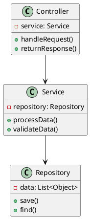
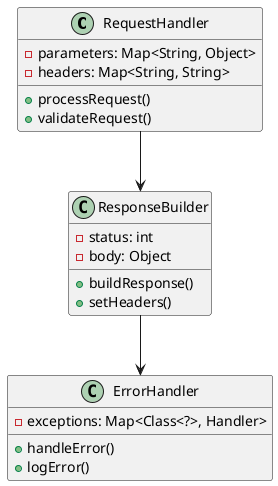
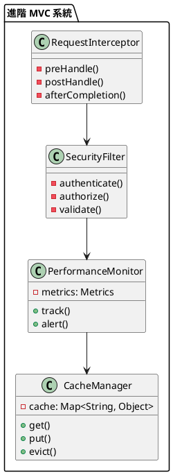

# Spring MVC 教學

## 初級（Beginner）層級

### 1. 概念說明
Spring MVC 就像是一個班級的班長，負責接收同學們的請求並分派任務。初級學習者需要了解：
- 什麼是 MVC 模式
- 為什麼需要 Spring MVC
- 基本的請求處理流程

### 2. PlantUML 圖解


### 3. 分段教學步驟

#### 步驟 1：基本專案設定
```xml
<!-- pom.xml -->
<dependencies>
    <dependency>
        <groupId>org.springframework.boot</groupId>
        <artifactId>spring-boot-starter-web</artifactId>
        <version>3.3.10</version>
    </dependency>
</dependencies>
```

#### 步驟 2：基本配置
```yaml
# application.yml
server:
  port: 8080
spring:
  mvc:
    pathmatch:
      matching-strategy: ant_path_matcher
```

#### 步驟 3：簡單範例
```java
import org.springframework.web.bind.annotation.*;
import org.springframework.stereotype.Controller;

@Controller
@RequestMapping("/class")
public class ClassController {
    
    @GetMapping("/students")
    public String getStudents() {
        return "students";
    }
    
    @PostMapping("/register")
    public String registerStudent(@RequestParam String name) {
        return "redirect:/class/students";
    }
}
```

## 中級（Intermediate）層級

### 1. 概念說明
中級學習者需要理解：
- 請求參數處理
- 回應格式控制
- 視圖解析
- 錯誤處理

### 2. PlantUML 圖解


### 3. 分段教學步驟

#### 步驟 1：請求參數處理
```java
import org.springframework.web.bind.annotation.*;
import org.springframework.stereotype.Controller;

@Controller
@RequestMapping("/class")
public class ClassController {
    
    @GetMapping("/student/{id}")
    public String getStudent(@PathVariable Long id, 
                           @RequestParam(required = false) String name) {
        return "student";
    }
    
    @PostMapping("/student")
    public String createStudent(@RequestBody Student student) {
        return "redirect:/class/students";
    }
}
```

#### 步驟 2：回應格式控制
```java
import org.springframework.web.bind.annotation.*;
import org.springframework.http.*;
import org.springframework.stereotype.Controller;

@Controller
@RequestMapping("/class")
public class ClassController {
    
    @GetMapping("/students")
    public ResponseEntity<List<Student>> getStudents() {
        List<Student> students = studentService.getAllStudents();
        return ResponseEntity.ok(students);
    }
    
    @PostMapping("/student")
    public ResponseEntity<Student> createStudent(@RequestBody Student student) {
        Student savedStudent = studentService.saveStudent(student);
        return ResponseEntity.status(HttpStatus.CREATED).body(savedStudent);
    }
}
```

#### 步驟 3：錯誤處理
```java
import org.springframework.web.bind.annotation.*;
import org.springframework.http.*;
import org.springframework.stereotype.Controller;

@ControllerAdvice
public class GlobalExceptionHandler {
    
    @ExceptionHandler(StudentNotFoundException.class)
    public ResponseEntity<ErrorResponse> handleStudentNotFound(
            StudentNotFoundException ex) {
        ErrorResponse error = new ErrorResponse(
            "STUDENT_NOT_FOUND",
            ex.getMessage()
        );
        return ResponseEntity.status(HttpStatus.NOT_FOUND).body(error);
    }
    
    @ExceptionHandler(Exception.class)
    public ResponseEntity<ErrorResponse> handleGeneralException(Exception ex) {
        ErrorResponse error = new ErrorResponse(
            "INTERNAL_SERVER_ERROR",
            "發生內部錯誤"
        );
        return ResponseEntity.status(HttpStatus.INTERNAL_SERVER_ERROR)
                .body(error);
    }
}
```

## 高級（Advanced）層級

### 1. 概念說明
高級學習者需要掌握：
- 進階請求處理
- 攔截器
- 效能優化
- 安全性

### 2. PlantUML 圖解


### 3. 分段教學步驟

#### 步驟 1：進階請求處理
```java
import org.springframework.web.bind.annotation.*;
import org.springframework.web.servlet.mvc.method.annotation.*;
import org.springframework.stereotype.Controller;

@Controller
@RequestMapping("/class")
public class AdvancedClassController {
    
    @GetMapping("/students")
    public StreamingResponseBody getStudentsStream() {
        return outputStream -> {
            List<Student> students = studentService.getAllStudents();
            for (Student student : students) {
                outputStream.write(student.toString().getBytes());
                outputStream.write("\n".getBytes());
            }
        };
    }
    
    @GetMapping("/students/async")
    public CompletableFuture<List<Student>> getStudentsAsync() {
        return CompletableFuture.supplyAsync(
            () -> studentService.getAllStudents()
        );
    }
}
```

#### 步驟 2：攔截器配置
```java
import org.springframework.web.servlet.*;
import org.springframework.stereotype.Component;

@Component
public class ClassInterceptor implements HandlerInterceptor {
    
    @Override
    public boolean preHandle(HttpServletRequest request,
                           HttpServletResponse response,
                           Object handler) {
        // 在處理請求前執行
        return true;
    }
    
    @Override
    public void postHandle(HttpServletRequest request,
                         HttpServletResponse response,
                         Object handler,
                         ModelAndView modelAndView) {
        // 在處理請求後執行
    }
    
    @Override
    public void afterCompletion(HttpServletRequest request,
                              HttpServletResponse response,
                              Object handler,
                              Exception ex) {
        // 在請求完成後執行
    }
}
```

#### 步驟 3：效能優化
```java
import org.springframework.web.bind.annotation.*;
import org.springframework.cache.annotation.*;
import org.springframework.stereotype.Controller;

@Controller
@RequestMapping("/class")
public class OptimizedClassController {
    
    @Cacheable("students")
    @GetMapping("/students")
    public List<Student> getStudents() {
        return studentService.getAllStudents();
    }
    
    @CacheEvict(value = "students", allEntries = true)
    @PostMapping("/student")
    public Student createStudent(@RequestBody Student student) {
        return studentService.saveStudent(student);
    }
    
    @CachePut(value = "students", key = "#student.id")
    @PutMapping("/student/{id}")
    public Student updateStudent(@PathVariable Long id,
                               @RequestBody Student student) {
        return studentService.updateStudent(id, student);
    }
}
```

這個教學文件提供了從基礎到進階的 Spring MVC 學習路徑，每個層級都包含了相應的概念說明、圖解、教學步驟和實作範例。初級學習者可以從基本的請求處理開始，中級學習者可以學習更複雜的參數處理和錯誤處理，而高級學習者則可以掌握進階請求處理和效能優化等進階功能。 