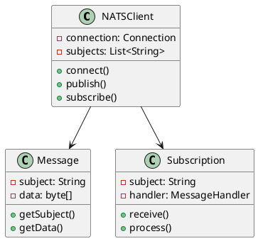
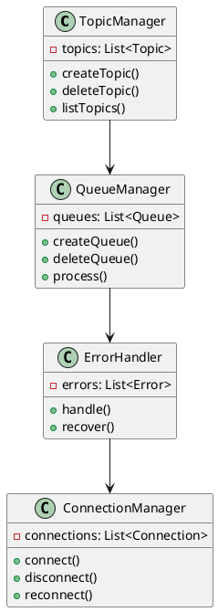
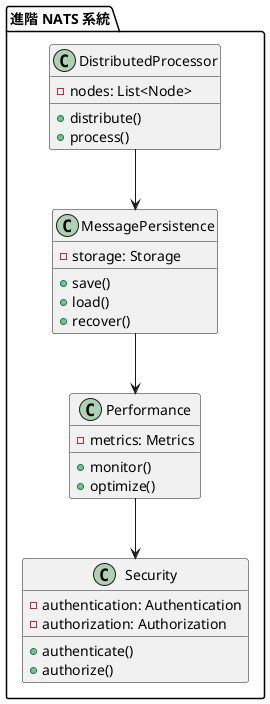

# Spring NATS 教學

## 初級（Beginner）層級

### 1. 概念說明
Spring NATS 就像是一個班級的廣播系統，可以讓同學們即時傳遞訊息。初級學習者需要了解：
- 什麼是訊息佇列
- 為什麼需要訊息佇列
- 基本的訊息收發操作

### 2. PlantUML 圖解


### 3. 分段教學步驟

#### 步驟 1：基本專案設定
```xml
<!-- pom.xml -->
<dependencies>
    <dependency>
        <groupId>org.springframework.boot</groupId>
        <artifactId>spring-boot-starter-web</artifactId>
        <version>3.3.10</version>
    </dependency>
    <dependency>
        <groupId>io.nats</groupId>
        <artifactId>jnats</artifactId>
        <version>2.16.14</version>
    </dependency>
</dependencies>
```

#### 步驟 2：基本配置
```yaml
# application.yml
nats:
  server: nats://localhost:4222
  subject: class-messages
```

#### 步驟 3：簡單範例
```java
import io.nats.client.*;
import org.springframework.stereotype.*;

@Service
public class ClassMessageService {
    
    private final Connection natsConnection;
    private final String subject;
    
    public ClassMessageService(Connection natsConnection,
                             @Value("${nats.subject}") String subject) {
        this.natsConnection = natsConnection;
        this.subject = subject;
    }
    
    public void sendMessage(String message) throws Exception {
        natsConnection.publish(subject, message.getBytes());
    }
    
    public void receiveMessages() throws Exception {
        Dispatcher dispatcher = natsConnection.createDispatcher((msg) -> {
            String message = new String(msg.getData());
            System.out.println("收到訊息: " + message);
        });
        
        dispatcher.subscribe(subject);
    }
}
```

## 中級（Intermediate）層級

### 1. 概念說明
中級學習者需要理解：
- 主題訂閱
- 訊息佇列
- 錯誤處理
- 連線管理

### 2. PlantUML 圖解


### 3. 分段教學步驟

#### 步驟 1：主題訂閱
```java
import io.nats.client.*;
import org.springframework.stereotype.*;

@Service
public class ClassTopicService {
    
    private final Connection natsConnection;
    
    public void subscribeToTopic(String topic) throws Exception {
        Dispatcher dispatcher = natsConnection.createDispatcher((msg) -> {
            String message = new String(msg.getData());
            System.out.println("收到主題 " + topic + " 的訊息: " + message);
        });
        
        dispatcher.subscribe(topic);
    }
    
    public void publishToTopic(String topic, String message) throws Exception {
        natsConnection.publish(topic, message.getBytes());
    }
}
```

#### 步驟 2：訊息佇列
```java
import io.nats.client.*;
import org.springframework.stereotype.*;

@Service
public class ClassQueueService {
    
    private final Connection natsConnection;
    
    public void createQueue(String queueName, String subject) throws Exception {
        Dispatcher dispatcher = natsConnection.createDispatcher((msg) -> {
            String message = new String(msg.getData());
            System.out.println("佇列 " + queueName + " 收到訊息: " + message);
        });
        
        dispatcher.subscribe(subject, queueName);
    }
    
    public void sendToQueue(String queueName, String message) throws Exception {
        natsConnection.publish(queueName, message.getBytes());
    }
}
```

#### 步驟 3：錯誤處理
```java
import io.nats.client.*;
import org.springframework.stereotype.*;

@Service
public class ClassErrorHandler {
    
    private final Connection natsConnection;
    
    public void handleConnectionError() {
        natsConnection.setClosedCallback((conn) -> {
            System.out.println("連線已關閉，嘗試重新連線...");
            try {
                conn.reconnect();
            } catch (Exception e) {
                System.out.println("重新連線失敗: " + e.getMessage());
            }
        });
        
        natsConnection.setDisconnectedCallback((conn) -> {
            System.out.println("連線已斷開，等待重新連線...");
        });
    }
}
```

## 高級（Advanced）層級

### 1. 概念說明
高級學習者需要掌握：
- 分散式處理
- 訊息持久化
- 效能監控
- 安全認證

### 2. PlantUML 圖解


### 3. 分段教學步驟

#### 步驟 1：分散式處理
```java
import io.nats.client.*;
import org.springframework.stereotype.*;

@Service
public class ClassDistributedService {
    
    private final List<Connection> connections;
    
    public void distributeMessage(String subject, String message) throws Exception {
        for (Connection conn : connections) {
            conn.publish(subject, message.getBytes());
        }
    }
    
    public void processDistributedMessage(String subject) throws Exception {
        for (Connection conn : connections) {
            Dispatcher dispatcher = conn.createDispatcher((msg) -> {
                String receivedMessage = new String(msg.getData());
                System.out.println("節點 " + conn.getServerInfo() + 
                                 " 收到訊息: " + receivedMessage);
            });
            
            dispatcher.subscribe(subject);
        }
    }
}
```

#### 步驟 2：訊息持久化
```java
import io.nats.client.*;
import org.springframework.stereotype.*;

@Service
public class ClassPersistenceService {
    
    private final Connection natsConnection;
    private final StorageService storageService;
    
    public void persistMessage(String subject, String message) throws Exception {
        // 儲存訊息
        storageService.saveMessage(subject, message);
        
        // 發送訊息
        natsConnection.publish(subject, message.getBytes());
    }
    
    public void recoverMessages(String subject) throws Exception {
        List<String> messages = storageService.loadMessages(subject);
        for (String message : messages) {
            natsConnection.publish(subject, message.getBytes());
        }
    }
}
```

#### 步驟 3：效能監控
```java
import io.nats.client.*;
import org.springframework.stereotype.*;

@Service
public class ClassPerformanceService {
    
    private final Connection natsConnection;
    
    public void monitorPerformance() {
        natsConnection.setStatisticsCollector((stats) -> {
            System.out.println("訊息發送數: " + stats.getOutMsgs());
            System.out.println("訊息接收數: " + stats.getInMsgs());
            System.out.println("連線時間: " + stats.getConnectionTime());
        });
    }
    
    public void optimizeConnection() {
        Options options = new Options.Builder()
            .server("nats://localhost:4222")
            .maxReconnects(5)
            .reconnectWait(Duration.ofSeconds(1))
            .build();
        
        natsConnection.setOptions(options);
    }
}
```

這個教學文件提供了從基礎到進階的 Spring NATS 學習路徑，每個層級都包含了相應的概念說明、圖解、教學步驟和實作範例。初級學習者可以從基本的訊息收發開始，中級學習者可以學習更複雜的主題訂閱和訊息佇列，而高級學習者則可以掌握分散式處理和訊息持久化等進階功能。
