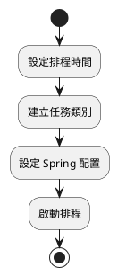
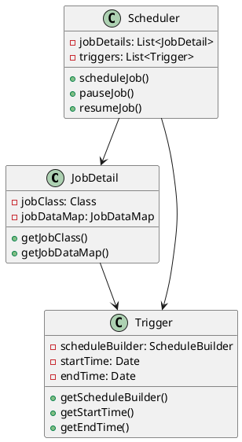
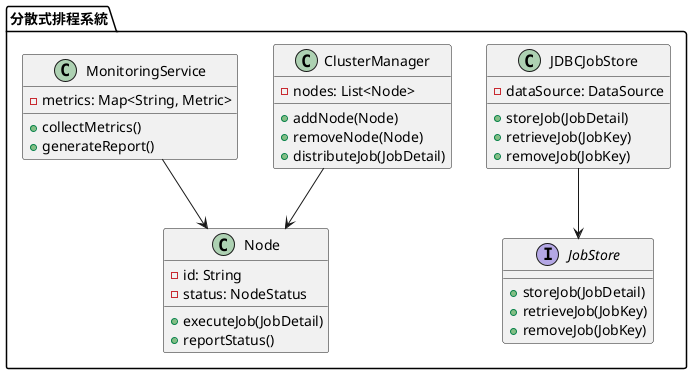

# Spring 使用 Quartz 教學

## 初級（Beginner）層級

### 1. 概念說明
Quartz 是一個排程任務的框架，可以幫助我們在特定時間執行某些工作。初級學習者需要了解：
- 什麼是排程任務
- 如何設定簡單的定時任務
- 基本的 Spring 整合方式

### 2. PlantUML 圖解


### 3. 分段教學步驟

#### 步驟 1：基本專案設定
```xml
<!-- pom.xml -->
<dependencies>
    <dependency>
        <groupId>org.springframework.boot</groupId>
        <artifactId>spring-boot-starter-quartz</artifactId>
    </dependency>
</dependencies>
```

#### 步驟 2：建立簡單的任務類別
```java
import org.quartz.Job;
import org.quartz.JobExecutionContext;
import org.quartz.JobExecutionException;

public class SimpleJob implements Job {
    @Override
    public void execute(JobExecutionContext context) throws JobExecutionException {
        System.out.println("執行簡單任務：" + new java.util.Date());
    }
}
```

#### 步驟 3：設定排程
```java
import org.springframework.context.annotation.Bean;
import org.springframework.context.annotation.Configuration;
import org.quartz.*;

@Configuration
public class SimpleQuartzConfig {
    @Bean
    public JobDetail simpleJobDetail() {
        return JobBuilder.newJob(SimpleJob.class)
            .withIdentity("simpleJob")
            .storeDurably()
            .build();
    }

    @Bean
    public Trigger simpleJobTrigger() {
        SimpleScheduleBuilder scheduleBuilder = SimpleScheduleBuilder.simpleSchedule()
            .withIntervalInSeconds(5)  // 每5秒執行一次
            .repeatForever();

        return TriggerBuilder.newTrigger()
            .forJob(simpleJobDetail())
            .withIdentity("simpleTrigger")
            .withSchedule(scheduleBuilder)
            .build();
    }
}
```

## 中級（Intermediate）層級

### 1. 概念說明
中級學習者需要理解：
- 複雜的排程設定
- 任務的參數傳遞
- 任務的狀態管理
- 錯誤處理機制

### 2. PlantUML 圖解


### 3. 分段教學步驟

#### 步驟 1：建立可傳遞參數的任務
```java
import org.quartz.Job;
import org.quartz.JobExecutionContext;
import org.quartz.JobExecutionException;
import org.quartz.JobDataMap;

public class ParameterizedJob implements Job {
    @Override
    public void execute(JobExecutionContext context) throws JobExecutionException {
        JobDataMap dataMap = context.getJobDetail().getJobDataMap();
        String message = dataMap.getString("message");
        int count = dataMap.getInt("count");
        
        System.out.println("收到訊息：" + message);
        System.out.println("計數：" + count);
    }
}
```

#### 步驟 2：設定複雜的排程
```java
import org.springframework.context.annotation.Bean;
import org.springframework.context.annotation.Configuration;
import org.quartz.*;

@Configuration
public class ComplexQuartzConfig {
    @Bean
    public JobDetail parameterizedJobDetail() {
        JobDataMap jobDataMap = new JobDataMap();
        jobDataMap.put("message", "Hello Quartz!");
        jobDataMap.put("count", 0);

        return JobBuilder.newJob(ParameterizedJob.class)
            .withIdentity("parameterizedJob")
            .usingJobData(jobDataMap)
            .storeDurably()
            .build();
    }

    @Bean
    public Trigger complexTrigger() {
        // 設定每天上午10點執行
        CronScheduleBuilder scheduleBuilder = CronScheduleBuilder.cronSchedule("0 0 10 * * ?");
        
        return TriggerBuilder.newTrigger()
            .forJob(parameterizedJobDetail())
            .withIdentity("complexTrigger")
            .withSchedule(scheduleBuilder)
            .startNow()
            .build();
    }
}
```

#### 步驟 3：任務監控與管理
```java
import org.springframework.beans.factory.annotation.Autowired;
import org.springframework.web.bind.annotation.*;
import org.quartz.*;

@RestController
@RequestMapping("/jobs")
public class JobController {
    @Autowired
    private Scheduler scheduler;

    @PostMapping("/pause/{jobName}")
    public void pauseJob(@PathVariable String jobName) throws SchedulerException {
        JobKey jobKey = new JobKey(jobName);
        scheduler.pauseJob(jobKey);
    }

    @PostMapping("/resume/{jobName}")
    public void resumeJob(@PathVariable String jobName) throws SchedulerException {
        JobKey jobKey = new JobKey(jobName);
        scheduler.resumeJob(jobKey);
    }

    @GetMapping("/status/{jobName}")
    public String getJobStatus(@PathVariable String jobName) throws SchedulerException {
        JobKey jobKey = new JobKey(jobName);
        JobDetail jobDetail = scheduler.getJobDetail(jobKey);
        return "任務狀態：" + (jobDetail != null ? "運行中" : "不存在");
    }
}
```

## 高級（Advanced）層級

### 1. 概念說明
高級學習者需要掌握：
- 分散式排程
- 任務的持久化
- 動態排程管理
- 效能優化與監控

### 2. PlantUML 圖解


### 3. 分段教學步驟

#### 步驟 1：設定分散式排程
```java
import org.springframework.context.annotation.Bean;
import org.springframework.context.annotation.Configuration;
import org.quartz.*;
import javax.sql.DataSource;

@Configuration
public class DistributedQuartzConfig {
    @Bean
    public SchedulerFactoryBean schedulerFactoryBean(DataSource dataSource) {
        SchedulerFactoryBean factory = new SchedulerFactoryBean();
        
        // 設定資料庫儲存
        factory.setDataSource(dataSource);
        factory.setJobFactory(jobFactory());
        
        // 設定叢集屬性
        Properties properties = new Properties();
        properties.setProperty("org.quartz.scheduler.instanceName", "DistributedScheduler");
        properties.setProperty("org.quartz.scheduler.instanceId", "AUTO");
        properties.setProperty("org.quartz.jobStore.class", "org.quartz.impl.jdbcjobstore.JobStoreTX");
        properties.setProperty("org.quartz.jobStore.driverDelegateClass", "org.quartz.impl.jdbcjobstore.StdJDBCDelegate");
        properties.setProperty("org.quartz.jobStore.tablePrefix", "QRTZ_");
        properties.setProperty("org.quartz.jobStore.isClustered", "true");
        properties.setProperty("org.quartz.threadPool.class", "org.quartz.simpl.SimpleThreadPool");
        properties.setProperty("org.quartz.threadPool.threadCount", "10");
        
        factory.setQuartzProperties(properties);
        return factory;
    }
}
```

#### 步驟 2：動態排程管理
```java
import org.springframework.beans.factory.annotation.Autowired;
import org.springframework.web.bind.annotation.*;
import org.quartz.*;

@RestController
@RequestMapping("/dynamic-jobs")
public class DynamicJobController {
    @Autowired
    private Scheduler scheduler;

    @PostMapping("/schedule")
    public void scheduleJob(@RequestBody JobRequest request) throws SchedulerException {
        JobDetail jobDetail = JobBuilder.newJob(request.getJobClass())
            .withIdentity(request.getJobName())
            .usingJobData(request.getJobData())
            .storeDurably()
            .build();

        Trigger trigger = TriggerBuilder.newTrigger()
            .withIdentity(request.getTriggerName())
            .withSchedule(CronScheduleBuilder.cronSchedule(request.getCronExpression()))
            .build();

        scheduler.scheduleJob(jobDetail, trigger);
    }

    @PostMapping("/unschedule/{jobName}")
    public void unscheduleJob(@PathVariable String jobName) throws SchedulerException {
        JobKey jobKey = new JobKey(jobName);
        scheduler.deleteJob(jobKey);
    }

    @PostMapping("/reschedule")
    public void rescheduleJob(@RequestBody RescheduleRequest request) throws SchedulerException {
        TriggerKey triggerKey = new TriggerKey(request.getTriggerName());
        Trigger newTrigger = TriggerBuilder.newTrigger()
            .withIdentity(triggerKey)
            .withSchedule(CronScheduleBuilder.cronSchedule(request.getNewCronExpression()))
            .build();

        scheduler.rescheduleJob(triggerKey, newTrigger);
    }
}
```

#### 步驟 3：效能監控與優化
```java
import org.springframework.context.annotation.Bean;
import org.springframework.context.annotation.Configuration;
import org.quartz.*;
import io.micrometer.core.instrument.MeterRegistry;

@Configuration
public class MonitoringConfig {
    @Bean
    public JobListener jobMetricsListener(MeterRegistry registry) {
        return new JobListener() {
            @Override
            public String getName() {
                return "metricsJobListener";
            }

            @Override
            public void jobToBeExecuted(JobExecutionContext context) {
                registry.counter("quartz.job.started", 
                    "job", context.getJobDetail().getKey().getName())
                    .increment();
            }

            @Override
            public void jobExecutionVetoed(JobExecutionContext context) {
                registry.counter("quartz.job.vetoed",
                    "job", context.getJobDetail().getKey().getName())
                    .increment();
            }

            @Override
            public void jobWasExecuted(JobExecutionContext context, JobExecutionException jobException) {
                String status = jobException == null ? "success" : "failure";
                registry.counter("quartz.job.completed",
                    "job", context.getJobDetail().getKey().getName(),
                    "status", status)
                    .increment();
                
                if (jobException != null) {
                    registry.counter("quartz.job.error",
                        "job", context.getJobDetail().getKey().getName())
                        .increment();
                }
            }
        };
    }
}
```

這個教學文件提供了從基礎到進階的 Spring 使用 Quartz 學習路徑，每個層級都包含了相應的概念說明、圖解、教學步驟和實作範例。初級學習者可以從基本的排程任務開始，中級學習者可以學習更複雜的排程設定和任務管理，而高級學習者則可以掌握完整的分散式排程和效能優化。 