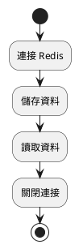
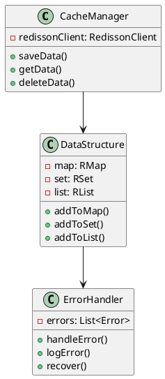
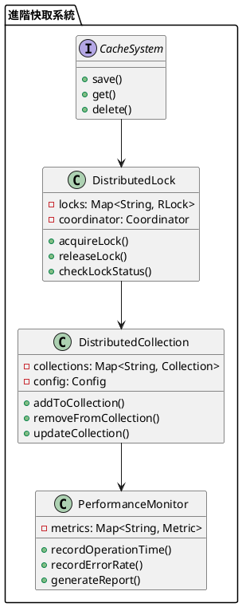

# Spring 使用 Redisson 教學

## 初級（Beginner）層級

### 1. 概念說明
Redisson 是一個幫助我們使用 Redis 的工具。初級學習者需要了解：
- 什麼是 Redis
- 為什麼需要 Redis
- 基本的資料存取方式

### 2. PlantUML 圖解


### 3. 分段教學步驟

#### 步驟 1：基本專案設定
```xml
<!-- pom.xml -->
<dependencies>
    <dependency>
        <groupId>org.redisson</groupId>
        <artifactId>redisson-spring-boot-starter</artifactId>
        <version>3.27.1</version>
    </dependency>
</dependencies>
```

#### 步驟 2：基本配置
```java
import org.redisson.Redisson;
import org.redisson.api.RedissonClient;
import org.redisson.config.Config;
import org.springframework.context.annotation.Bean;
import org.springframework.context.annotation.Configuration;

@Configuration
public class RedissonConfig {
    @Bean
    public RedissonClient redissonClient() {
        Config config = new Config();
        config.useSingleServer()
              .setAddress("redis://localhost:6379");
        return Redisson.create(config);
    }
}
```

#### 步驟 3：基本使用
```java
import org.redisson.api.RBucket;
import org.redisson.api.RedissonClient;
import org.springframework.stereotype.Component;

@Component
public class SimpleCache {
    private final RedissonClient redissonClient;

    public SimpleCache(RedissonClient redissonClient) {
        this.redissonClient = redissonClient;
    }

    public void saveData(String key, String value) {
        RBucket<String> bucket = redissonClient.getBucket(key);
        bucket.set(value);
    }

    public String getData(String key) {
        RBucket<String> bucket = redissonClient.getBucket(key);
        return bucket.get();
    }
}
```

## 中級（Intermediate）層級

### 1. 概念說明
中級學習者需要理解：
- 資料結構的使用
- 並發控制
- 資料過期處理
- 錯誤處理

### 2. PlantUML 圖解


### 3. 分段教學步驟

#### 步驟 1：進階資料結構
```java
import org.redisson.api.RMap;
import org.redisson.api.RSet;
import org.redisson.api.RedissonClient;
import org.springframework.stereotype.Component;

@Component
public class AdvancedCache {
    private final RedissonClient redissonClient;

    public AdvancedCache(RedissonClient redissonClient) {
        this.redissonClient = redissonClient;
    }

    public void saveToMap(String mapName, String key, String value) {
        RMap<String, String> map = redissonClient.getMap(mapName);
        map.put(key, value);
    }

    public void addToSet(String setName, String value) {
        RSet<String> set = redissonClient.getSet(setName);
        set.add(value);
    }

    public void addToList(String listName, String value) {
        RList<String> list = redissonClient.getList(listName);
        list.add(value);
    }
}
```

#### 步驟 2：資料過期處理
```java
import org.redisson.api.RBucket;
import org.redisson.api.RedissonClient;
import org.springframework.stereotype.Component;
import java.util.concurrent.TimeUnit;

@Component
public class ExpiringCache {
    private final RedissonClient redissonClient;

    public ExpiringCache(RedissonClient redissonClient) {
        this.redissonClient = redissonClient;
    }

    public void saveWithExpiration(String key, String value, long time, TimeUnit unit) {
        RBucket<String> bucket = redissonClient.getBucket(key);
        bucket.set(value, time, unit);
    }

    public boolean isExpired(String key) {
        RBucket<String> bucket = redissonClient.getBucket(key);
        return bucket.remainTimeToLive() <= 0;
    }
}
```

#### 步驟 3：錯誤處理
```java
import org.springframework.stereotype.Component;
import java.util.concurrent.ConcurrentHashMap;

@Component
public class CacheErrorHandler {
    private final Map<String, ErrorStats> errorStats = new ConcurrentHashMap<>();

    public void handleError(String operation, Exception e) {
        errorStats.computeIfAbsent(operation, k -> new ErrorStats())
                 .recordError(e);
        logError(operation, e);
    }

    private void logError(String operation, Exception e) {
        System.err.printf("操作 %s 發生錯誤: %s%n", operation, e.getMessage());
    }
}
```

## 高級（Advanced）層級

### 1. 概念說明
高級學習者需要掌握：
- 分散式鎖定
- 分散式集合
- 效能優化
- 監控機制

### 2. PlantUML 圖解


### 3. 分段教學步驟

#### 步驟 1：分散式鎖定
```java
import org.redisson.api.RLock;
import org.redisson.api.RedissonClient;
import org.springframework.stereotype.Component;
import java.util.concurrent.TimeUnit;

@Component
public class DistributedLockManager {
    private final RedissonClient redissonClient;

    public DistributedLockManager(RedissonClient redissonClient) {
        this.redissonClient = redissonClient;
    }

    public boolean acquireLock(String lockName, long waitTime, long leaseTime, TimeUnit unit) {
        RLock lock = redissonClient.getLock(lockName);
        try {
            return lock.tryLock(waitTime, leaseTime, unit);
        } catch (InterruptedException e) {
            Thread.currentThread().interrupt();
            return false;
        }
    }

    public void releaseLock(String lockName) {
        RLock lock = redissonClient.getLock(lockName);
        if (lock.isHeldByCurrentThread()) {
            lock.unlock();
        }
    }
}
```

#### 步驟 2：分散式集合
```java
import org.redisson.api.RMap;
import org.redisson.api.RedissonClient;
import org.springframework.stereotype.Component;
import java.util.concurrent.ConcurrentHashMap;

@Component
public class DistributedCollectionManager {
    private final RedissonClient redissonClient;
    private final Map<String, RMap<String, String>> collections = new ConcurrentHashMap<>();

    public DistributedCollectionManager(RedissonClient redissonClient) {
        this.redissonClient = redissonClient;
    }

    public void addToCollection(String collectionName, String key, String value) {
        RMap<String, String> map = collections.computeIfAbsent(
            collectionName,
            k -> redissonClient.getMap(collectionName)
        );
        map.put(key, value);
    }

    public String getFromCollection(String collectionName, String key) {
        RMap<String, String> map = collections.get(collectionName);
        return map != null ? map.get(key) : null;
    }
}
```

#### 步驟 3：效能監控
```java
import org.springframework.stereotype.Component;
import java.util.concurrent.ConcurrentHashMap;
import java.util.concurrent.atomic.AtomicLong;

@Component
public class CacheMetrics {
    private final Map<String, OperationStats> stats = new ConcurrentHashMap<>();

    public void recordOperation(String operation, long duration, boolean success) {
        stats.computeIfAbsent(operation, k -> new OperationStats())
            .recordOperation(duration, success);
    }

    public void generateReport() {
        stats.forEach((operation, stat) -> {
            System.out.printf("操作: %s, 成功率: %.2f%%, 平均執行時間: %.2fms%n",
                operation,
                stat.getSuccessRate() * 100,
                stat.getAverageDuration());
        });
    }

    private static class OperationStats {
        private final AtomicLong totalOperations = new AtomicLong();
        private final AtomicLong successfulOperations = new AtomicLong();
        private final AtomicLong totalDuration = new AtomicLong();

        void recordOperation(long duration, boolean success) {
            totalOperations.incrementAndGet();
            if (success) {
                successfulOperations.incrementAndGet();
            }
            totalDuration.addAndGet(duration);
        }

        double getSuccessRate() {
            return totalOperations.get() > 0 
                ? (double) successfulOperations.get() / totalOperations.get() 
                : 0;
        }

        double getAverageDuration() {
            return totalOperations.get() > 0 
                ? (double) totalDuration.get() / totalOperations.get() 
                : 0;
        }
    }
}
```

這個教學文件提供了從基礎到進階的 Spring 使用 Redisson 學習路徑，每個層級都包含了相應的概念說明、圖解、教學步驟和實作範例。初級學習者可以從基本的資料存取開始，中級學習者可以學習更複雜的資料結構和錯誤處理，而高級學習者則可以掌握完整的分散式鎖定和效能優化。 