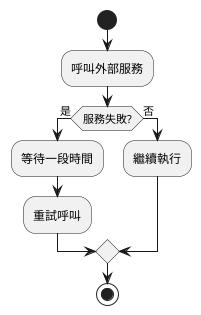
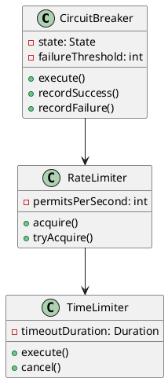
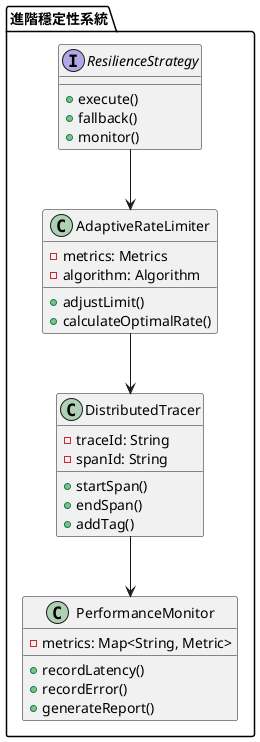

# Spring 使用 Resilience4j 教學

## 初級（Beginner）層級

### 1. 概念說明
Resilience4j 是一個幫助我們讓程式更穩定的工具。初級學習者需要了解：
- 什麼是程式穩定性
- 基本的錯誤處理
- 簡單的重試機制

### 2. PlantUML 圖解


### 3. 分段教學步驟

#### 步驟 1：基本專案設定
```xml
<!-- pom.xml -->
<dependencies>
    <dependency>
        <groupId>io.github.resilience4j</groupId>
        <artifactId>resilience4j-spring-boot2</artifactId>
        <version>1.7.0</version>
    </dependency>
    <dependency>
        <groupId>io.github.resilience4j</groupId>
        <artifactId>resilience4j-retry</artifactId>
        <version>1.7.0</version>
    </dependency>
</dependencies>
```

#### 步驟 2：基本配置
```yaml
# application.yml
resilience4j:
  retry:
    configs:
      default:
        maxAttempts: 3
        waitDuration: 1000
        retryExceptions:
          - java.io.IOException
```

#### 步驟 3：基本使用
```java
import io.github.resilience4j.retry.annotation.Retry;
import org.springframework.stereotype.Service;

@Service
public class WeatherService {
    @Retry(name = "weatherApi")
    public String getWeather(String city) {
        // 呼叫天氣 API
        return callWeatherApi(city);
    }

    private String callWeatherApi(String city) {
        // 實際的 API 呼叫邏輯
        return "晴天";
    }
}
```

## 中級（Intermediate）層級

### 1. 概念說明
中級學習者需要理解：
- 斷路器模式
- 限流機制
- 超時控制
- 錯誤處理策略

### 2. PlantUML 圖解


### 3. 分段教學步驟

#### 步驟 1：進階配置
```yaml
# application.yml
resilience4j:
  circuitbreaker:
    configs:
      default:
        failureRateThreshold: 50
        waitDurationInOpenState: 5000
        permittedNumberOfCallsInHalfOpenState: 2
        slidingWindowSize: 10
        slidingWindowType: COUNT_BASED
        minimumNumberOfCalls: 5
  ratelimiter:
    configs:
      default:
        limitForPeriod: 10
        limitRefreshPeriod: 1s
        timeoutDuration: 0
  timelimiter:
    configs:
      default:
        timeoutDuration: 2s
```

#### 步驟 2：組合使用
```java
import io.github.resilience4j.circuitbreaker.annotation.CircuitBreaker;
import io.github.resilience4j.ratelimiter.annotation.RateLimiter;
import io.github.resilience4j.timelimiter.annotation.TimeLimiter;
import org.springframework.stereotype.Service;

@Service
public class AdvancedWeatherService {
    @CircuitBreaker(name = "weatherApi")
    @RateLimiter(name = "weatherApi")
    @TimeLimiter(name = "weatherApi")
    public CompletableFuture<String> getWeatherWithProtection(String city) {
        return CompletableFuture.supplyAsync(() -> {
            // 呼叫天氣 API
            return callWeatherApi(city);
        });
    }

    private String callWeatherApi(String city) {
        // 實際的 API 呼叫邏輯
        return "晴天";
    }
}
```

#### 步驟 3：錯誤處理
```java
import io.github.resilience4j.circuitbreaker.CircuitBreaker;
import io.github.resilience4j.circuitbreaker.CircuitBreakerConfig;
import org.springframework.stereotype.Component;

@Component
public class WeatherErrorHandler {
    private final CircuitBreaker circuitBreaker;

    public WeatherErrorHandler() {
        CircuitBreakerConfig config = CircuitBreakerConfig.custom()
            .failureRateThreshold(50)
            .waitDurationInOpenState(Duration.ofMillis(1000))
            .permittedNumberOfCallsInHalfOpenState(2)
            .slidingWindowSize(10)
            .build();

        circuitBreaker = CircuitBreaker.of("weatherApi", config);
    }

    public void handleError(Throwable throwable) {
        if (throwable instanceof IOException) {
            circuitBreaker.onError(0, throwable);
        }
    }

    public void recordSuccess() {
        circuitBreaker.onSuccess(0);
    }
}
```

## 高級（Advanced）層級

### 1. 概念說明
高級學習者需要掌握：
- 進階熔斷策略
- 自適應限流
- 分散式追蹤
- 效能監控

### 2. PlantUML 圖解


### 3. 分段教學步驟

#### 步驟 1：自適應限流
```java
import io.github.resilience4j.ratelimiter.RateLimiter;
import io.github.resilience4j.ratelimiter.RateLimiterConfig;
import org.springframework.stereotype.Component;
import java.time.Duration;
import java.util.concurrent.atomic.AtomicInteger;

@Component
public class AdaptiveRateLimiter {
    private final RateLimiter rateLimiter;
    private final AtomicInteger currentLimit = new AtomicInteger(10);
    private final AtomicInteger errorCount = new AtomicInteger(0);

    public AdaptiveRateLimiter() {
        RateLimiterConfig config = RateLimiterConfig.custom()
            .limitForPeriod(currentLimit.get())
            .limitRefreshPeriod(Duration.ofSeconds(1))
            .timeoutDuration(Duration.ofMillis(0))
            .build();

        rateLimiter = RateLimiter.of("adaptiveLimiter", config);
    }

    public void adjustLimit() {
        int errors = errorCount.get();
        if (errors > 5) {
            currentLimit.updateAndGet(current -> Math.max(1, current / 2));
        } else if (errors < 2) {
            currentLimit.updateAndGet(current -> Math.min(100, current * 2));
        }
        errorCount.set(0);
    }

    public void recordError() {
        errorCount.incrementAndGet();
    }
}
```

#### 步驟 2：分散式追蹤
```java
import io.github.resilience4j.tracing.Tracer;
import org.springframework.stereotype.Component;
import java.util.UUID;

@Component
public class DistributedTracing {
    private final Tracer tracer;

    public DistributedTracing() {
        this.tracer = Tracer.of("weatherService");
    }

    public void traceOperation(String operationName) {
        String traceId = UUID.randomUUID().toString();
        String spanId = UUID.randomUUID().toString();

        tracer.startSpan(traceId, spanId, operationName);
        try {
            // 執行操作
            executeOperation();
        } finally {
            tracer.endSpan(traceId, spanId);
        }
    }

    private void executeOperation() {
        // 實際的操作邏輯
    }
}
```

#### 步驟 3：效能監控
```java
import io.github.resilience4j.metrics.Metrics;
import org.springframework.stereotype.Component;
import java.util.concurrent.ConcurrentHashMap;
import java.util.concurrent.atomic.AtomicLong;

@Component
public class ResilienceMetrics {
    private final Map<String, OperationMetrics> metrics = new ConcurrentHashMap<>();

    public void recordOperation(String operationName, long duration, boolean success) {
        metrics.computeIfAbsent(operationName, k -> new OperationMetrics())
              .recordOperation(duration, success);
    }

    public void generateReport() {
        metrics.forEach((operation, metric) -> {
            System.out.printf("操作: %s, 成功率: %.2f%%, 平均延遲: %.2fms%n",
                operation,
                metric.getSuccessRate() * 100,
                metric.getAverageLatency());
        });
    }

    private static class OperationMetrics {
        private final AtomicLong totalOperations = new AtomicLong();
        private final AtomicLong successfulOperations = new AtomicLong();
        private final AtomicLong totalLatency = new AtomicLong();

        void recordOperation(long duration, boolean success) {
            totalOperations.incrementAndGet();
            if (success) {
                successfulOperations.incrementAndGet();
            }
            totalLatency.addAndGet(duration);
        }

        double getSuccessRate() {
            return totalOperations.get() > 0 
                ? (double) successfulOperations.get() / totalOperations.get() 
                : 0;
        }

        double getAverageLatency() {
            return totalOperations.get() > 0 
                ? (double) totalLatency.get() / totalOperations.get() 
                : 0;
        }
    }
}
```

這個教學文件提供了從基礎到進階的 Spring 使用 Resilience4j 學習路徑，每個層級都包含了相應的概念說明、圖解、教學步驟和實作範例。初級學習者可以從基本的重試機制開始，中級學習者可以學習更複雜的斷路器和限流機制，而高級學習者則可以掌握完整的自適應限流和分散式追蹤。 