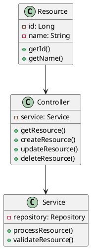
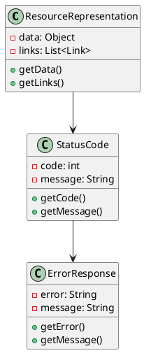
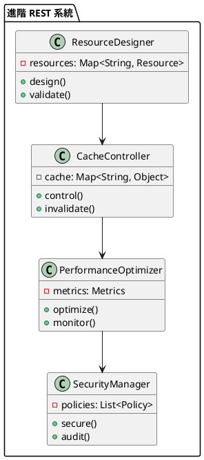

# Spring REST 教學

## 初級（Beginner）層級

### 1. 概念說明
Spring REST 就像是一個班級的聯絡簿，可以讓同學們互相分享資訊。初級學習者需要了解：
- 什麼是 REST API
- 為什麼需要 REST
- 基本的 HTTP 方法和資源操作

### 2. PlantUML 圖解


### 3. 分段教學步驟

#### 步驟 1：基本專案設定
```xml
<!-- pom.xml -->
<dependencies>
    <dependency>
        <groupId>org.springframework.boot</groupId>
        <artifactId>spring-boot-starter-web</artifactId>
        <version>3.3.10</version>
    </dependency>
</dependencies>
```

#### 步驟 2：基本配置
```yaml
# application.yml
server:
  port: 8080
spring:
  mvc:
    pathmatch:
      matching-strategy: ant_path_matcher
```

#### 步驟 3：簡單範例
```java
import org.springframework.web.bind.annotation.*;
import org.springframework.http.*;
import org.springframework.stereotype.Controller;

@RestController
@RequestMapping("/api/students")
public class StudentController {
    
    @GetMapping
    public List<Student> getAllStudents() {
        return studentService.getAllStudents();
    }
    
    @PostMapping
    public ResponseEntity<Student> createStudent(@RequestBody Student student) {
        Student savedStudent = studentService.saveStudent(student);
        return ResponseEntity.status(HttpStatus.CREATED).body(savedStudent);
    }
}
```

## 中級（Intermediate）層級

### 1. 概念說明
中級學習者需要理解：
- 資源表示
- 狀態碼
- 錯誤處理
- 版本控制

### 2. PlantUML 圖解


### 3. 分段教學步驟

#### 步驟 1：資源表示
```java
import org.springframework.hateoas.*;
import org.springframework.web.bind.annotation.*;
import org.springframework.http.*;

@RestController
@RequestMapping("/api/students")
public class StudentController {
    
    @GetMapping("/{id}")
    public EntityModel<Student> getStudent(@PathVariable Long id) {
        Student student = studentService.getStudent(id);
        return EntityModel.of(student,
            linkTo(methodOn(StudentController.class).getStudent(id)).withSelfRel(),
            linkTo(methodOn(StudentController.class).getAllStudents()).withRel("students")
        );
    }
    
    @GetMapping
    public CollectionModel<EntityModel<Student>> getAllStudents() {
        List<EntityModel<Student>> students = studentService.getAllStudents()
            .stream()
            .map(student -> EntityModel.of(student,
                linkTo(methodOn(StudentController.class).getStudent(student.getId())).withSelfRel()
            ))
            .collect(Collectors.toList());
            
        return CollectionModel.of(students,
            linkTo(methodOn(StudentController.class).getAllStudents()).withSelfRel()
        );
    }
}
```

#### 步驟 2：錯誤處理
```java
import org.springframework.web.bind.annotation.*;
import org.springframework.http.*;
import org.springframework.stereotype.Controller;

@ControllerAdvice
public class GlobalExceptionHandler {
    
    @ExceptionHandler(StudentNotFoundException.class)
    public ResponseEntity<ErrorResponse> handleStudentNotFound(
            StudentNotFoundException ex) {
        ErrorResponse error = new ErrorResponse(
            "STUDENT_NOT_FOUND",
            ex.getMessage()
        );
        return ResponseEntity.status(HttpStatus.NOT_FOUND).body(error);
    }
    
    @ExceptionHandler(ValidationException.class)
    public ResponseEntity<ErrorResponse> handleValidationException(
            ValidationException ex) {
        ErrorResponse error = new ErrorResponse(
            "VALIDATION_ERROR",
            ex.getMessage()
        );
        return ResponseEntity.status(HttpStatus.BAD_REQUEST).body(error);
    }
}
```

#### 步驟 3：版本控制
```java
import org.springframework.web.bind.annotation.*;
import org.springframework.http.*;
import org.springframework.stereotype.Controller;

@RestController
@RequestMapping("/api/v1/students")
public class StudentControllerV1 {
    // V1 版本的實現
}

@RestController
@RequestMapping("/api/v2/students")
public class StudentControllerV2 {
    // V2 版本的實現
}
```

## 高級（Advanced）層級

### 1. 概念說明
高級學習者需要掌握：
- 進階資源設計
- 快取控制
- 效能優化
- 安全性

### 2. PlantUML 圖解


### 3. 分段教學步驟

#### 步驟 1：進階資源設計
```java
import org.springframework.web.bind.annotation.*;
import org.springframework.http.*;
import org.springframework.hateoas.*;
import org.springframework.data.domain.*;

@RestController
@RequestMapping("/api/students")
public class AdvancedStudentController {
    
    @GetMapping
    public PagedModel<EntityModel<Student>> getAllStudents(
            @RequestParam(defaultValue = "0") int page,
            @RequestParam(defaultValue = "10") int size,
            @RequestParam(defaultValue = "name") String sort) {
        
        Page<Student> studentPage = studentService.getAllStudents(
            PageRequest.of(page, size, Sort.by(sort))
        );
        
        List<EntityModel<Student>> students = studentPage.getContent()
            .stream()
            .map(student -> EntityModel.of(student,
                linkTo(methodOn(StudentController.class).getStudent(student.getId())).withSelfRel()
            ))
            .collect(Collectors.toList());
            
        PagedModel.PageMetadata metadata = new PagedModel.PageMetadata(
            studentPage.getSize(),
            studentPage.getNumber(),
            studentPage.getTotalElements(),
            studentPage.getTotalPages()
        );
            
        return PagedModel.of(students, metadata,
            linkTo(methodOn(StudentController.class).getAllStudents(page, size, sort)).withSelfRel()
        );
    }
}
```

#### 步驟 2：快取控制
```java
import org.springframework.web.bind.annotation.*;
import org.springframework.http.*;
import org.springframework.cache.annotation.*;

@RestController
@RequestMapping("/api/students")
public class CachedStudentController {
    
    @Cacheable("students")
    @GetMapping("/{id}")
    public Student getStudent(@PathVariable Long id) {
        return studentService.getStudent(id);
    }
    
    @CacheEvict(value = "students", allEntries = true)
    @PostMapping
    public Student createStudent(@RequestBody Student student) {
        return studentService.saveStudent(student);
    }
    
    @CachePut(value = "students", key = "#student.id")
    @PutMapping("/{id}")
    public Student updateStudent(@PathVariable Long id,
                               @RequestBody Student student) {
        return studentService.updateStudent(id, student);
    }
}
```

#### 步驟 3：效能優化
```java
import org.springframework.web.bind.annotation.*;
import org.springframework.http.*;
import org.springframework.web.servlet.mvc.method.annotation.*;

@RestController
@RequestMapping("/api/students")
public class OptimizedStudentController {
    
    @GetMapping("/stream")
    public StreamingResponseBody getStudentsStream() {
        return outputStream -> {
            List<Student> students = studentService.getAllStudents();
            for (Student student : students) {
                outputStream.write(student.toString().getBytes());
                outputStream.write("\n".getBytes());
            }
        };
    }
    
    @GetMapping("/async")
    public CompletableFuture<List<Student>> getStudentsAsync() {
        return CompletableFuture.supplyAsync(
            () -> studentService.getAllStudents()
        );
    }
}
```

這個教學文件提供了從基礎到進階的 Spring REST 學習路徑，每個層級都包含了相應的概念說明、圖解、教學步驟和實作範例。初級學習者可以從基本的資源操作開始，中級學習者可以學習更複雜的資源表示和錯誤處理，而高級學習者則可以掌握進階資源設計和效能優化等進階功能。 