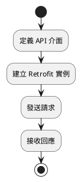
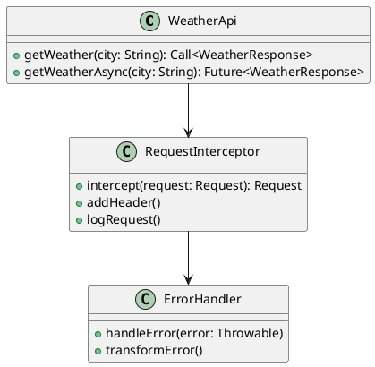
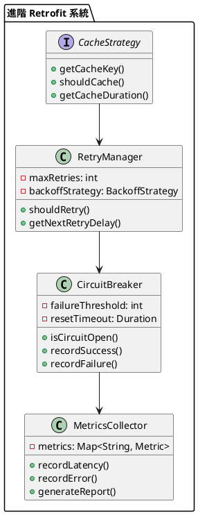

# Spring 使用 Retrofit 教學

## 初級（Beginner）層級

### 1. 概念說明
Retrofit 是一個幫助我們更容易呼叫網路 API 的工具。初級學習者需要了解：
- 什麼是 API 呼叫
- 基本的 HTTP 請求
- 簡單的資料轉換

### 2. PlantUML 圖解


### 3. 分段教學步驟

#### 步驟 1：基本專案設定
```xml
<!-- pom.xml -->
<dependencies>
    <dependency>
        <groupId>com.squareup.retrofit2</groupId>
        <artifactId>retrofit</artifactId>
        <version>2.9.0</version>
    </dependency>
    <dependency>
        <groupId>com.squareup.retrofit2</groupId>
        <artifactId>converter-gson</artifactId>
        <version>2.9.0</version>
    </dependency>
</dependencies>
```

#### 步驟 2：定義 API 介面
```java
import retrofit2.Call;
import retrofit2.http.GET;
import retrofit2.http.Path;

public interface WeatherApi {
    @GET("weather/{city}")
    Call<WeatherResponse> getWeather(@Path("city") String city);
}
```

#### 步驟 3：基本使用
```java
import retrofit2.Retrofit;
import retrofit2.converter.gson.GsonConverterFactory;
import org.springframework.stereotype.Service;

@Service
public class WeatherService {
    private final WeatherApi weatherApi;

    public WeatherService() {
        Retrofit retrofit = new Retrofit.Builder()
            .baseUrl("https://api.weather.com/")
            .addConverterFactory(GsonConverterFactory.create())
            .build();

        weatherApi = retrofit.create(WeatherApi.class);
    }

    public WeatherResponse getWeather(String city) throws IOException {
        return weatherApi.getWeather(city).execute().body();
    }
}
```

## 中級（Intermediate）層級

### 1. 概念說明
中級學習者需要理解：
- 非同步請求處理
- 錯誤處理機制
- 請求攔截器
- 資料驗證

### 2. PlantUML 圖解


### 3. 分段教學步驟

#### 步驟 1：非同步請求
```java
import retrofit2.Call;
import retrofit2.Callback;
import retrofit2.Response;
import org.springframework.stereotype.Service;
import java.util.concurrent.CompletableFuture;

@Service
public class AsyncWeatherService {
    private final WeatherApi weatherApi;

    public AsyncWeatherService(WeatherApi weatherApi) {
        this.weatherApi = weatherApi;
    }

    public CompletableFuture<WeatherResponse> getWeatherAsync(String city) {
        CompletableFuture<WeatherResponse> future = new CompletableFuture<>();

        weatherApi.getWeather(city).enqueue(new Callback<WeatherResponse>() {
            @Override
            public void onResponse(Call<WeatherResponse> call, Response<WeatherResponse> response) {
                if (response.isSuccessful()) {
                    future.complete(response.body());
                } else {
                    future.completeExceptionally(new RuntimeException("API 呼叫失敗"));
                }
            }

            @Override
            public void onFailure(Call<WeatherResponse> call, Throwable t) {
                future.completeExceptionally(t);
            }
        });

        return future;
    }
}
```

#### 步驟 2：請求攔截器
```java
import okhttp3.Interceptor;
import okhttp3.Request;
import okhttp3.Response;
import org.springframework.stereotype.Component;
import java.io.IOException;

@Component
public class LoggingInterceptor implements Interceptor {
    @Override
    public Response intercept(Chain chain) throws IOException {
        Request request = chain.request();
        
        // 記錄請求資訊
        System.out.println("發送請求: " + request.url());
        System.out.println("請求方法: " + request.method());
        
        // 加入自訂標頭
        Request newRequest = request.newBuilder()
            .addHeader("X-Request-ID", UUID.randomUUID().toString())
            .build();
        
        return chain.proceed(newRequest);
    }
}
```

#### 步驟 3：錯誤處理
```java
import org.springframework.stereotype.Component;
import retrofit2.Response;
import java.io.IOException;

@Component
public class ApiErrorHandler {
    public void handleError(Response<?> response) throws IOException {
        if (!response.isSuccessful()) {
            String errorBody = response.errorBody().string();
            switch (response.code()) {
                case 400:
                    throw new IllegalArgumentException("請求格式錯誤: " + errorBody);
                case 401:
                    throw new SecurityException("未授權: " + errorBody);
                case 404:
                    throw new RuntimeException("找不到資源: " + errorBody);
                default:
                    throw new RuntimeException("API 錯誤: " + errorBody);
            }
        }
    }
}
```

## 高級（Advanced）層級

### 1. 概念說明
高級學習者需要掌握：
- 進階請求配置
- 快取策略
- 重試機制
- 效能監控

### 2. PlantUML 圖解


### 3. 分段教學步驟

#### 步驟 1：快取策略
```java
import okhttp3.Cache;
import okhttp3.OkHttpClient;
import org.springframework.context.annotation.Bean;
import org.springframework.context.annotation.Configuration;
import java.io.File;
import java.util.concurrent.TimeUnit;

@Configuration
public class CacheConfig {
    @Bean
    public OkHttpClient okHttpClient() {
        File cacheDirectory = new File("cache");
        int cacheSize = 10 * 1024 * 1024; // 10MB
        Cache cache = new Cache(cacheDirectory, cacheSize);

        return new OkHttpClient.Builder()
            .cache(cache)
            .addInterceptor(new CacheInterceptor())
            .addNetworkInterceptor(new CacheControlInterceptor())
            .build();
    }
}

class CacheInterceptor implements Interceptor {
    @Override
    public Response intercept(Chain chain) throws IOException {
        Request request = chain.request();
        Response response = chain.proceed(request);

        // 設定快取策略
        return response.newBuilder()
            .header("Cache-Control", "public, max-age=3600")
            .build();
    }
}
```

#### 步驟 2：重試機制
```java
import okhttp3.Interceptor;
import okhttp3.Request;
import okhttp3.Response;
import java.io.IOException;
import java.util.concurrent.TimeUnit;

public class RetryInterceptor implements Interceptor {
    private final int maxRetries;
    private final long retryDelay;

    public RetryInterceptor(int maxRetries, long retryDelay) {
        this.maxRetries = maxRetries;
        this.retryDelay = retryDelay;
    }

    @Override
    public Response intercept(Chain chain) throws IOException {
        Request request = chain.request();
        Response response = null;
        IOException exception = null;

        for (int i = 0; i <= maxRetries; i++) {
            try {
                response = chain.proceed(request);
                if (response.isSuccessful()) {
                    return response;
                }
            } catch (IOException e) {
                exception = e;
            }

            if (i < maxRetries) {
                try {
                    TimeUnit.MILLISECONDS.sleep(retryDelay * (i + 1));
                } catch (InterruptedException e) {
                    Thread.currentThread().interrupt();
                    throw new IOException("重試被中斷", e);
                }
            }
        }

        throw exception != null ? exception : new IOException("重試次數已達上限");
    }
}
```

#### 步驟 3：效能監控
```java
import okhttp3.Interceptor;
import okhttp3.Request;
import okhttp3.Response;
import org.springframework.stereotype.Component;
import java.io.IOException;
import java.util.concurrent.ConcurrentHashMap;
import java.util.concurrent.atomic.AtomicLong;

@Component
public class MetricsInterceptor implements Interceptor {
    private final Map<String, ApiMetrics> metrics = new ConcurrentHashMap<>();

    @Override
    public Response intercept(Chain chain) throws IOException {
        Request request = chain.request();
        String endpoint = request.url().encodedPath();
        long startTime = System.nanoTime();

        try {
            Response response = chain.proceed(request);
            long duration = System.nanoTime() - startTime;

            metrics.computeIfAbsent(endpoint, k -> new ApiMetrics())
                  .recordSuccess(duration);

            return response;
        } catch (IOException e) {
            metrics.computeIfAbsent(endpoint, k -> new ApiMetrics())
                  .recordError();
            throw e;
        }
    }

    private static class ApiMetrics {
        private final AtomicLong totalRequests = new AtomicLong();
        private final AtomicLong totalErrors = new AtomicLong();
        private final AtomicLong totalLatency = new AtomicLong();

        void recordSuccess(long latency) {
            totalRequests.incrementAndGet();
            totalLatency.addAndGet(latency);
        }

        void recordError() {
            totalErrors.incrementAndGet();
        }

        double getAverageLatency() {
            return totalRequests.get() > 0 
                ? totalLatency.get() / (double) totalRequests.get() 
                : 0;
        }

        double getErrorRate() {
            return totalRequests.get() > 0 
                ? totalErrors.get() / (double) totalRequests.get() 
                : 0;
        }
    }
}
```

這個教學文件提供了從基礎到進階的 Spring 使用 Retrofit 學習路徑，每個層級都包含了相應的概念說明、圖解、教學步驟和實作範例。初級學習者可以從基本的 API 呼叫開始，中級學習者可以學習更複雜的非同步請求和錯誤處理，而高級學習者則可以掌握完整的快取策略和效能監控。 