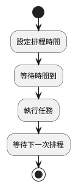
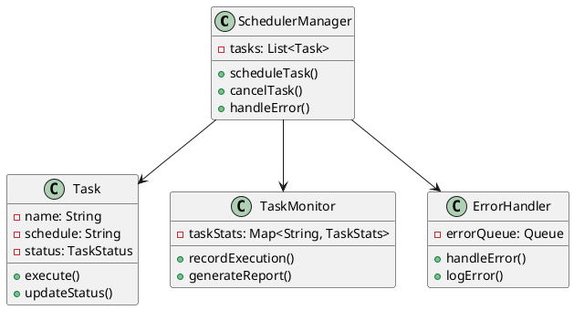
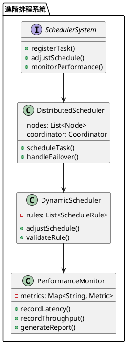

# Spring Scheduler 教學

## 初級（Beginner）層級

### 1. 概念說明
Spring Scheduler 就像是一個自動化的鬧鐘系統，可以讓程式在指定的時間自動執行某些任務，就像學校的上課鐘聲一樣。初級學習者需要了解：
- 什麼是排程（Scheduling）
- 為什麼需要排程
- 基本的定時任務設定

### 2. PlantUML 圖解


### 3. 分段教學步驟

#### 步驟 1：基本專案設定
```xml
<!-- pom.xml -->
<dependencies>
    <dependency>
        <groupId>org.springframework.boot</groupId>
        <artifactId>spring-boot-starter</artifactId>
    </dependency>
    <dependency>
        <groupId>org.springframework.boot</groupId>
        <artifactId>spring-boot-starter-web</artifactId>
    </dependency>
</dependencies>
```

#### 步驟 2：基本配置
```java
import org.springframework.context.annotation.Configuration;
import org.springframework.scheduling.annotation.EnableScheduling;

@Configuration
@EnableScheduling
public class SchedulerConfig {
    // 基本配置完成
}
```

#### 步驟 3：基本使用
```java
import org.springframework.scheduling.annotation.Scheduled;
import org.springframework.stereotype.Component;

@Component
public class SchoolBell {
    
    @Scheduled(fixedRate = 3600000) // 每小時執行一次
    public void ringBell() {
        System.out.println("上課鐘聲響起！");
    }
}
```

## 中級（Intermediate）層級

### 1. 概念說明
中級學習者需要理解：
- 排程時間的設定方式
- 任務的執行順序
- 錯誤處理機制
- 任務狀態追蹤

### 2. PlantUML 圖解


### 3. 分段教學步驟

#### 步驟 1：進階排程設定
```java
import org.springframework.scheduling.annotation.Scheduled;
import org.springframework.stereotype.Component;
import java.time.LocalDateTime;

@Component
public class AdvancedScheduler {
    
    @Scheduled(cron = "0 0 8 * * MON-FRI") // 每個工作日的早上8點
    public void morningAnnouncement() {
        System.out.println("早安！現在是 " + LocalDateTime.now());
    }
    
    @Scheduled(fixedDelay = 300000) // 每5分鐘執行一次
    public void checkAttendance() {
        System.out.println("正在檢查出席狀況...");
    }
}
```

#### 步驟 2：任務監控
```java
import org.springframework.stereotype.Component;
import java.util.Map;
import java.util.concurrent.ConcurrentHashMap;

@Component
public class TaskMonitor {
    private final Map<String, TaskStats> taskStats = new ConcurrentHashMap<>();
    
    public void recordTaskExecution(String taskName, boolean success) {
        TaskStats stats = taskStats.computeIfAbsent(taskName, k -> new TaskStats());
        stats.recordExecution(success);
    }
    
    private static class TaskStats {
        private int totalExecutions = 0;
        private int successfulExecutions = 0;
        
        void recordExecution(boolean success) {
            totalExecutions++;
            if (success) {
                successfulExecutions++;
            }
        }
        
        double getSuccessRate() {
            return totalExecutions > 0 
                ? (double) successfulExecutions / totalExecutions 
                : 0;
        }
    }
}
```

#### 步驟 3：錯誤處理
```java
import org.springframework.stereotype.Component;
import java.util.concurrent.ConcurrentLinkedQueue;

@Component
public class SchedulerErrorHandler {
    private final ConcurrentLinkedQueue<ErrorRecord> errorQueue = new ConcurrentLinkedQueue<>();
    
    public void handleError(String taskName, Exception ex) {
        errorQueue.offer(new ErrorRecord(taskName, ex));
        logError(taskName, ex);
    }
    
    private void logError(String taskName, Exception ex) {
        System.err.printf("任務 %s 執行失敗: %s%n", 
            taskName, 
            ex.getMessage());
    }
    
    private static class ErrorRecord {
        private final String taskName;
        private final Exception exception;
        
        ErrorRecord(String taskName, Exception exception) {
            this.taskName = taskName;
            this.exception = exception;
        }
    }
}
```

## 高級（Advanced）層級

### 1. 概念說明
高級學習者需要掌握：
- 分散式排程系統
- 動態排程調整
- 效能優化
- 監控機制

### 2. PlantUML 圖解


### 3. 分段教學步驟

#### 步驟 1：分散式排程
```java
import org.springframework.stereotype.Component;
import java.util.List;
import java.util.concurrent.CompletableFuture;

@Component
public class DistributedScheduler {
    private final List<SchedulerNode> nodes;
    
    public DistributedScheduler(List<SchedulerNode> nodes) {
        this.nodes = nodes;
    }
    
    public CompletableFuture<Void> scheduleTask(Task task) {
        return CompletableFuture.allOf(
            nodes.stream()
                .map(node -> node.executeTask(task))
                .toArray(CompletableFuture[]::new)
        ).exceptionally(ex -> {
            handleNodeFailure(ex);
            return null;
        });
    }
    
    private void handleNodeFailure(Throwable ex) {
        System.err.println("節點執行失敗: " + ex.getMessage());
    }
}
```

#### 步驟 2：動態排程調整
```java
import org.springframework.stereotype.Component;
import java.util.Map;
import java.util.concurrent.ConcurrentHashMap;

@Component
public class DynamicScheduler {
    private final Map<String, ScheduleRule> rules = new ConcurrentHashMap<>();
    
    public void adjustSchedule(String taskName, ScheduleRule newRule) {
        if (validateRule(newRule)) {
            rules.put(taskName, newRule);
            applyNewSchedule(taskName, newRule);
        } else {
            handleInvalidRule(taskName, newRule);
        }
    }
    
    private boolean validateRule(ScheduleRule rule) {
        // 驗證排程規則的邏輯
        return true;
    }
    
    private void applyNewSchedule(String taskName, ScheduleRule rule) {
        System.out.printf("更新任務 %s 的排程規則%n", taskName);
    }
    
    private void handleInvalidRule(String taskName, ScheduleRule rule) {
        System.err.printf("無效的排程規則: %s%n", taskName);
    }
}
```

#### 步驟 3：效能監控
```java
import org.springframework.stereotype.Component;
import java.util.concurrent.ConcurrentHashMap;
import java.util.concurrent.atomic.AtomicLong;

@Component
public class SchedulerPerformanceMonitor {
    private final Map<String, TaskMetrics> metrics = new ConcurrentHashMap<>();
    
    public void recordTaskExecution(String taskName, long duration, boolean success) {
        TaskMetrics metric = metrics.computeIfAbsent(taskName, k -> new TaskMetrics());
        metric.recordExecution(duration, success);
    }
    
    private static class TaskMetrics {
        private final AtomicLong totalExecutions = new AtomicLong();
        private final AtomicLong successfulExecutions = new AtomicLong();
        private final AtomicLong totalDuration = new AtomicLong();
        
        void recordExecution(long duration, boolean success) {
            totalExecutions.incrementAndGet();
            if (success) {
                successfulExecutions.incrementAndGet();
            }
            totalDuration.addAndGet(duration);
        }
        
        double getSuccessRate() {
            return totalExecutions.get() > 0 
                ? (double) successfulExecutions.get() / totalExecutions.get() 
                : 0;
        }
        
        double getAverageDuration() {
            return totalExecutions.get() > 0 
                ? (double) totalDuration.get() / totalExecutions.get() 
                : 0;
        }
    }
}
```

這個教學文件提供了從基礎到進階的 Spring Scheduler 學習路徑，每個層級都包含了相應的概念說明、圖解、教學步驟和實作範例。初級學習者可以從基本的定時任務開始，中級學習者可以學習更複雜的排程設定和錯誤處理，而高級學習者則可以掌握完整的分散式排程系統和效能監控。 