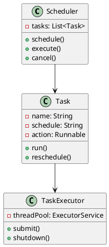
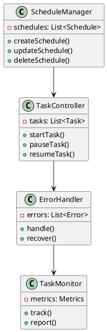
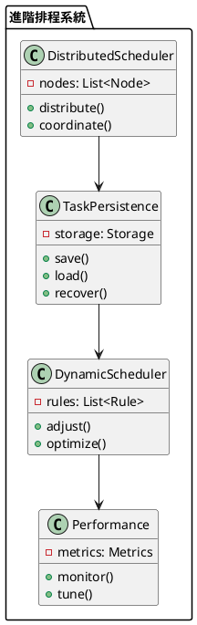

# Spring Scheduler 教學

## 初級（Beginner）層級

### 1. 概念說明
Spring Scheduler 就像是一個班級的課表系統，可以自動安排和執行各種任務。初級學習者需要了解：
- 什麼是排程任務
- 為什麼需要排程任務
- 基本的定時任務設定

### 2. PlantUML 圖解


### 3. 分段教學步驟

#### 步驟 1：基本專案設定
```xml
<!-- pom.xml -->
<dependencies>
    <dependency>
        <groupId>org.springframework.boot</groupId>
        <artifactId>spring-boot-starter-web</artifactId>
        <version>3.3.10</version>
    </dependency>
    <dependency>
        <groupId>org.springframework.boot</groupId>
        <artifactId>spring-boot-starter-quartz</artifactId>
        <version>3.3.10</version>
    </dependency>
</dependencies>
```

#### 步驟 2：基本配置
```yaml
# application.yml
spring:
  task:
    scheduling:
      pool:
        size: 5
      thread-name-prefix: class-scheduler-
```

#### 步驟 3：簡單範例
```java
import org.springframework.scheduling.annotation.*;
import org.springframework.stereotype.*;

@Service
public class ClassScheduleService {
    
    @Scheduled(fixedRate = 5000)
    public void checkAttendance() {
        System.out.println("正在檢查出席狀況...");
    }
    
    @Scheduled(cron = "0 0 8 * * ?")
    public void morningAnnouncement() {
        System.out.println("早安！今天是新的一天！");
    }
}
```

## 中級（Intermediate）層級

### 1. 概念說明
中級學習者需要理解：
- 任務排程策略
- 任務執行控制
- 錯誤處理
- 任務監控

### 2. PlantUML 圖解


### 3. 分段教學步驟

#### 步驟 1：任務排程策略
```java
import org.springframework.scheduling.annotation.*;
import org.springframework.stereotype.*;
import java.util.concurrent.*;

@Service
public class ClassScheduleStrategyService {
    
    @Scheduled(fixedDelay = 1000)
    public void fixedDelayTask() {
        System.out.println("固定延遲任務執行中...");
    }
    
    @Scheduled(fixedRate = 2000)
    public void fixedRateTask() {
        System.out.println("固定頻率任務執行中...");
    }
    
    @Scheduled(initialDelay = 5000, fixedRate = 3000)
    public void initialDelayTask() {
        System.out.println("初始延遲任務執行中...");
    }
}
```

#### 步驟 2：任務執行控制
```java
import org.springframework.scheduling.annotation.*;
import org.springframework.stereotype.*;
import java.util.concurrent.*;

@Service
public class ClassTaskControlService {
    
    private final ScheduledExecutorService executor;
    
    public ClassTaskControlService() {
        this.executor = Executors.newScheduledThreadPool(3);
    }
    
    public void startTask(Runnable task, long initialDelay, long period) {
        executor.scheduleAtFixedRate(task, initialDelay, period, TimeUnit.SECONDS);
    }
    
    public void stopTask() {
        executor.shutdown();
    }
}
```

#### 步驟 3：錯誤處理
```java
import org.springframework.scheduling.annotation.*;
import org.springframework.stereotype.*;

@Service
public class ClassErrorHandlerService {
    
    @Scheduled(fixedRate = 5000)
    public void handleTaskErrors() {
        try {
            System.out.println("執行任務中...");
            // 模擬錯誤
            if (Math.random() > 0.5) {
                throw new RuntimeException("任務執行失敗");
            }
        } catch (Exception e) {
            System.out.println("錯誤處理: " + e.getMessage());
            // 錯誤恢復邏輯
        }
    }
}
```

## 高級（Advanced）層級

### 1. 概念說明
高級學習者需要掌握：
- 分散式排程
- 任務持久化
- 動態排程
- 效能優化

### 2. PlantUML 圖解


### 3. 分段教學步驟

#### 步驟 1：分散式排程
```java
import org.springframework.scheduling.annotation.*;
import org.springframework.stereotype.*;
import java.util.concurrent.*;

@Service
public class ClassDistributedSchedulerService {
    
    private final List<ScheduledExecutorService> executors;
    
    public void distributeTask(Runnable task, long period) {
        for (ScheduledExecutorService executor : executors) {
            executor.scheduleAtFixedRate(task, 0, period, TimeUnit.SECONDS);
        }
    }
    
    public void coordinateTasks() {
        // 協調不同節點上的任務執行
        System.out.println("正在協調分散式任務...");
    }
}
```

#### 步驟 2：任務持久化
```java
import org.springframework.scheduling.annotation.*;
import org.springframework.stereotype.*;
import org.springframework.transaction.annotation.*;

@Service
public class ClassTaskPersistenceService {
    
    private final TaskRepository taskRepository;
    
    @Transactional
    public void saveTaskSchedule(String taskName, String schedule) {
        TaskSchedule taskSchedule = new TaskSchedule();
        taskSchedule.setTaskName(taskName);
        taskSchedule.setSchedule(schedule);
        taskRepository.save(taskSchedule);
    }
    
    @Transactional
    public void loadAndExecuteTasks() {
        List<TaskSchedule> schedules = taskRepository.findAll();
        for (TaskSchedule schedule : schedules) {
            // 根據儲存的排程執行任務
            System.out.println("執行任務: " + schedule.getTaskName());
        }
    }
}
```

#### 步驟 3：動態排程
```java
import org.springframework.scheduling.annotation.*;
import org.springframework.stereotype.*;
import org.springframework.scheduling.support.*;

@Service
public class ClassDynamicSchedulerService {
    
    private final TaskScheduler taskScheduler;
    private ScheduledFuture<?> scheduledTask;
    
    public void scheduleDynamicTask(Runnable task, String cronExpression) {
        if (scheduledTask != null) {
            scheduledTask.cancel(false);
        }
        
        CronTrigger trigger = new CronTrigger(cronExpression);
        scheduledTask = taskScheduler.schedule(task, trigger);
    }
    
    public void adjustSchedule(String newCronExpression) {
        // 動態調整排程
        System.out.println("調整排程為: " + newCronExpression);
    }
}
```

這個教學文件提供了從基礎到進階的 Spring Scheduler 學習路徑，每個層級都包含了相應的概念說明、圖解、教學步驟和實作範例。初級學習者可以從基本的定時任務開始，中級學習者可以學習更複雜的任務控制和錯誤處理，而高級學習者則可以掌握分散式排程和動態排程等進階功能。 