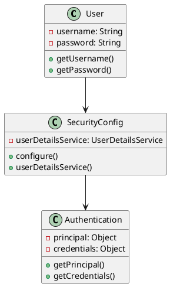
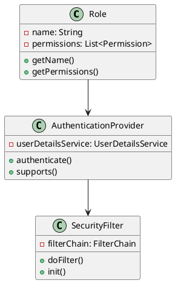
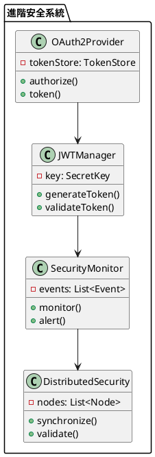

# Spring Security 教學

## 初級（Beginner）層級

### 1. 概念說明
Spring Security 就像是一個班級的門禁系統，可以保護班級的安全。初級學習者需要了解：
- 什麼是認證和授權
- 為什麼需要安全保護
- 基本的用戶登入和權限控制

### 2. PlantUML 圖解


### 3. 分段教學步驟

#### 步驟 1：基本專案設定
```xml
<!-- pom.xml -->
<dependencies>
    <dependency>
        <groupId>org.springframework.boot</groupId>
        <artifactId>spring-boot-starter-security</artifactId>
        <version>3.3.10</version>
    </dependency>
</dependencies>
```

#### 步驟 2：基本配置
```yaml
# application.yml
spring:
  security:
    user:
      name: student
      password: password
```

#### 步驟 3：簡單範例
```java
import org.springframework.security.config.annotation.web.builders.*;
import org.springframework.security.config.annotation.web.configuration.*;
import org.springframework.security.core.userdetails.*;
import org.springframework.security.crypto.password.*;

@Configuration
@EnableWebSecurity
public class SecurityConfig {
    
    @Bean
    public SecurityFilterChain securityFilterChain(HttpSecurity http) throws Exception {
        http
            .authorizeHttpRequests(auth -> auth
                .requestMatchers("/public/**").permitAll()
                .anyRequest().authenticated()
            )
            .formLogin(form -> form
                .loginPage("/login")
                .permitAll()
            );
        return http.build();
    }
    
    @Bean
    public UserDetailsService userDetailsService() {
        UserDetails user = User.withUsername("student")
            .password(passwordEncoder().encode("password"))
            .roles("STUDENT")
            .build();
        return new InMemoryUserDetailsManager(user);
    }
    
    @Bean
    public PasswordEncoder passwordEncoder() {
        return new BCryptPasswordEncoder();
    }
}
```

## 中級（Intermediate）層級

### 1. 概念說明
中級學習者需要理解：
- 角色和權限
- 自定義認證
- 會話管理
- 安全過濾器

### 2. PlantUML 圖解


### 3. 分段教學步驟

#### 步驟 1：自定義認證
```java
import org.springframework.security.authentication.*;
import org.springframework.security.core.*;
import org.springframework.security.core.userdetails.*;
import org.springframework.stereotype.Component;

@Component
public class CustomAuthenticationProvider implements AuthenticationProvider {
    
    @Override
    public Authentication authenticate(Authentication authentication) 
            throws AuthenticationException {
        String username = authentication.getName();
        String password = authentication.getCredentials().toString();
        
        if ("student".equals(username) && "password".equals(password)) {
            return new UsernamePasswordAuthenticationToken(
                username, password, List.of(new SimpleGrantedAuthority("ROLE_STUDENT"))
            );
        } else {
            throw new BadCredentialsException("認證失敗");
        }
    }
    
    @Override
    public boolean supports(Class<?> authentication) {
        return authentication.equals(UsernamePasswordAuthenticationToken.class);
    }
}
```

#### 步驟 2：角色和權限
```java
import org.springframework.security.config.annotation.web.builders.*;
import org.springframework.security.config.annotation.web.configuration.*;
import org.springframework.security.core.authority.*;

@Configuration
@EnableWebSecurity
public class RoleBasedSecurityConfig {
    
    @Bean
    public SecurityFilterChain securityFilterChain(HttpSecurity http) throws Exception {
        http
            .authorizeHttpRequests(auth -> auth
                .requestMatchers("/student/**").hasRole("STUDENT")
                .requestMatchers("/teacher/**").hasRole("TEACHER")
                .requestMatchers("/admin/**").hasRole("ADMIN")
                .anyRequest().authenticated()
            )
            .formLogin(form -> form
                .loginPage("/login")
                .permitAll()
            );
        return http.build();
    }
}
```

#### 步驟 3：會話管理
```java
import org.springframework.security.config.annotation.web.builders.*;
import org.springframework.security.config.annotation.web.configuration.*;
import org.springframework.security.web.session.*;

@Configuration
@EnableWebSecurity
public class SessionSecurityConfig {
    
    @Bean
    public SecurityFilterChain securityFilterChain(HttpSecurity http) throws Exception {
        http
            .sessionManagement(session -> session
                .maximumSessions(1)
                .expiredUrl("/login?expired")
                .maxSessionsPreventsLogin(true)
            )
            .formLogin(form -> form
                .loginPage("/login")
                .permitAll()
            );
        return http.build();
    }
}
```

## 高級（Advanced）層級

### 1. 概念說明
高級學習者需要掌握：
- OAuth2 和 JWT
- 進階授權
- 安全事件監控
- 分散式安全

### 2. PlantUML 圖解


### 3. 分段教學步驟

#### 步驟 1：OAuth2 配置
```java
import org.springframework.security.oauth2.config.annotation.web.configuration.*;
import org.springframework.security.oauth2.config.annotation.configurers.*;
import org.springframework.security.oauth2.provider.token.*;

@Configuration
@EnableAuthorizationServer
public class OAuth2Config extends AuthorizationServerConfigurerAdapter {
    
    @Override
    public void configure(ClientDetailsServiceConfigurer clients) throws Exception {
        clients.inMemory()
            .withClient("client")
            .secret(passwordEncoder().encode("secret"))
            .authorizedGrantTypes("password", "refresh_token")
            .scopes("read", "write")
            .accessTokenValiditySeconds(3600);
    }
    
    @Override
    public void configure(AuthorizationServerEndpointsConfigurer endpoints) {
        endpoints.tokenStore(tokenStore())
            .authenticationManager(authenticationManager);
    }
    
    @Bean
    public TokenStore tokenStore() {
        return new InMemoryTokenStore();
    }
}
```

#### 步驟 2：JWT 實現
```java
import io.jsonwebtoken.*;
import org.springframework.security.core.*;
import org.springframework.stereotype.Component;

@Component
public class JwtTokenProvider {
    
    private final String secret = "your-secret-key";
    private final long validityInMilliseconds = 3600000;
    
    public String createToken(Authentication authentication) {
        UserDetails user = (UserDetails) authentication.getPrincipal();
        Date now = new Date();
        Date validity = new Date(now.getTime() + validityInMilliseconds);
        
        return Jwts.builder()
            .setSubject(user.getUsername())
            .setIssuedAt(now)
            .setExpiration(validity)
            .signWith(SignatureAlgorithm.HS256, secret)
            .compact();
    }
    
    public boolean validateToken(String token) {
        try {
            Jws<Claims> claims = Jwts.parser()
                .setSigningKey(secret)
                .parseClaimsJws(token);
            return !claims.getBody().getExpiration().before(new Date());
        } catch (JwtException | IllegalArgumentException e) {
            return false;
        }
    }
}
```

#### 步驟 3：安全監控
```java
import org.springframework.security.core.*;
import org.springframework.security.core.context.*;
import org.springframework.security.web.authentication.*;
import org.springframework.stereotype.Component;

@Component
public class SecurityEventMonitor extends SimpleUrlAuthenticationSuccessHandler {
    
    @Override
    public void onAuthenticationSuccess(HttpServletRequest request,
            HttpServletResponse response, Authentication authentication) {
        SecurityContext context = SecurityContextHolder.getContext();
        String username = authentication.getName();
        String ip = request.getRemoteAddr();
        
        // 記錄安全事件
        logSecurityEvent("LOGIN_SUCCESS", username, ip);
        
        super.onAuthenticationSuccess(request, response, authentication);
    }
    
    private void logSecurityEvent(String eventType, String username, String ip) {
        // 實現安全事件記錄邏輯
    }
}
```

這個教學文件提供了從基礎到進階的 Spring Security 學習路徑，每個層級都包含了相應的概念說明、圖解、教學步驟和實作範例。初級學習者可以從基本的認證和授權開始，中級學習者可以學習更複雜的角色和權限管理，而高級學習者則可以掌握 OAuth2、JWT 和進階安全監控等進階功能。 