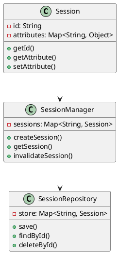
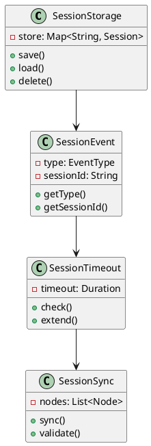
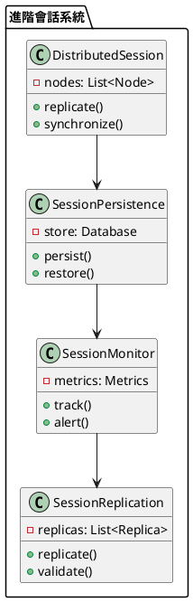

# Spring Session 教學

## 初級（Beginner）層級

### 1. 概念說明
Spring Session 就像是一個班級的點名簿，可以記錄每個同學的上課狀態。初級學習者需要了解：
- 什麼是會話（Session）
- 為什麼需要會話管理
- 基本的會話操作

### 2. PlantUML 圖解


### 3. 分段教學步驟

#### 步驟 1：基本專案設定
```xml
<!-- pom.xml -->
<dependencies>
    <dependency>
        <groupId>org.springframework.boot</groupId>
        <artifactId>spring-boot-starter-web</artifactId>
        <version>3.3.10</version>
    </dependency>
    <dependency>
        <groupId>org.springframework.session</groupId>
        <artifactId>spring-session-core</artifactId>
        <version>3.3.10</version>
    </dependency>
</dependencies>
```

#### 步驟 2：基本配置
```yaml
# application.yml
spring:
  session:
    store-type: simple
    timeout: 30m
```

#### 步驟 3：簡單範例
```java
import org.springframework.web.bind.annotation.*;
import org.springframework.http.*;
import jakarta.servlet.http.*;

@RestController
@RequestMapping("/api/class")
public class ClassController {
    
    @GetMapping("/attendance")
    public ResponseEntity<String> checkAttendance(HttpSession session) {
        String studentId = (String) session.getAttribute("studentId");
        if (studentId == null) {
            return ResponseEntity.status(HttpStatus.UNAUTHORIZED)
                .body("請先登入");
        }
        return ResponseEntity.ok("學生 " + studentId + " 已簽到");
    }
    
    @PostMapping("/login")
    public ResponseEntity<String> login(@RequestParam String studentId,
                                      HttpSession session) {
        session.setAttribute("studentId", studentId);
        return ResponseEntity.ok("登入成功");
    }
}
```

## 中級（Intermediate）層級

### 1. 概念說明
中級學習者需要理解：
- 會話存儲
- 會話事件
- 會話超時
- 會話同步

### 2. PlantUML 圖解


### 3. 分段教學步驟

#### 步驟 1：會話存儲
```java
import org.springframework.session.*;
import org.springframework.stereotype.Component;
import java.util.concurrent.*;

@Component
public class CustomSessionRepository implements SessionRepository<Session> {
    
    private final Map<String, Session> sessions = new ConcurrentHashMap<>();
    
    @Override
    public Session createSession() {
        Session session = new MapSession();
        sessions.put(session.getId(), session);
        return session;
    }
    
    @Override
    public void save(Session session) {
        sessions.put(session.getId(), session);
    }
    
    @Override
    public Session findById(String id) {
        return sessions.get(id);
    }
    
    @Override
    public void deleteById(String id) {
        sessions.remove(id);
    }
}
```

#### 步驟 2：會話事件
```java
import org.springframework.session.events.*;
import org.springframework.context.event.*;
import org.springframework.stereotype.Component;

@Component
public class SessionEventListener {
    
    @EventListener
    public void handleSessionCreated(SessionCreatedEvent event) {
        System.out.println("會話創建: " + event.getSessionId());
    }
    
    @EventListener
    public void handleSessionDestroyed(SessionDestroyedEvent event) {
        System.out.println("會話銷毀: " + event.getSessionId());
    }
    
    @EventListener
    public void handleSessionExpired(SessionExpiredEvent event) {
        System.out.println("會話過期: " + event.getSessionId());
    }
}
```

#### 步驟 3：會話超時
```java
import org.springframework.session.config.annotation.web.http.*;
import org.springframework.web.bind.annotation.*;

@Configuration
@EnableSpringHttpSession
public class SessionConfig {
    
    @Bean
    public SessionRepositoryFilter<?> sessionRepositoryFilter(
            SessionRepository<?> sessionRepository) {
        SessionRepositoryFilter<?> filter = new SessionRepositoryFilter<>(sessionRepository);
        filter.setHttpSessionIdResolver(new CookieHttpSessionIdResolver());
        return filter;
    }
    
    @Bean
    public CookieSerializer cookieSerializer() {
        DefaultCookieSerializer serializer = new DefaultCookieSerializer();
        serializer.setCookieName("CLASS_SESSION");
        serializer.setCookieMaxAge(1800); // 30分鐘
        return serializer;
    }
}
```

## 高級（Advanced）層級

### 1. 概念說明
高級學習者需要掌握：
- 分散式會話
- 會話複製
- 會話持久化
- 會話監控

### 2. PlantUML 圖解


### 3. 分段教學步驟

#### 步驟 1：分散式會話
```java
import org.springframework.session.data.redis.config.annotation.web.http.*;
import org.springframework.data.redis.connection.*;
import org.springframework.context.annotation.*;

@Configuration
@EnableRedisHttpSession
public class RedisSessionConfig {
    
    @Bean
    public RedisConnectionFactory redisConnectionFactory() {
        return new LettuceConnectionFactory();
    }
    
    @Bean
    public RedisTemplate<String, Object> redisTemplate(
            RedisConnectionFactory connectionFactory) {
        RedisTemplate<String, Object> template = new RedisTemplate<>();
        template.setConnectionFactory(connectionFactory);
        template.setKeySerializer(new StringRedisSerializer());
        template.setValueSerializer(new GenericJackson2JsonRedisSerializer());
        return template;
    }
}
```

#### 步驟 2：會話持久化
```java
import org.springframework.session.jdbc.config.annotation.web.http.*;
import org.springframework.context.annotation.*;
import javax.sql.DataSource;

@Configuration
@EnableJdbcHttpSession
public class JdbcSessionConfig {
    
    @Bean
    public JdbcOperationsSessionRepository sessionRepository(DataSource dataSource) {
        return new JdbcOperationsSessionRepository(dataSource);
    }
    
    @Bean
    public PlatformTransactionManager transactionManager(DataSource dataSource) {
        return new DataSourceTransactionManager(dataSource);
    }
}
```

#### 步驟 3：會話監控
```java
import org.springframework.session.*;
import org.springframework.stereotype.Component;
import java.util.concurrent.*;

@Component
public class SessionMetrics {
    
    private final Map<String, SessionStats> stats = new ConcurrentHashMap<>();
    
    public void recordSessionAccess(String sessionId) {
        stats.compute(sessionId, (key, value) -> {
            if (value == null) {
                return new SessionStats(1);
            }
            value.incrementAccessCount();
            return value;
        });
    }
    
    public SessionStats getSessionStats(String sessionId) {
        return stats.get(sessionId);
    }
    
    private static class SessionStats {
        private int accessCount;
        
        SessionStats(int accessCount) {
            this.accessCount = accessCount;
        }
        
        void incrementAccessCount() {
            accessCount++;
        }
        
        int getAccessCount() {
            return accessCount;
        }
    }
}
```

這個教學文件提供了從基礎到進階的 Spring Session 學習路徑，每個層級都包含了相應的概念說明、圖解、教學步驟和實作範例。初級學習者可以從基本的會話操作開始，中級學習者可以學習更複雜的會話存儲和事件處理，而高級學習者則可以掌握分散式會話和會話監控等進階功能。 