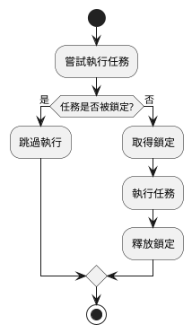
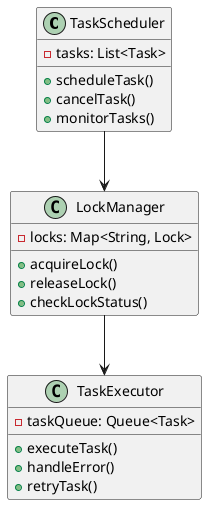
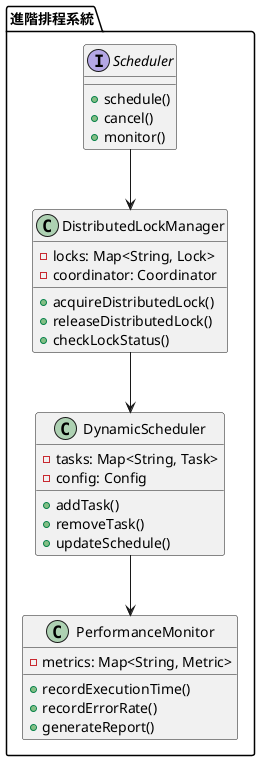

# Spring 使用 ShedLock 教學

## 初級（Beginner）層級

### 1. 概念說明
ShedLock 是一個幫助我們確保任務只執行一次的工具。初級學習者需要了解：
- 什麼是排程任務
- 為什麼需要鎖定
- 基本的鎖定機制

### 2. PlantUML 圖解


#### 步驟 2：基本配置
```java
import net.javacrumbs.shedlock.core.LockProvider;
import net.javacrumbs.shedlock.provider.jdbctemplate.JdbcTemplateLockProvider;
import org.springframework.context.annotation.Bean;
import org.springframework.context.annotation.Configuration;
import org.springframework.jdbc.core.JdbcTemplate;

@Configuration
public class ShedLockConfig {
    @Bean
    public LockProvider lockProvider(JdbcTemplate jdbcTemplate) {
        return new JdbcTemplateLockProvider(jdbcTemplate);
    }
}
```

#### 步驟 3：基本使用
```java
import net.javacrumbs.shedlock.spring.annotation.SchedulerLock;
import org.springframework.scheduling.annotation.Scheduled;
import org.springframework.stereotype.Component;

@Component
public class SimpleTask {
    @Scheduled(fixedRate = 60000)
    @SchedulerLock(name = "simpleTask", lockAtLeastFor = "PT30S", lockAtMostFor = "PT1M")
    public void execute() {
        System.out.println("執行簡單任務");
    }
}
```

## 中級（Intermediate）層級

### 1. 概念說明
中級學習者需要理解：
- 鎖定策略
- 任務排程
- 錯誤處理
- 監控機制

### 2. PlantUML 圖解


### 3. 分段教學步驟

#### 步驟 1：進階任務配置
```java
import net.javacrumbs.shedlock.spring.annotation.SchedulerLock;
import org.springframework.scheduling.annotation.Scheduled;
import org.springframework.stereotype.Component;

@Component
public class AdvancedTask {
    @Scheduled(cron = "0 0 * * * *")
    @SchedulerLock(
        name = "advancedTask",
        lockAtLeastFor = "PT5M",
        lockAtMostFor = "PT10M"
    )
    public void execute() {
        try {
            System.out.println("執行進階任務");
            // 執行複雜的任務邏輯
        } catch (Exception e) {
            System.err.println("任務執行失敗: " + e.getMessage());
        }
    }
}
```

#### 步驟 2：任務監控
```java
import net.javacrumbs.shedlock.core.LockProvider;
import org.springframework.stereotype.Component;
import java.time.Duration;
import java.time.Instant;

@Component
public class TaskMonitor {
    private final LockProvider lockProvider;

    public TaskMonitor(LockProvider lockProvider) {
        this.lockProvider = lockProvider;
    }

    public void monitorTask(String taskName) {
        var lock = lockProvider.lock(taskName);
        if (lock.isPresent()) {
            System.out.println("任務 " + taskName + " 正在執行");
            // 檢查執行時間
            Duration duration = Duration.between(
                lock.get().getLockedAt(),
                Instant.now()
            );
            if (duration.toMinutes() > 10) {
                System.out.println("警告：任務執行時間過長");
            }
        }
    }
}
```

#### 步驟 3：錯誤處理
```java
import net.javacrumbs.shedlock.spring.annotation.SchedulerLock;
import org.springframework.scheduling.annotation.Scheduled;
import org.springframework.stereotype.Component;

@Component
public class ErrorHandlingTask {
    @Scheduled(fixedRate = 300000)
    @SchedulerLock(
        name = "errorHandlingTask",
        lockAtLeastFor = "PT1M",
        lockAtMostFor = "PT5M"
    )
    public void execute() {
        try {
            // 執行可能失敗的任務
            performTask();
        } catch (Exception e) {
            handleError(e);
        }
    }

    private void performTask() {
        // 實際的任務邏輯
    }

    private void handleError(Exception e) {
        System.err.println("任務執行錯誤: " + e.getMessage());
        // 可以加入重試邏輯或通知機制
    }
}
```

## 高級（Advanced）層級

### 1. 概念說明
高級學習者需要掌握：
- 分散式鎖定
- 動態排程
- 效能優化
- 系統監控

### 2. PlantUML 圖解


### 3. 分段教學步驟

#### 步驟 1：分散式鎖定
```java
import net.javacrumbs.shedlock.core.LockProvider;
import org.springframework.stereotype.Component;
import java.util.concurrent.ConcurrentHashMap;
import java.util.concurrent.atomic.AtomicInteger;

@Component
public class DistributedLockManager {
    private final LockProvider lockProvider;
    private final Map<String, AtomicInteger> lockAttempts = new ConcurrentHashMap<>();

    public DistributedLockManager(LockProvider lockProvider) {
        this.lockProvider = lockProvider;
    }

    public boolean acquireDistributedLock(String lockName) {
        var lock = lockProvider.lock(lockName);
        if (lock.isPresent()) {
            lockAttempts.computeIfAbsent(lockName, k -> new AtomicInteger(0))
                       .incrementAndGet();
            return true;
        }
        return false;
    }

    public void releaseDistributedLock(String lockName) {
        lockProvider.unlock(lockName);
        lockAttempts.remove(lockName);
    }
}
```

#### 步驟 2：動態排程
```java
import net.javacrumbs.shedlock.spring.annotation.SchedulerLock;
import org.springframework.scheduling.annotation.Scheduled;
import org.springframework.stereotype.Component;
import java.util.concurrent.ConcurrentHashMap;

@Component
public class DynamicScheduler {
    private final Map<String, TaskConfig> taskConfigs = new ConcurrentHashMap<>();

    @Scheduled(fixedRate = 60000)
    @SchedulerLock(name = "dynamicScheduler", lockAtMostFor = "PT1M")
    public void executeDynamicTasks() {
        taskConfigs.forEach((taskName, config) -> {
            if (shouldExecute(config)) {
                executeTask(taskName, config);
            }
        });
    }

    private boolean shouldExecute(TaskConfig config) {
        // 根據配置決定是否執行任務
        return true;
    }

    private void executeTask(String taskName, TaskConfig config) {
        // 執行動態任務
    }
}
```

#### 步驟 3：效能監控
```java
import org.springframework.stereotype.Component;
import java.util.concurrent.ConcurrentHashMap;
import java.util.concurrent.atomic.AtomicLong;

@Component
public class SchedulerMetrics {
    private final Map<String, TaskMetrics> metrics = new ConcurrentHashMap<>();

    public void recordTaskExecution(String taskName, long duration, boolean success) {
        metrics.computeIfAbsent(taskName, k -> new TaskMetrics())
              .recordExecution(duration, success);
    }

    public void generateReport() {
        metrics.forEach((taskName, metric) -> {
            System.out.printf("任務: %s, 成功率: %.2f%%, 平均執行時間: %.2fms%n",
                taskName,
                metric.getSuccessRate() * 100,
                metric.getAverageDuration());
        });
    }

    private static class TaskMetrics {
        private final AtomicLong totalExecutions = new AtomicLong();
        private final AtomicLong successfulExecutions = new AtomicLong();
        private final AtomicLong totalDuration = new AtomicLong();

        void recordExecution(long duration, boolean success) {
            totalExecutions.incrementAndGet();
            if (success) {
                successfulExecutions.incrementAndGet();
            }
            totalDuration.addAndGet(duration);
        }

        double getSuccessRate() {
            return totalExecutions.get() > 0 
                ? (double) successfulExecutions.get() / totalExecutions.get() 
                : 0;
        }

        double getAverageDuration() {
            return totalExecutions.get() > 0 
                ? (double) totalDuration.get() / totalExecutions.get() 
                : 0;
        }
    }
}
```

這個教學文件提供了從基礎到進階的 Spring 使用 ShedLock 學習路徑，每個層級都包含了相應的概念說明、圖解、教學步驟和實作範例。初級學習者可以從基本的任務排程開始，中級學習者可以學習更複雜的鎖定機制和錯誤處理，而高級學習者則可以掌握完整的分散式鎖定和動態排程。 