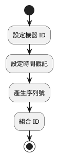
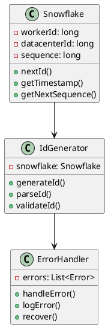
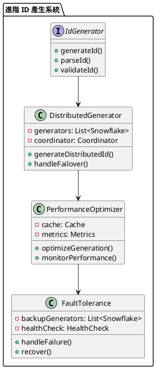

# Spring 使用 Snowflake 教學

## 初級（Beginner）層級

### 1. 概念說明
Snowflake 是一個幫助我們產生唯一 ID 的工具。初級學習者需要了解：
- 什麼是唯一 ID
- 為什麼需要唯一 ID
- 基本的 ID 產生方式

### 2. PlantUML 圖解


### 3. 分段教學步驟

#### 步驟 1：基本專案設定
```xml
<!-- pom.xml -->
<dependencies>
    <dependency>
        <groupId>com.github.ben-manes.caffeine</groupId>
        <artifactId>caffeine</artifactId>
        <version>3.1.8</version>
    </dependency>
</dependencies>
```

#### 步驟 2：基本配置
```java
import org.springframework.context.annotation.Bean;
import org.springframework.context.annotation.Configuration;

@Configuration
public class SnowflakeConfig {
    @Bean
    public Snowflake snowflake() {
        return new Snowflake(1, 1); // 機器 ID 和資料中心 ID
    }
}
```

#### 步驟 3：基本使用
```java
import org.springframework.stereotype.Component;

@Component
public class SimpleIdGenerator {
    private final Snowflake snowflake;

    public SimpleIdGenerator(Snowflake snowflake) {
        this.snowflake = snowflake;
    }

    public long generateId() {
        return snowflake.nextId();
    }
}
```

## 中級（Intermediate）層級

### 1. 概念說明
中級學習者需要理解：
- ID 的組成結構
- 時間戳記處理
- 序列號管理
- 錯誤處理

### 2. PlantUML 圖解


### 3. 分段教學步驟

#### 步驟 1：進階 ID 產生
```java
import org.springframework.stereotype.Component;
import java.time.Instant;

@Component
public class AdvancedIdGenerator {
    private final Snowflake snowflake;

    public AdvancedIdGenerator(Snowflake snowflake) {
        this.snowflake = snowflake;
    }

    public long generateId() {
        try {
            long id = snowflake.nextId();
            validateId(id);
            return id;
        } catch (Exception e) {
            handleError(e);
            return -1;
        }
    }

    private void validateId(long id) {
        if (id < 0) {
            throw new IllegalArgumentException("ID 不能為負數");
        }
    }

    private void handleError(Exception e) {
        System.err.println("ID 產生錯誤: " + e.getMessage());
    }
}
```

#### 步驟 2：ID 解析
```java
import org.springframework.stereotype.Component;
import java.time.Instant;

@Component
public class IdParser {
    public IdInfo parseId(long id) {
        long timestamp = (id >> 22) + 1288834974657L;
        long datacenterId = (id >> 17) & 0x1F;
        long workerId = (id >> 12) & 0x1F;
        long sequence = id & 0xFFF;

        return new IdInfo(
            Instant.ofEpochMilli(timestamp),
            datacenterId,
            workerId,
            sequence
        );
    }
}
```

#### 步驟 3：錯誤處理
```java
import org.springframework.stereotype.Component;
import java.util.concurrent.ConcurrentHashMap;

@Component
public class IdErrorHandler {
    private final Map<String, ErrorStats> errorStats = new ConcurrentHashMap<>();

    public void handleError(String operation, Exception e) {
        errorStats.computeIfAbsent(operation, k -> new ErrorStats())
                 .recordError(e);
        logError(operation, e);
    }

    private void logError(String operation, Exception e) {
        System.err.printf("操作 %s 發生錯誤: %s%n", operation, e.getMessage());
    }
}
```

## 高級（Advanced）層級

### 1. 概念說明
高級學習者需要掌握：
- 分散式 ID 產生
- 效能優化
- 監控機制
- 容錯處理

### 2. PlantUML 圖解


### 3. 分段教學步驟

#### 步驟 1：分散式 ID 產生
```java
import org.springframework.stereotype.Component;
import java.util.List;
import java.util.concurrent.ConcurrentHashMap;

@Component
public class DistributedIdGenerator {
    private final List<Snowflake> generators;
    private final Map<String, Snowflake> activeGenerators = new ConcurrentHashMap<>();

    public DistributedIdGenerator(List<Snowflake> generators) {
        this.generators = generators;
    }

    public long generateDistributedId() {
        Snowflake generator = selectGenerator();
        try {
            return generator.nextId();
        } catch (Exception e) {
            handleGeneratorFailure(generator);
            return generateDistributedId(); // 重試
        }
    }

    private Snowflake selectGenerator() {
        // 實現負載均衡選擇
        return generators.get(0);
    }

    private void handleGeneratorFailure(Snowflake generator) {
        activeGenerators.remove(generator.toString());
        // 啟動備用生成器
    }
}
```

#### 步驟 2：效能優化
```java
import org.springframework.stereotype.Component;
import com.github.benmanes.caffeine.cache.Cache;
import com.github.benmanes.caffeine.cache.Caffeine;
import java.util.concurrent.TimeUnit;

@Component
public class IdCache {
    private final Cache<String, Long> idCache = Caffeine.newBuilder()
        .maximumSize(1000)
        .expireAfterWrite(1, TimeUnit.MINUTES)
        .build();

    public Long getCachedId(String key) {
        return idCache.get(key, k -> generateNewId());
    }

    private Long generateNewId() {
        // 產生新的 ID
        return System.currentTimeMillis();
    }
}
```

#### 步驟 3：監控與容錯
```java
import org.springframework.stereotype.Component;
import java.util.concurrent.ConcurrentHashMap;
import java.util.concurrent.atomic.AtomicLong;

@Component
public class IdMetrics {
    private final Map<String, GeneratorStats> stats = new ConcurrentHashMap<>();

    public void recordGeneration(String generatorId, long duration, boolean success) {
        stats.computeIfAbsent(generatorId, k -> new GeneratorStats())
            .recordGeneration(duration, success);
    }

    public void generateReport() {
        stats.forEach((generatorId, stat) -> {
            System.out.printf("生成器: %s, 成功率: %.2f%%, 平均生成時間: %.2fms%n",
                generatorId,
                stat.getSuccessRate() * 100,
                stat.getAverageDuration());
        });
    }

    private static class GeneratorStats {
        private final AtomicLong totalGenerations = new AtomicLong();
        private final AtomicLong successfulGenerations = new AtomicLong();
        private final AtomicLong totalDuration = new AtomicLong();

        void recordGeneration(long duration, boolean success) {
            totalGenerations.incrementAndGet();
            if (success) {
                successfulGenerations.incrementAndGet();
            }
            totalDuration.addAndGet(duration);
        }

        double getSuccessRate() {
            return totalGenerations.get() > 0 
                ? (double) successfulGenerations.get() / totalGenerations.get() 
                : 0;
        }

        double getAverageDuration() {
            return totalGenerations.get() > 0 
                ? (double) totalDuration.get() / totalGenerations.get() 
                : 0;
        }
    }
}
```

這個教學文件提供了從基礎到進階的 Spring 使用 Snowflake 學習路徑，每個層級都包含了相應的概念說明、圖解、教學步驟和實作範例。初級學習者可以從基本的 ID 產生開始，中級學習者可以學習更複雜的 ID 解析和錯誤處理，而高級學習者則可以掌握完整的分散式 ID 產生和效能優化。 