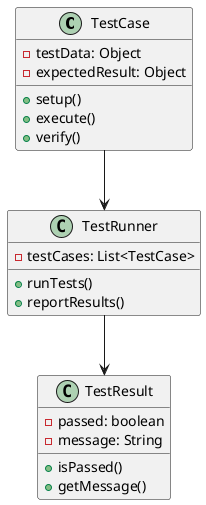
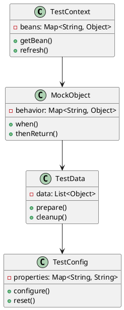
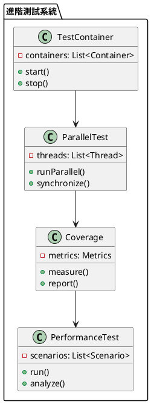

# Spring Test 教學

## 初級（Beginner）層級

### 1. 概念說明
Spring Test 就像是一個班級的測驗系統，可以幫助老師檢查同學們的學習成果。初級學習者需要了解：
- 什麼是單元測試
- 為什麼需要測試
- 基本的測試方法

### 2. PlantUML 圖解


### 3. 分段教學步驟

#### 步驟 1：基本專案設定
```xml
<!-- pom.xml -->
<dependencies>
    <dependency>
        <groupId>org.springframework.boot</groupId>
        <artifactId>spring-boot-starter-test</artifactId>
        <version>3.3.10</version>
        <scope>test</scope>
    </dependency>
</dependencies>
```

#### 步驟 2：基本配置
```yaml
# application-test.yml
spring:
  test:
    database:
      replace: none
```

#### 步驟 3：簡單範例
```java
import org.junit.jupiter.api.*;
import org.springframework.beans.factory.annotation.*;
import org.springframework.boot.test.context.*;
import static org.junit.jupiter.api.Assertions.*;

@SpringBootTest
class StudentServiceTest {
    
    @Autowired
    private StudentService studentService;
    
    @Test
    void testAddStudent() {
        // 準備測試數據
        Student student = new Student("小明", 15);
        
        // 執行測試
        Student savedStudent = studentService.addStudent(student);
        
        // 驗證結果
        assertNotNull(savedStudent.getId());
        assertEquals("小明", savedStudent.getName());
        assertEquals(15, savedStudent.getAge());
    }
}
```

## 中級（Intermediate）層級

### 1. 概念說明
中級學習者需要理解：
- 測試上下文
- 模擬對象
- 測試數據
- 測試配置

### 2. PlantUML 圖解


### 3. 分段教學步驟

#### 步驟 1：模擬對象
```java
import org.junit.jupiter.api.*;
import org.mockito.*;
import org.springframework.boot.test.context.*;
import static org.mockito.Mockito.*;

@SpringBootTest
class StudentServiceTest {
    
    @Mock
    private StudentRepository studentRepository;
    
    @InjectMocks
    private StudentService studentService;
    
    @Test
    void testFindStudent() {
        // 準備模擬數據
        Student mockStudent = new Student("小明", 15);
        when(studentRepository.findById(1L))
            .thenReturn(Optional.of(mockStudent));
        
        // 執行測試
        Student foundStudent = studentService.findStudent(1L);
        
        // 驗證結果
        assertNotNull(foundStudent);
        assertEquals("小明", foundStudent.getName());
        verify(studentRepository).findById(1L);
    }
}
```

#### 步驟 2：測試數據
```java
import org.junit.jupiter.api.*;
import org.springframework.boot.test.context.*;
import org.springframework.test.context.jdbc.*;
import static org.junit.jupiter.api.Assertions.*;

@SpringBootTest
@Sql(scripts = "classpath:test-data.sql")
class StudentServiceTest {
    
    @Autowired
    private StudentService studentService;
    
    @Test
    void testGetAllStudents() {
        // 執行測試
        List<Student> students = studentService.getAllStudents();
        
        // 驗證結果
        assertEquals(3, students.size());
        assertTrue(students.stream()
            .anyMatch(s -> s.getName().equals("小明")));
    }
    
    @Test
    @Sql(scripts = "classpath:additional-data.sql")
    void testGetStudentsByAge() {
        // 執行測試
        List<Student> students = studentService.getStudentsByAge(15);
        
        // 驗證結果
        assertEquals(2, students.size());
    }
}
```

#### 步驟 3：測試配置
```java
import org.junit.jupiter.api.*;
import org.springframework.boot.test.context.*;
import org.springframework.test.context.*;
import static org.junit.jupiter.api.Assertions.*;

@SpringBootTest
@TestPropertySource(properties = {
    "spring.datasource.url=jdbc:h2:mem:testdb",
    "spring.datasource.username=sa",
    "spring.datasource.password="
})
class StudentServiceTest {
    
    @Autowired
    private StudentService studentService;
    
    @Test
    void testUpdateStudent() {
        // 準備測試數據
        Student student = new Student("小明", 15);
        student.setId(1L);
        
        // 執行測試
        Student updatedStudent = studentService.updateStudent(student);
        
        // 驗證結果
        assertEquals("小明", updatedStudent.getName());
        assertEquals(15, updatedStudent.getAge());
    }
}
```

## 高級（Advanced）層級

### 1. 概念說明
高級學習者需要掌握：
- 測試容器
- 並行測試
- 測試覆蓋率
- 效能測試

### 2. PlantUML 圖解


### 3. 分段教學步驟

#### 步驟 1：測試容器
```java
import org.junit.jupiter.api.*;
import org.springframework.boot.test.context.*;
import org.testcontainers.containers.*;
import org.testcontainers.junit.jupiter.*;

@SpringBootTest
@Testcontainers
class StudentServiceTest {
    
    @Container
    private static final PostgreSQLContainer postgres = 
        new PostgreSQLContainer("postgres:latest");
    
    @DynamicPropertySource
    static void configureProperties(DynamicPropertyRegistry registry) {
        registry.add("spring.datasource.url", postgres::getJdbcUrl);
        registry.add("spring.datasource.username", postgres::getUsername);
        registry.add("spring.datasource.password", postgres::getPassword);
    }
    
    @Test
    void testDatabaseOperations() {
        // 執行數據庫相關測試
    }
}
```

#### 步驟 2：並行測試
```java
import org.junit.jupiter.api.*;
import org.springframework.boot.test.context.*;
import java.util.concurrent.*;

@SpringBootTest
class StudentServiceTest {
    
    @Test
    void testParallelOperations() throws Exception {
        ExecutorService executor = Executors.newFixedThreadPool(3);
        
        List<Callable<Student>> tasks = List.of(
            () -> studentService.addStudent(new Student("小明", 15)),
            () -> studentService.addStudent(new Student("小華", 16)),
            () -> studentService.addStudent(new Student("小美", 14))
        );
        
        List<Future<Student>> results = executor.invokeAll(tasks);
        
        for (Future<Student> result : results) {
            assertNotNull(result.get());
        }
        
        executor.shutdown();
    }
}
```

#### 步驟 3：效能測試
```java
import org.junit.jupiter.api.*;
import org.springframework.boot.test.context.*;
import org.springframework.test.context.junit.jupiter.*;
import java.util.concurrent.*;

@SpringBootTest
class StudentServicePerformanceTest {
    
    @Test
    void testPerformance() {
        int iterations = 1000;
        long startTime = System.currentTimeMillis();
        
        for (int i = 0; i < iterations; i++) {
            studentService.addStudent(new Student("學生" + i, 15));
        }
        
        long endTime = System.currentTimeMillis();
        long duration = endTime - startTime;
        
        assertTrue(duration < 5000, "操作耗時過長: " + duration + "ms");
    }
}
```

這個教學文件提供了從基礎到進階的 Spring Test 學習路徑，每個層級都包含了相應的概念說明、圖解、教學步驟和實作範例。初級學習者可以從基本的單元測試開始，中級學習者可以學習更複雜的模擬對象和測試數據管理，而高級學習者則可以掌握測試容器和效能測試等進階功能。 