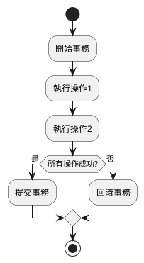
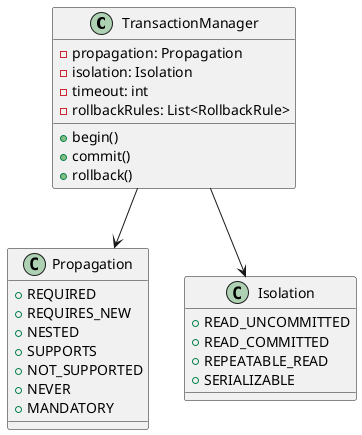
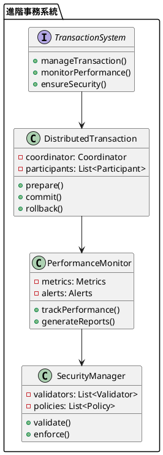

# Spring Transaction 教學

## 初級（Beginner）層級

### 1. 概念說明
Spring Transaction 就像是一個班級事務管理員，確保所有事情要麼全部完成，要麼全部不做。初級學習者需要了解：
- 什麼是事務
- 為什麼需要事務
- 基本的事務管理方式

### 2. PlantUML 圖解


### 3. 分段教學步驟

#### 步驟 1：基本專案設定
```xml
<!-- pom.xml -->
<dependencies>
    <dependency>
        <groupId>org.springframework.boot</groupId>
        <artifactId>spring-boot-starter-data-jpa</artifactId>
        <version>3.3.10</version>
    </dependency>
</dependencies>
```

#### 步驟 2：基本配置
```yaml
# application.yml
spring:
  datasource:
    url: jdbc:mysql://localhost:3306/school
    username: root
    password: password
  jpa:
    hibernate:
      ddl-auto: update
```

#### 步驟 3：簡單範例
```java
import org.springframework.stereotype.Service;
import org.springframework.transaction.annotation.Transactional;
import jakarta.persistence.EntityManager;

@Service
public class StudentService {
    private final EntityManager entityManager;
    
    public StudentService(EntityManager entityManager) {
        this.entityManager = entityManager;
    }
    
    @Transactional
    public void registerStudent(Student student) {
        entityManager.persist(student);
    }
}
```

## 中級（Intermediate）層級

### 1. 概念說明
中級學習者需要理解：
- 事務傳播行為
- 隔離級別
- 超時設定
- 回滾規則

### 2. PlantUML 圖解


### 3. 分段教學步驟

#### 步驟 1：事務傳播行為
```java
import org.springframework.stereotype.Service;
import org.springframework.transaction.annotation.Transactional;
import org.springframework.transaction.annotation.Propagation;
import jakarta.persistence.EntityManager;

@Service
public class StudentService {
    private final EntityManager entityManager;
    private final GradeService gradeService;
    
    public StudentService(EntityManager entityManager, GradeService gradeService) {
        this.entityManager = entityManager;
        this.gradeService = gradeService;
    }
    
    @Transactional(propagation = Propagation.REQUIRED)
    public void registerStudentWithGrade(Student student, Grade grade) {
        entityManager.persist(student);
        gradeService.assignGrade(student.getId(), grade);
    }
}
```

#### 步驟 2：隔離級別
```java
import org.springframework.stereotype.Service;
import org.springframework.transaction.annotation.Transactional;
import org.springframework.transaction.annotation.Isolation;
import jakarta.persistence.EntityManager;

@Service
public class GradeService {
    private final EntityManager entityManager;
    
    public GradeService(EntityManager entityManager) {
        this.entityManager = entityManager;
    }
    
    @Transactional(isolation = Isolation.READ_COMMITTED)
    public void updateGrade(Long studentId, Grade newGrade) {
        Grade grade = entityManager.find(Grade.class, studentId);
        grade.setScore(newGrade.getScore());
        entityManager.merge(grade);
    }
}
```

#### 步驟 3：超時和回滾規則
```java
import org.springframework.stereotype.Service;
import org.springframework.transaction.annotation.Transactional;
import jakarta.persistence.EntityManager;

@Service
public class ExamService {
    private final EntityManager entityManager;
    
    public ExamService(EntityManager entityManager) {
        this.entityManager = entityManager;
    }
    
    @Transactional(timeout = 30, rollbackFor = {RuntimeException.class})
    public void processExamResults(Exam exam) {
        // 處理考試結果
        entityManager.persist(exam);
        if (exam.getScore() < 60) {
            throw new RuntimeException("考試不及格");
        }
    }
}
```

## 高級（Advanced）層級

### 1. 概念說明
高級學習者需要掌握：
- 分散式事務
- 效能優化
- 事務監控
- 安全控制

### 2. PlantUML 圖解


### 3. 分段教學步驟

#### 步驟 1：分散式事務
```java
import org.springframework.stereotype.Service;
import org.springframework.transaction.annotation.Transactional;
import jakarta.persistence.EntityManager;
import java.util.Map;
import java.util.concurrent.ConcurrentHashMap;
import java.util.stream.Collectors;

@Service
public class DistributedTransactionService {
    private final Map<String, TransactionState> transactionStates = new ConcurrentHashMap<>();
    
    @Transactional
    public void processDistributedTransaction(String transactionId) {
        // 準備階段
        boolean allPrepared = prepareAllParticipants(transactionId);
        
        if (allPrepared) {
            // 提交階段
            commitAllParticipants(transactionId);
        } else {
            // 回滾階段
            rollbackAllParticipants(transactionId);
        }
    }
    
    private boolean prepareAllParticipants(String transactionId) {
        return transactionStates.entrySet().stream()
            .allMatch(entry -> entry.getValue().prepare());
    }
    
    private void commitAllParticipants(String transactionId) {
        transactionStates.forEach((id, state) -> state.commit());
    }
    
    private void rollbackAllParticipants(String transactionId) {
        transactionStates.forEach((id, state) -> state.rollback());
    }
}
```

#### 步驟 2：效能優化
```java
import org.springframework.stereotype.Service;
import org.springframework.transaction.annotation.Transactional;
import jakarta.persistence.EntityManager;
import java.util.Map;
import java.util.concurrent.ConcurrentHashMap;
import java.util.stream.Collectors;

@Service
public class OptimizedTransactionService {
    private final Map<String, PerformanceMetrics> metrics = new ConcurrentHashMap<>();
    
    @Transactional
    public void processOptimizedTransaction(String transactionId) {
        long startTime = System.currentTimeMillis();
        
        try {
            // 執行事務操作
            processTransaction(transactionId);
            
            // 記錄效能指標
            recordPerformance(transactionId, startTime, true);
        } catch (Exception e) {
            recordPerformance(transactionId, startTime, false);
            throw e;
        }
    }
    
    private void recordPerformance(String transactionId, long startTime, boolean success) {
        long duration = System.currentTimeMillis() - startTime;
        metrics.put(transactionId, new PerformanceMetrics(duration, success));
    }
}
```

#### 步驟 3：安全控制
```java
import org.springframework.stereotype.Service;
import org.springframework.transaction.annotation.Transactional;
import jakarta.persistence.EntityManager;
import java.util.Map;

@Service
public class SecureTransactionService {
    @Transactional
    public void processSecureTransaction(String transactionId) {
        // 驗證權限
        if (!hasPermission(transactionId)) {
            throw new SecurityException("權限不足");
        }
        
        // 執行安全的事務操作
        processTransaction(transactionId);
    }
    
    private boolean hasPermission(String transactionId) {
        // 實現權限檢查邏輯
        return true;
    }
}
```

這個教學文件提供了從基礎到進階的 Spring Transaction 學習路徑，每個層級都包含了相應的概念說明、圖解、教學步驟和實作範例。初級學習者可以從基本的事務管理開始，中級學習者可以學習更複雜的事務配置和行為，而高級學習者則可以掌握完整的分散式事務系統和效能優化。 