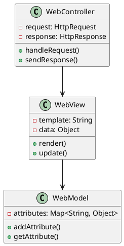
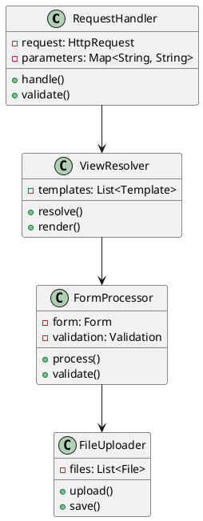
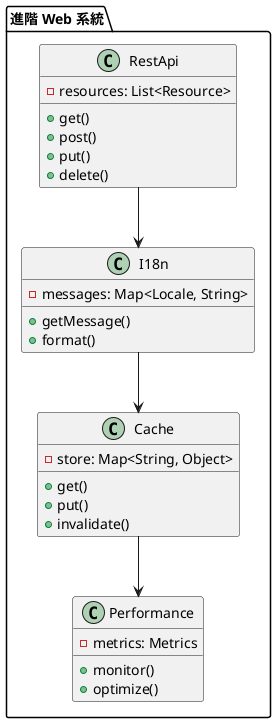

# Spring Web 教學

## 初級（Beginner）層級

### 1. 概念說明
Spring Web 就像是一個班級的網站系統，可以讓同學們在網路上交流。初級學習者需要了解：
- 什麼是 Web 應用
- 為什麼需要 Web 應用
- 基本的 Web 操作

### 2. PlantUML 圖解


### 3. 分段教學步驟

#### 步驟 1：基本專案設定
```xml
<!-- pom.xml -->
<dependencies>
    <dependency>
        <groupId>org.springframework.boot</groupId>
        <artifactId>spring-boot-starter-web</artifactId>
        <version>3.3.10</version>
    </dependency>
    <dependency>
        <groupId>org.springframework.boot</groupId>
        <artifactId>spring-boot-starter-thymeleaf</artifactId>
        <version>3.3.10</version>
    </dependency>
</dependencies>
```

#### 步驟 2：基本配置
```yaml
# application.yml
spring:
  thymeleaf:
    prefix: classpath:/templates/
    suffix: .html
  mvc:
    view:
      prefix: /templates/
      suffix: .html
```

#### 步驟 3：簡單範例
```java
import org.springframework.stereotype.*;
import org.springframework.web.bind.annotation.*;
import org.springframework.ui.*;

@Controller
public class ClassController {
    
    @GetMapping("/welcome")
    public String welcome(Model model) {
        model.addAttribute("message", "歡迎來到班級網站！");
        return "welcome";
    }
    
    @GetMapping("/students")
    public String listStudents(Model model) {
        List<Student> students = List.of(
            new Student("小明", 15),
            new Student("小華", 16)
        );
        model.addAttribute("students", students);
        return "students";
    }
}
```

## 中級（Intermediate）層級

### 1. 概念說明
中級學習者需要理解：
- 請求處理
- 視圖解析
- 表單處理
- 文件上傳

### 2. PlantUML 圖解


### 3. 分段教學步驟

#### 步驟 1：請求處理
```java
import org.springframework.web.bind.annotation.*;
import org.springframework.http.*;
import org.springframework.validation.*;

@RestController
@RequestMapping("/api/class")
public class ClassController {
    
    @GetMapping("/{id}")
    public ResponseEntity<ClassInfo> getClassInfo(@PathVariable Long id) {
        ClassInfo info = classService.getClassInfo(id);
        return ResponseEntity.ok(info);
    }
    
    @PostMapping
    public ResponseEntity<ClassInfo> createClass(
            @Valid @RequestBody ClassInfo info,
            BindingResult result) {
        if (result.hasErrors()) {
            return ResponseEntity.badRequest().build();
        }
        ClassInfo saved = classService.saveClass(info);
        return ResponseEntity.ok(saved);
    }
}
```

#### 步驟 2：表單處理
```java
import org.springframework.stereotype.*;
import org.springframework.web.bind.annotation.*;
import org.springframework.validation.*;
import org.springframework.ui.*;

@Controller
@RequestMapping("/class")
public class ClassFormController {
    
    @GetMapping("/register")
    public String showRegistrationForm(Model model) {
        model.addAttribute("student", new Student());
        return "register";
    }
    
    @PostMapping("/register")
    public String processRegistration(
            @Valid @ModelAttribute("student") Student student,
            BindingResult result) {
        if (result.hasErrors()) {
            return "register";
        }
        studentService.saveStudent(student);
        return "redirect:/class/welcome";
    }
}
```

#### 步驟 3：文件上傳
```java
import org.springframework.web.bind.annotation.*;
import org.springframework.web.multipart.*;
import org.springframework.http.*;

@RestController
@RequestMapping("/api/files")
public class FileController {
    
    @PostMapping("/upload")
    public ResponseEntity<String> uploadFile(@RequestParam("file") MultipartFile file) {
        try {
            String fileName = file.getOriginalFilename();
            file.transferTo(new File("uploads/" + fileName));
            return ResponseEntity.ok("文件上傳成功: " + fileName);
        } catch (IOException e) {
            return ResponseEntity.status(HttpStatus.INTERNAL_SERVER_ERROR)
                .body("文件上傳失敗");
        }
    }
}
```

## 高級（Advanced）層級

### 1. 概念說明
高級學習者需要掌握：
- RESTful API
- 國際化
- 快取控制
- 效能優化

### 2. PlantUML 圖解


### 3. 分段教學步驟

#### 步驟 1：RESTful API
```java
import org.springframework.web.bind.annotation.*;
import org.springframework.http.*;
import org.springframework.hateoas.*;

@RestController
@RequestMapping("/api/students")
public class StudentController {
    
    @GetMapping
    public ResponseEntity<CollectionModel<EntityModel<Student>>> getAllStudents() {
        List<Student> students = studentService.getAllStudents();
        List<EntityModel<Student>> studentModels = students.stream()
            .map(student -> EntityModel.of(student,
                linkTo(methodOn(StudentController.class)
                    .getStudent(student.getId())).withSelfRel()))
            .collect(Collectors.toList());
        
        return ResponseEntity.ok(CollectionModel.of(studentModels,
            linkTo(methodOn(StudentController.class)
                .getAllStudents()).withSelfRel()));
    }
    
    @GetMapping("/{id}")
    public ResponseEntity<EntityModel<Student>> getStudent(@PathVariable Long id) {
        Student student = studentService.getStudent(id);
        return ResponseEntity.ok(EntityModel.of(student,
            linkTo(methodOn(StudentController.class)
                .getStudent(id)).withSelfRel()));
    }
}
```

#### 步驟 2：國際化
```java
import org.springframework.context.*;
import org.springframework.web.bind.annotation.*;
import org.springframework.http.*;

@RestController
@RequestMapping("/api/messages")
public class MessageController {
    
    @Autowired
    private MessageSource messageSource;
    
    @GetMapping("/welcome")
    public ResponseEntity<String> getWelcomeMessage(
            @RequestHeader("Accept-Language") String lang) {
        Locale locale = Locale.forLanguageTag(lang);
        String message = messageSource.getMessage(
            "welcome.message", null, locale);
        return ResponseEntity.ok(message);
    }
}
```

#### 步驟 3：快取控制
```java
import org.springframework.web.bind.annotation.*;
import org.springframework.http.*;
import org.springframework.cache.annotation.*;

@RestController
@RequestMapping("/api/cache")
public class CacheController {
    
    @GetMapping("/students")
    @Cacheable("students")
    public ResponseEntity<List<Student>> getAllStudents() {
        List<Student> students = studentService.getAllStudents();
        return ResponseEntity.ok()
            .cacheControl(CacheControl.maxAge(1, TimeUnit.HOURS))
            .body(students);
    }
    
    @PostMapping("/students")
    @CacheEvict(value = "students", allEntries = true)
    public ResponseEntity<Student> createStudent(@RequestBody Student student) {
        Student saved = studentService.saveStudent(student);
        return ResponseEntity.ok(saved);
    }
}
```

這個教學文件提供了從基礎到進階的 Spring Web 學習路徑，每個層級都包含了相應的概念說明、圖解、教學步驟和實作範例。初級學習者可以從基本的 Web 操作開始，中級學習者可以學習更複雜的表單處理和文件上傳，而高級學習者則可以掌握 RESTful API 和國際化等進階功能。 