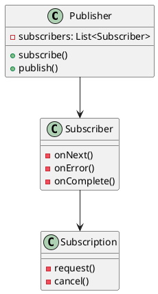
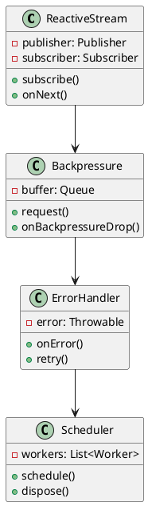
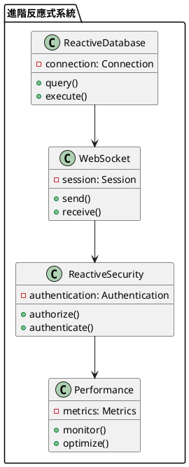

# Spring WebFlux 教學

## 初級（Beginner）層級

### 1. 概念說明
Spring WebFlux 就像是一個班級的即時通訊系統，可以讓同學們快速交換訊息。初級學習者需要了解：
- 什麼是反應式編程
- 為什麼需要反應式編程
- 基本的反應式操作

### 2. PlantUML 圖解


### 3. 分段教學步驟

#### 步驟 1：基本專案設定
```xml
<!-- pom.xml -->
<dependencies>
    <dependency>
        <groupId>org.springframework.boot</groupId>
        <artifactId>spring-boot-starter-webflux</artifactId>
        <version>3.3.10</version>
    </dependency>
</dependencies>
```

#### 步驟 2：基本配置
```yaml
# application.yml
spring:
  webflux:
    base-path: /api
```

#### 步驟 3：簡單範例
```java
import org.springframework.web.bind.annotation.*;
import org.springframework.http.*;
import reactor.core.publisher.*;

@RestController
@RequestMapping("/api/messages")
public class MessageController {
    
    @GetMapping
    public Flux<Message> getAllMessages() {
        return Flux.just(
            new Message("小明", "大家好！"),
            new Message("小華", "今天天氣真好！")
        );
    }
    
    @PostMapping
    public Mono<Message> createMessage(@RequestBody Message message) {
        return Mono.just(message);
    }
}
```

## 中級（Intermediate）層級

### 1. 概念說明
中級學習者需要理解：
- 反應式流
- 背壓處理
- 錯誤處理
- 調度器

### 2. PlantUML 圖解


### 3. 分段教學步驟

#### 步驟 1：反應式流
```java
import org.springframework.web.bind.annotation.*;
import org.springframework.http.*;
import reactor.core.publisher.*;
import java.time.Duration;

@RestController
@RequestMapping("/api/stream")
public class StreamController {
    
    @GetMapping("/numbers")
    public Flux<Integer> getNumbers() {
        return Flux.range(1, 10)
            .delayElements(Duration.ofSeconds(1));
    }
    
    @GetMapping("/events")
    public Flux<Event> getEvents() {
        return Flux.interval(Duration.ofSeconds(1))
            .map(i -> new Event("事件 " + i, System.currentTimeMillis()));
    }
}
```

#### 步驟 2：背壓處理
```java
import org.springframework.web.bind.annotation.*;
import org.springframework.http.*;
import reactor.core.publisher.*;
import reactor.core.scheduler.*;

@RestController
@RequestMapping("/api/backpressure")
public class BackpressureController {
    
    @GetMapping("/data")
    public Flux<Data> getData() {
        return Flux.range(1, 1000)
            .onBackpressureBuffer(100)
            .map(i -> new Data("數據 " + i))
            .subscribeOn(Schedulers.boundedElastic());
    }
    
    @GetMapping("/limited")
    public Flux<Data> getLimitedData() {
        return Flux.range(1, 1000)
            .onBackpressureDrop()
            .map(i -> new Data("數據 " + i))
            .limitRate(10);
    }
}
```

#### 步驟 3：錯誤處理
```java
import org.springframework.web.bind.annotation.*;
import org.springframework.http.*;
import reactor.core.publisher.*;
import java.time.Duration;

@RestController
@RequestMapping("/api/error")
public class ErrorController {
    
    @GetMapping("/retry")
    public Mono<String> getWithRetry() {
        return Mono.fromCallable(() -> {
                if (Math.random() > 0.5) {
                    throw new RuntimeException("隨機錯誤");
                }
                return "成功！";
            })
            .retry(3)
            .onErrorResume(e -> Mono.just("重試失敗"));
    }
    
    @GetMapping("/timeout")
    public Mono<String> getWithTimeout() {
        return Mono.delay(Duration.ofSeconds(2))
            .timeout(Duration.ofSeconds(1))
            .map(i -> "成功！")
            .onErrorResume(TimeoutException.class, 
                e -> Mono.just("超時！"));
    }
}
```

## 高級（Advanced）層級

### 1. 概念說明
高級學習者需要掌握：
- 反應式數據庫
- WebSocket
- 反應式安全
- 效能優化

### 2. PlantUML 圖解


### 3. 分段教學步驟

#### 步驟 1：反應式數據庫
```java
import org.springframework.web.bind.annotation.*;
import org.springframework.http.*;
import org.springframework.data.r2dbc.core.*;
import reactor.core.publisher.*;

@RestController
@RequestMapping("/api/database")
public class DatabaseController {
    
    @Autowired
    private R2dbcEntityTemplate template;
    
    @GetMapping("/students")
    public Flux<Student> getAllStudents() {
        return template.select(Student.class)
            .all();
    }
    
    @PostMapping("/students")
    public Mono<Student> createStudent(@RequestBody Student student) {
        return template.insert(student);
    }
}
```

#### 步驟 2：WebSocket
```java
import org.springframework.web.bind.annotation.*;
import org.springframework.web.reactive.socket.*;
import reactor.core.publisher.*;

@RestController
public class WebSocketController {
    
    @GetMapping("/ws")
    public Mono<Void> handleWebSocket(WebSocketSession session) {
        return session.send(
            Flux.interval(Duration.ofSeconds(1))
                .map(i -> session.textMessage("訊息 " + i))
        );
    }
}
```

#### 步驟 3：反應式安全
```java
import org.springframework.web.bind.annotation.*;
import org.springframework.http.*;
import org.springframework.security.core.annotation.*;
import reactor.core.publisher.*;

@RestController
@RequestMapping("/api/secure")
public class SecureController {
    
    @GetMapping("/user")
    public Mono<String> getUserInfo(@AuthenticationPrincipal Mono<User> user) {
        return user.map(u -> "歡迎, " + u.getUsername());
    }
    
    @PostMapping("/message")
    public Mono<Message> sendMessage(@RequestBody Message message,
                                   @AuthenticationPrincipal Mono<User> user) {
        return user.flatMap(u -> {
            message.setSender(u.getUsername());
            return Mono.just(message);
        });
    }
}
```

這個教學文件提供了從基礎到進階的 Spring WebFlux 學習路徑，每個層級都包含了相應的概念說明、圖解、教學步驟和實作範例。初級學習者可以從基本的反應式編程開始，中級學習者可以學習更複雜的反應式流和背壓處理，而高級學習者則可以掌握反應式數據庫和 WebSocket 等進階功能。 