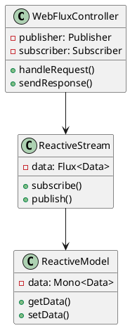
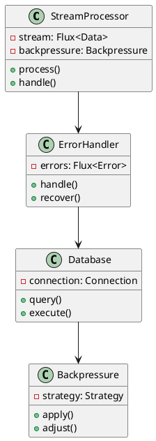
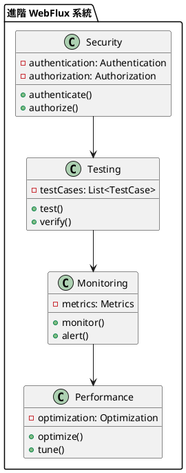

# Spring WebFlux 教學

## 初級（Beginner）層級

### 1. 概念說明
Spring WebFlux 就像是一個班級的即時通知系統，可以讓同學們即時收到最新的班級消息。初級學習者需要了解：
- 什麼是響應式編程
- 為什麼需要響應式編程
- 基本的 WebFlux 操作

### 2. PlantUML 圖解


### 3. 分段教學步驟

#### 步驟 1：基本專案設定
```xml
<!-- pom.xml -->
<dependencies>
    <dependency>
        <groupId>org.springframework.boot</groupId>
        <artifactId>spring-boot-starter-webflux</artifactId>
        <version>3.3.10</version>
    </dependency>
    <dependency>
        <groupId>org.springframework.boot</groupId>
        <artifactId>spring-boot-starter-data-r2dbc</artifactId>
        <version>3.3.10</version>
    </dependency>
</dependencies>
```

#### 步驟 2：基本配置
```yaml
# application.yml
spring:
  r2dbc:
    url: r2dbc:h2:mem:///classdb
    username: sa
    password: 
```

#### 步驟 3：簡單範例
```java
import org.springframework.web.bind.annotation.*;
import org.springframework.http.*;
import reactor.core.publisher.*;

@RestController
public class ClassController {
    
    @GetMapping("/welcome")
    public Mono<String> welcome() {
        return Mono.just("歡迎來到班級通知系統！");
    }
    
    @GetMapping("/notices")
    public Flux<Notice> listNotices() {
        return noticeService.getAllNotices();
    }
}
```

## 中級（Intermediate）層級

### 1. 概念說明
中級學習者需要理解：
- 響應式流處理
- 背壓處理
- 錯誤處理
- 響應式數據庫

### 2. PlantUML 圖解


### 3. 分段教學步驟

#### 步驟 1：響應式流處理
```java
import org.springframework.web.bind.annotation.*;
import org.springframework.http.*;
import reactor.core.publisher.*;

@RestController
@RequestMapping("/api/class")
public class ClassController {
    
    @GetMapping("/events")
    public Flux<Event> streamEvents() {
        return eventService.getEventStream()
            .map(event -> {
                event.setProcessed(true);
                return event;
            })
            .log();
    }
    
    @PostMapping("/events")
    public Mono<Event> createEvent(@RequestBody Event event) {
        return eventService.saveEvent(event);
    }
}
```

#### 步驟 2：背壓處理
```java
import org.springframework.web.bind.annotation.*;
import org.springframework.http.*;
import reactor.core.publisher.*;

@RestController
@RequestMapping("/api/stream")
public class StreamController {
    
    @GetMapping("/data")
    public Flux<Data> streamData() {
        return dataService.getDataStream()
            .onBackpressureBuffer(100) // 緩衝區大小
            .onBackpressureDrop() // 丟棄策略
            .onBackpressureLatest() // 最新策略
            .log();
    }
}
```

#### 步驟 3：錯誤處理
```java
import org.springframework.web.bind.annotation.*;
import org.springframework.http.*;
import reactor.core.publisher.*;

@RestControllerAdvice
public class GlobalErrorHandler {
    
    @ExceptionHandler(RuntimeException.class)
    public Mono<ResponseEntity<ErrorResponse>> handleError(
            RuntimeException ex) {
        return Mono.just(ResponseEntity
            .status(HttpStatus.INTERNAL_SERVER_ERROR)
            .body(new ErrorResponse("錯誤發生", ex.getMessage())));
    }
    
    @ExceptionHandler(DataAccessException.class)
    public Mono<ResponseEntity<ErrorResponse>> handleDataError(
            DataAccessException ex) {
        return Mono.just(ResponseEntity
            .status(HttpStatus.SERVICE_UNAVAILABLE)
            .body(new ErrorResponse("數據庫錯誤", ex.getMessage())));
    }
}
```

## 高級（Advanced）層級

### 1. 概念說明
高級學習者需要掌握：
- 響應式安全
- 響應式測試
- 響應式監控
- 效能優化

### 2. PlantUML 圖解


### 3. 分段教學步驟

#### 步驟 1：響應式安全
```java
import org.springframework.security.core.annotation.*;
import org.springframework.web.bind.annotation.*;
import reactor.core.publisher.*;

@RestController
@RequestMapping("/api/secure")
public class SecureController {
    
    @GetMapping("/user")
    public Mono<User> getUser(@AuthenticationPrincipal User user) {
        return userService.getUserDetails(user.getUsername());
    }
    
    @PostMapping("/message")
    public Mono<Message> sendMessage(
            @AuthenticationPrincipal User user,
            @RequestBody Message message) {
        return messageService.sendMessage(user, message);
    }
}
```

#### 步驟 2：響應式測試
```java
import org.springframework.boot.test.context.*;
import org.springframework.test.web.reactive.server.*;
import reactor.test.*;

@SpringBootTest
@AutoConfigureWebTestClient
public class ClassControllerTest {
    
    @Autowired
    private WebTestClient webClient;
    
    @Test
    public void testGetNotices() {
        webClient.get()
            .uri("/notices")
            .exchange()
            .expectStatus().isOk()
            .expectBodyList(Notice.class)
            .hasSize(2);
    }
    
    @Test
    public void testStreamEvents() {
        StepVerifier.create(eventService.getEventStream())
            .expectNextMatches(event -> event.getType().equals("notice"))
            .expectNextMatches(event -> event.getType().equals("alert"))
            .thenCancel()
            .verify();
    }
}
```

#### 步驟 3：響應式監控
```java
import org.springframework.boot.actuate.metrics.*;
import org.springframework.web.bind.annotation.*;
import reactor.core.publisher.*;

@RestController
@RequestMapping("/api/monitor")
public class MonitorController {
    
    @Autowired
    private MeterRegistry registry;
    
    @GetMapping("/metrics")
    public Flux<Metric> getMetrics() {
        return Flux.fromIterable(registry.getMeters())
            .map(meter -> new Metric(
                meter.getId().getName(),
                meter.measure()
            ));
    }
    
    @GetMapping("/health")
    public Mono<Health> checkHealth() {
        return healthService.checkSystemHealth()
            .map(status -> new Health(status));
    }
}
```

這個教學文件提供了從基礎到進階的 Spring WebFlux 學習路徑，每個層級都包含了相應的概念說明、圖解、教學步驟和實作範例。初級學習者可以從基本的響應式編程開始，中級學習者可以學習更複雜的流處理和背壓處理，而高級學習者則可以掌握響應式安全和監控等進階功能。 