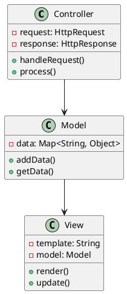
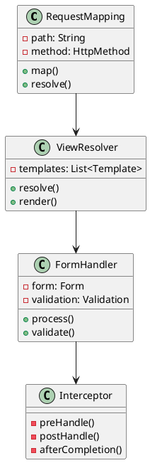
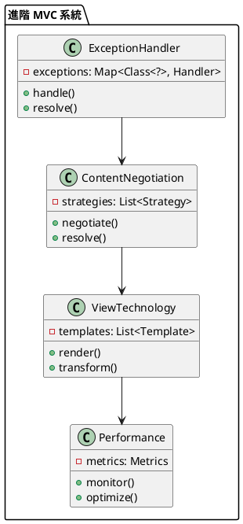

# Spring WebMVC 教學

## 初級（Beginner）層級

### 1. 概念說明
Spring WebMVC 就像是一個班級的班級幹部系統，負責協調和管理班級的各項事務。初級學習者需要了解：
- 什麼是 MVC 模式
- 為什麼需要 MVC 模式
- 基本的 MVC 操作

### 2. PlantUML 圖解


### 3. 分段教學步驟

#### 步驟 1：基本專案設定
```xml
<!-- pom.xml -->
<dependencies>
    <dependency>
        <groupId>org.springframework.boot</groupId>
        <artifactId>spring-boot-starter-web</artifactId>
        <version>3.3.10</version>
    </dependency>
    <dependency>
        <groupId>org.springframework.boot</groupId>
        <artifactId>spring-boot-starter-thymeleaf</artifactId>
        <version>3.3.10</version>
    </dependency>
</dependencies>
```

#### 步驟 2：基本配置
```yaml
# application.yml
spring:
  mvc:
    view:
      prefix: /templates/
      suffix: .html
  thymeleaf:
    prefix: classpath:/templates/
    suffix: .html
```

#### 步驟 3：簡單範例
```java
import org.springframework.stereotype.*;
import org.springframework.web.bind.annotation.*;
import org.springframework.ui.*;

@Controller
public class ClassController {
    
    @GetMapping("/welcome")
    public String welcome(Model model) {
        model.addAttribute("message", "歡迎來到班級幹部系統！");
        return "welcome";
    }
    
    @GetMapping("/students")
    public String listStudents(Model model) {
        List<Student> students = List.of(
            new Student("小明", "班長"),
            new Student("小華", "副班長")
        );
        model.addAttribute("students", students);
        return "students";
    }
}
```

## 中級（Intermediate）層級

### 1. 概念說明
中級學習者需要理解：
- 請求映射
- 視圖解析
- 表單處理
- 攔截器

### 2. PlantUML 圖解


### 3. 分段教學步驟

#### 步驟 1：請求映射
```java
import org.springframework.web.bind.annotation.*;
import org.springframework.http.*;
import org.springframework.validation.*;

@Controller
@RequestMapping("/class")
public class ClassController {
    
    @GetMapping("/{id}")
    public String getClassInfo(@PathVariable Long id, Model model) {
        ClassInfo info = classService.getClassInfo(id);
        model.addAttribute("classInfo", info);
        return "class-info";
    }
    
    @PostMapping("/update")
    public String updateClass(
            @Valid @ModelAttribute("classInfo") ClassInfo info,
            BindingResult result) {
        if (result.hasErrors()) {
            return "class-form";
        }
        classService.updateClass(info);
        return "redirect:/class/" + info.getId();
    }
}
```

#### 步驟 2：攔截器
```java
import org.springframework.web.servlet.*;
import org.springframework.stereotype.*;
import jakarta.servlet.http.*;

@Component
public class ClassInterceptor implements HandlerInterceptor {
    
    @Override
    public boolean preHandle(HttpServletRequest request,
                           HttpServletResponse response,
                           Object handler) {
        // 檢查是否為班級幹部
        String role = request.getHeader("X-Class-Role");
        if (!"leader".equals(role)) {
            response.setStatus(HttpStatus.FORBIDDEN.value());
            return false;
        }
        return true;
    }
    
    @Override
    public void postHandle(HttpServletRequest request,
                         HttpServletResponse response,
                         Object handler,
                         ModelAndView modelAndView) {
        // 添加班級資訊到視圖
        if (modelAndView != null) {
            modelAndView.addObject("className", "三年一班");
        }
    }
}
```

#### 步驟 3：視圖解析
```java
import org.springframework.web.servlet.view.*;
import org.springframework.context.annotation.*;

@Configuration
public class ViewConfig {
    
    @Bean
    public ViewResolver viewResolver() {
        InternalResourceViewResolver resolver = new InternalResourceViewResolver();
        resolver.setPrefix("/WEB-INF/views/");
        resolver.setSuffix(".jsp");
        resolver.setViewClass(JstlView.class);
        return resolver;
    }
}
```

## 高級（Advanced）層級

### 1. 概念說明
高級學習者需要掌握：
- 異常處理
- 內容協商
- 視圖技術
- 效能優化

### 2. PlantUML 圖解


### 3. 分段教學步驟

#### 步驟 1：異常處理
```java
import org.springframework.web.bind.annotation.*;
import org.springframework.http.*;
import org.springframework.validation.*;

@ControllerAdvice
public class GlobalExceptionHandler {
    
    @ExceptionHandler(ClassNotFoundException.class)
    public ResponseEntity<ErrorResponse> handleClassNotFound(
            ClassNotFoundException ex) {
        ErrorResponse error = new ErrorResponse(
            "班級不存在",
            ex.getMessage()
        );
        return ResponseEntity.status(HttpStatus.NOT_FOUND)
            .body(error);
    }
    
    @ExceptionHandler(MethodArgumentNotValidException.class)
    public ResponseEntity<ErrorResponse> handleValidation(
            MethodArgumentNotValidException ex) {
        List<String> errors = ex.getBindingResult()
            .getFieldErrors()
            .stream()
            .map(FieldError::getDefaultMessage)
            .collect(Collectors.toList());
        
        ErrorResponse error = new ErrorResponse(
            "驗證失敗",
            errors
        );
        return ResponseEntity.badRequest().body(error);
    }
}
```

#### 步驟 2：內容協商
```java
import org.springframework.web.bind.annotation.*;
import org.springframework.http.*;
import org.springframework.web.accept.*;

@Configuration
public class ContentConfig {
    
    @Bean
    public ContentNegotiationManager contentNegotiationManager() {
        ContentNegotiationStrategy strategy = 
            new HeaderContentNegotiationStrategy();
        
        return new ContentNegotiationManager(strategy);
    }
}

@RestController
@RequestMapping("/api/class")
public class ClassController {
    
    @GetMapping(value = "/{id}", produces = {
        MediaType.APPLICATION_JSON_VALUE,
        MediaType.APPLICATION_XML_VALUE
    })
    public ResponseEntity<ClassInfo> getClassInfo(
            @PathVariable Long id) {
        ClassInfo info = classService.getClassInfo(id);
        return ResponseEntity.ok(info);
    }
}
```

#### 步驟 3：視圖技術
```java
import org.springframework.web.servlet.view.*;
import org.springframework.context.annotation.*;
import org.thymeleaf.spring6.*;
import org.thymeleaf.templateresolver.*;

@Configuration
public class ViewConfig {
    
    @Bean
    public SpringTemplateEngine templateEngine() {
        SpringTemplateEngine engine = new SpringTemplateEngine();
        engine.setTemplateResolver(templateResolver());
        engine.setEnableSpringELCompiler(true);
        return engine;
    }
    
    @Bean
    public ITemplateResolver templateResolver() {
        ClassLoaderTemplateResolver resolver = new ClassLoaderTemplateResolver();
        resolver.setPrefix("templates/");
        resolver.setSuffix(".html");
        resolver.setTemplateMode("HTML");
        resolver.setCharacterEncoding("UTF-8");
        return resolver;
    }
}
```

這個教學文件提供了從基礎到進階的 Spring WebMVC 學習路徑，每個層級都包含了相應的概念說明、圖解、教學步驟和實作範例。初級學習者可以從基本的 MVC 操作開始，中級學習者可以學習更複雜的請求映射和攔截器，而高級學習者則可以掌握異常處理和內容協商等進階功能。 