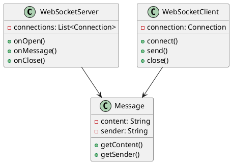
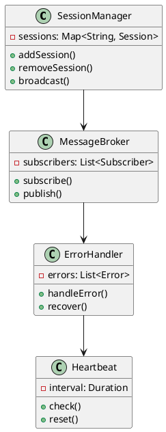
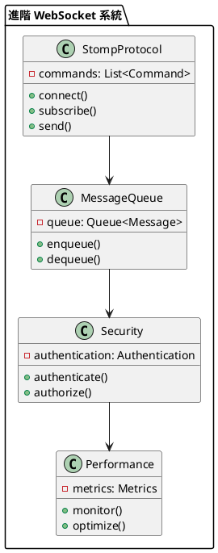

# Spring WebSocket 教學

## 初級（Beginner）層級

### 1. 概念說明
Spring WebSocket 就像是一個班級的即時聊天室，可以讓同學們即時交流。初級學習者需要了解：
- 什麼是 WebSocket
- 為什麼需要 WebSocket
- 基本的 WebSocket 操作

### 2. PlantUML 圖解


### 3. 分段教學步驟

#### 步驟 1：基本專案設定
```xml
<!-- pom.xml -->
<dependencies>
    <dependency>
        <groupId>org.springframework.boot</groupId>
        <artifactId>spring-boot-starter-websocket</artifactId>
        <version>3.3.10</version>
    </dependency>
</dependencies>
```

#### 步驟 2：基本配置
```yaml
# application.yml
spring:
  websocket:
    path: /chat
```

#### 步驟 3：簡單範例
```java
import org.springframework.web.socket.*;
import org.springframework.web.socket.handler.*;

@Configuration
@EnableWebSocket
public class WebSocketConfig implements WebSocketConfigurer {
    
    @Override
    public void registerWebSocketHandlers(WebSocketHandlerRegistry registry) {
        registry.addHandler(new ChatHandler(), "/chat")
            .setAllowedOrigins("*");
    }
}

public class ChatHandler extends TextWebSocketHandler {
    
    @Override
    public void handleTextMessage(WebSocketSession session, TextMessage message) {
        try {
            session.sendMessage(new TextMessage("收到訊息: " + message.getPayload()));
        } catch (IOException e) {
            e.printStackTrace();
        }
    }
}
```

## 中級（Intermediate）層級

### 1. 概念說明
中級學習者需要理解：
- 會話管理
- 訊息廣播
- 錯誤處理
- 心跳檢測

### 2. PlantUML 圖解


### 3. 分段教學步驟

#### 步驟 1：會話管理
```java
import org.springframework.web.socket.*;
import org.springframework.web.socket.handler.*;
import java.util.concurrent.*;

@Configuration
@EnableWebSocket
public class WebSocketConfig implements WebSocketConfigurer {
    
    private final Map<String, WebSocketSession> sessions = new ConcurrentHashMap<>();
    
    @Override
    public void registerWebSocketHandlers(WebSocketHandlerRegistry registry) {
        registry.addHandler(new ChatHandler(sessions), "/chat")
            .setAllowedOrigins("*");
    }
}

public class ChatHandler extends TextWebSocketHandler {
    
    private final Map<String, WebSocketSession> sessions;
    
    public ChatHandler(Map<String, WebSocketSession> sessions) {
        this.sessions = sessions;
    }
    
    @Override
    public void afterConnectionEstablished(WebSocketSession session) {
        sessions.put(session.getId(), session);
    }
    
    @Override
    public void afterConnectionClosed(WebSocketSession session, CloseStatus status) {
        sessions.remove(session.getId());
    }
}
```

#### 步驟 2：訊息廣播
```java
import org.springframework.web.socket.*;
import org.springframework.web.socket.handler.*;
import java.util.concurrent.*;

public class ChatHandler extends TextWebSocketHandler {
    
    private final Map<String, WebSocketSession> sessions;
    
    @Override
    public void handleTextMessage(WebSocketSession session, TextMessage message) {
        String payload = message.getPayload();
        String response = "[" + session.getId() + "]: " + payload;
        
        sessions.values().forEach(s -> {
            try {
                s.sendMessage(new TextMessage(response));
            } catch (IOException e) {
                e.printStackTrace();
            }
        });
    }
}
```

#### 步驟 3：心跳檢測
```java
import org.springframework.web.socket.*;
import org.springframework.web.socket.handler.*;
import java.util.concurrent.*;

public class ChatHandler extends TextWebSocketHandler {
    
    private final Map<String, Long> lastHeartbeat = new ConcurrentHashMap<>();
    
    @Override
    public void handleTextMessage(WebSocketSession session, TextMessage message) {
        if ("PING".equals(message.getPayload())) {
            lastHeartbeat.put(session.getId(), System.currentTimeMillis());
            try {
                session.sendMessage(new TextMessage("PONG"));
            } catch (IOException e) {
                e.printStackTrace();
            }
        }
    }
    
    public void checkHeartbeats() {
        long now = System.currentTimeMillis();
        sessions.entrySet().removeIf(entry -> {
            Long last = lastHeartbeat.get(entry.getKey());
            return last != null && (now - last) > 30000; // 30秒超時
        });
    }
}
```

## 高級（Advanced）層級

### 1. 概念說明
高級學習者需要掌握：
- STOMP 協議
- 訊息佇列
- 安全認證
- 效能優化

### 2. PlantUML 圖解


### 3. 分段教學步驟

#### 步驟 1：STOMP 協議
```java
import org.springframework.messaging.simp.config.*;
import org.springframework.web.socket.config.annotation.*;

@Configuration
@EnableWebSocketMessageBroker
public class WebSocketConfig implements WebSocketMessageBrokerConfigurer {
    
    @Override
    public void configureMessageBroker(MessageBrokerRegistry config) {
        config.enableSimpleBroker("/topic");
        config.setApplicationDestinationPrefixes("/app");
    }
    
    @Override
    public void registerStompEndpoints(StompEndpointRegistry registry) {
        registry.addEndpoint("/chat")
            .setAllowedOrigins("*");
    }
}

@Controller
public class ChatController {
    
    @MessageMapping("/chat.send")
    @SendTo("/topic/public")
    public ChatMessage sendMessage(ChatMessage message) {
        return message;
    }
}
```

#### 步驟 2：訊息佇列
```java
import org.springframework.messaging.simp.*;
import org.springframework.messaging.simp.stomp.*;
import org.springframework.stereotype.*;

@Component
public class ChatMessageListener implements StompCommandListener {
    
    @Autowired
    private SimpMessagingTemplate messagingTemplate;
    
    @Override
    public void handleMessage(StompHeaderAccessor headers, Object payload) {
        if (payload instanceof ChatMessage) {
            ChatMessage message = (ChatMessage) payload;
            messagingTemplate.convertAndSend("/topic/queue", message);
        }
    }
}
```

#### 步驟 3：安全認證
```java
import org.springframework.messaging.handler.annotation.*;
import org.springframework.security.core.annotation.*;
import org.springframework.stereotype.*;

@Controller
public class SecureChatController {
    
    @MessageMapping("/secure/chat")
    @SendTo("/topic/secure")
    public ChatMessage sendSecureMessage(
            @Payload ChatMessage message,
            @AuthenticationPrincipal User user) {
        message.setSender(user.getUsername());
        return message;
    }
}
```

這個教學文件提供了從基礎到進階的 Spring WebSocket 學習路徑，每個層級都包含了相應的概念說明、圖解、教學步驟和實作範例。初級學習者可以從基本的 WebSocket 操作開始，中級學習者可以學習更複雜的會話管理和訊息廣播，而高級學習者則可以掌握 STOMP 協議和安全認證等進階功能。 