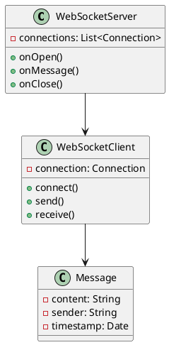
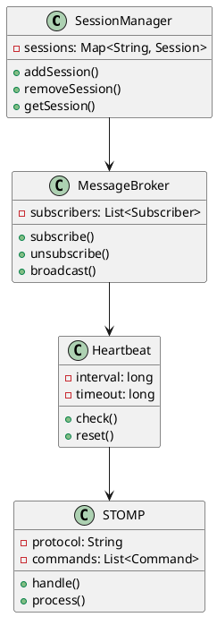
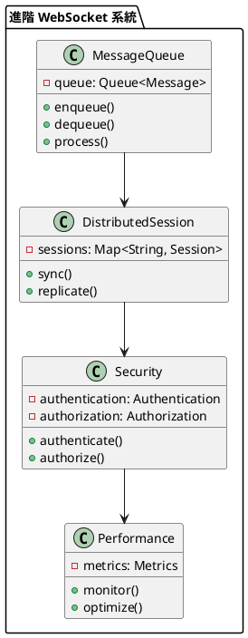

# Spring WebSocket 教學

## 初級（Beginner）層級

### 1. 概念說明
Spring WebSocket 就像是一個班級的即時聊天室，讓同學們可以即時交流。初級學習者需要了解：
- 什麼是 WebSocket
- 為什麼需要 WebSocket
- 基本的 WebSocket 操作

### 2. PlantUML 圖解


### 3. 分段教學步驟

#### 步驟 1：基本專案設定
```xml
<!-- pom.xml -->
<dependencies>
    <dependency>
        <groupId>org.springframework.boot</groupId>
        <artifactId>spring-boot-starter-websocket</artifactId>
        <version>3.3.10</version>
    </dependency>
</dependencies>
```

#### 步驟 2：基本配置
```java
import org.springframework.web.socket.config.annotation.*;
import org.springframework.context.annotation.*;

@Configuration
@EnableWebSocket
public class WebSocketConfig implements WebSocketConfigurer {
    
    @Override
    public void registerWebSocketHandlers(WebSocketHandlerRegistry registry) {
        registry.addHandler(classChatHandler(), "/chat")
            .setAllowedOrigins("*");
    }
    
    @Bean
    public WebSocketHandler classChatHandler() {
        return new ClassChatHandler();
    }
}
```

#### 步驟 3：簡單範例
```java
import org.springframework.web.socket.*;
import org.springframework.web.socket.handler.*;

public class ClassChatHandler extends TextWebSocketHandler {
    
    private final List<WebSocketSession> sessions = new CopyOnWriteArrayList<>();
    
    @Override
    public void afterConnectionEstablished(WebSocketSession session) {
        sessions.add(session);
        broadcast("新同學加入聊天室！");
    }
    
    @Override
    protected void handleTextMessage(WebSocketSession session, TextMessage message) {
        String sender = session.getAttributes().get("username").toString();
        broadcast(sender + ": " + message.getPayload());
    }
    
    @Override
    public void afterConnectionClosed(WebSocketSession session, CloseStatus status) {
        sessions.remove(session);
        broadcast("有同學離開聊天室！");
    }
    
    private void broadcast(String message) {
        for (WebSocketSession session : sessions) {
            try {
                session.sendMessage(new TextMessage(message));
            } catch (IOException e) {
                // 處理發送失敗的情況
            }
        }
    }
}
```

## 中級（Intermediate）層級

### 1. 概念說明
中級學習者需要理解：
- 會話管理
- 訊息廣播
- 心跳檢測
- STOMP 協議

### 2. PlantUML 圖解


### 3. 分段教學步驟

#### 步驟 1：STOMP 配置
```java
import org.springframework.messaging.simp.config.*;
import org.springframework.context.annotation.*;

@Configuration
@EnableWebSocketMessageBroker
public class WebSocketConfig implements WebSocketMessageBrokerConfigurer {
    
    @Override
    public void configureMessageBroker(MessageBrokerRegistry config) {
        config.enableSimpleBroker("/topic");
        config.setApplicationDestinationPrefixes("/app");
    }
    
    @Override
    public void registerStompEndpoints(StompEndpointRegistry registry) {
        registry.addEndpoint("/chat")
            .setAllowedOrigins("*")
            .withSockJS();
    }
}
```

#### 步驟 2：訊息處理
```java
import org.springframework.messaging.handler.annotation.*;
import org.springframework.messaging.simp.*;

@Controller
public class ChatController {
    
    @MessageMapping("/chat.send")
    @SendTo("/topic/public")
    public ChatMessage sendMessage(@Payload ChatMessage chatMessage) {
        return chatMessage;
    }
    
    @MessageMapping("/chat.addUser")
    @SendTo("/topic/public")
    public ChatMessage addUser(@Payload ChatMessage chatMessage,
                             SimpMessageHeaderAccessor headerAccessor) {
        headerAccessor.getSessionAttributes()
            .put("username", chatMessage.getSender());
        return chatMessage;
    }
}
```

#### 步驟 3：心跳檢測
```java
import org.springframework.web.socket.config.annotation.*;
import org.springframework.context.annotation.*;

@Configuration
public class WebSocketConfig {
    
    @Bean
    public WebSocketHandlerDecoratorFactory heartbeatDecorator() {
        return new WebSocketHandlerDecoratorFactory() {
            @Override
            public WebSocketHandler decorate(WebSocketHandler handler) {
                return new HeartbeatWebSocketHandler(handler);
            }
        };
    }
}

public class HeartbeatWebSocketHandler extends WebSocketHandlerDecorator {
    
    private static final long HEARTBEAT_INTERVAL = 30000;
    private static final long HEARTBEAT_TIMEOUT = 60000;
    
    private ScheduledExecutorService scheduler;
    private ScheduledFuture<?> heartbeatFuture;
    
    public HeartbeatWebSocketHandler(WebSocketHandler delegate) {
        super(delegate);
        this.scheduler = Executors.newSingleThreadScheduledExecutor();
    }
    
    @Override
    public void afterConnectionEstablished(WebSocketSession session) {
        startHeartbeat(session);
        super.afterConnectionEstablished(session);
    }
    
    private void startHeartbeat(WebSocketSession session) {
        heartbeatFuture = scheduler.scheduleAtFixedRate(() -> {
            try {
                if (session.isOpen()) {
                    session.sendMessage(new PingMessage());
                }
            } catch (IOException e) {
                // 處理心跳失敗
            }
        }, HEARTBEAT_INTERVAL, HEARTBEAT_INTERVAL, TimeUnit.MILLISECONDS);
    }
}
```

## 高級（Advanced）層級

### 1. 概念說明
高級學習者需要掌握：
- 訊息佇列
- 分散式會話
- 安全認證
- 效能監控

### 2. PlantUML 圖解


### 3. 分段教學步驟

#### 步驟 1：訊息佇列
```java
import org.springframework.messaging.simp.config.*;
import org.springframework.context.annotation.*;

@Configuration
public class MessageQueueConfig {
    
    @Bean
    public MessageChannel clientInboundChannel() {
        return new ExecutorSubscribableChannel(
            Executors.newFixedThreadPool(10)
        );
    }
    
    @Bean
    public MessageChannel clientOutboundChannel() {
        return new ExecutorSubscribableChannel(
            Executors.newFixedThreadPool(10)
        );
    }
    
    @Bean
    public MessageBroker messageBroker() {
        SimpleBrokerMessageHandler broker = new SimpleBrokerMessageHandler(
            clientInboundChannel(),
            clientOutboundChannel(),
            "/topic"
        );
        broker.setHeartbeatValue(new long[] {10000, 10000});
        return broker;
    }
}
```

#### 步驟 2：分散式會話
```java
import org.springframework.session.web.socket.config.annotation.*;
import org.springframework.session.web.socket.server.*;
import org.springframework.session.*;

@Configuration
@EnableRedisWebSocketSession
public class SessionConfig {
    
    @Bean
    public WebSocketSessionRepository webSocketSessionRepository() {
        return new MapSessionRepository();
    }
    
    @Bean
    public WebSocketSessionMessageBrokerConfigurer webSocketSessionMessageBrokerConfigurer() {
        return new WebSocketSessionMessageBrokerConfigurer();
    }
}
```

#### 步驟 3：安全認證
```java
import org.springframework.messaging.handler.annotation.*;
import org.springframework.security.core.annotation.*;
import org.springframework.security.core.userdetails.*;

@Controller
public class SecureChatController {
    
    @MessageMapping("/chat.private")
    @SendToUser("/queue/private")
    public ChatMessage sendPrivateMessage(
            @Payload ChatMessage chatMessage,
            @AuthenticationPrincipal UserDetails user) {
        // 驗證發送者身份
        if (!user.getUsername().equals(chatMessage.getSender())) {
            throw new SecurityException("無權發送訊息");
        }
        return chatMessage;
    }
    
    @MessageMapping("/chat.group")
    @SendTo("/topic/group")
    public ChatMessage sendGroupMessage(
            @Payload ChatMessage chatMessage,
            @AuthenticationPrincipal UserDetails user) {
        // 驗證群組權限
        if (!hasGroupPermission(user, chatMessage.getGroupId())) {
            throw new SecurityException("無權發送群組訊息");
        }
        return chatMessage;
    }
}
```

這個教學文件提供了從基礎到進階的 Spring WebSocket 學習路徑，每個層級都包含了相應的概念說明、圖解、教學步驟和實作範例。初級學習者可以從基本的 WebSocket 操作開始，中級學習者可以學習更複雜的會話管理和訊息廣播，而高級學習者則可以掌握訊息佇列和安全認證等進階功能。 